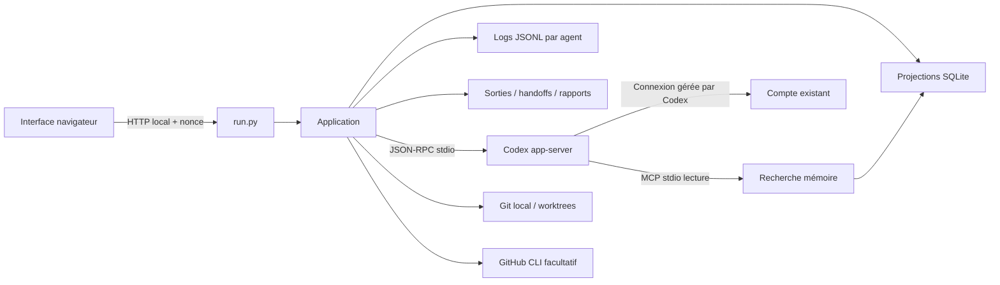

# Architecture locale

## Structure

- `run.py` : HTTP loopback, nonce local par lancement, contrôle Host/Origin, routes et fichiers statiques en liste blanche.
- `server/app.py` : sessions, projections, autorisations, fichiers, worktrees, orchestration, benchmarks et rapports.
- `server/codex.py` : handshake `initialize`/`initialized`, corrélation des réponses JSON-RPC, événements et arrêt des processus.
- `server/store.py` : objets SQLite, journal JSONL ajouté sans réécriture, masquage de motifs connus, hashes d’artefacts.
- `server/memory_mcp.py` : `memory_search` et `memory_read`, lecture uniquement et filtre projet/utilisateur.
- `web/core.js` : état partagé, navigation, API et rendu central avec préservation des champs/scroll.
- `web/views.js` : vues qui projettent cet état ; pas de données d’activité fictives.
- `web/forms.js` : formulaires, catalogue, skills et sélection du dossier/worktree.
- `web/app.js` : actions, soumission, raccourcis et rafraîchissement toutes les 1,8 secondes.
- `web/style.css` : variables de design, layouts, états, responsive, réduction du mouvement.

Les fichiers JS se chargent dans cet ordre avec `defer`. Le petit frontend fonctionne sans build ni dépendance. Il partage des variables lexicales dans la page ; une migration en modules ES pourra accompagner l’extension des adaptateurs.

## Sessions et permissions

Un processus app-server par agent, plus un processus de découverte. `account/read` fournit le mode de connexion sans extraction de credentials. `model/list` fournit modèles et efforts. Son catalogue n’est pas une preuve d’accès effectif : seul un tour réussi confirme l’accès pour la requête.

Chaque session démarre/reprend avec `cwd`, `sandbox` et `approvalPolicy=on-request`. `features.multi_agent=false` désactive la délégation native ; les workflows sont pilotés par Atelier. L’application n’offre pas de bypass. Les demandes de commande, fichiers, permissions et questions sont relayées à l’utilisateur. Les requêtes serveur inconnues reçoivent une erreur explicite.

Seuls `turn.status=completed` et les événements correspondants attestent la fin technique d’un tour. Un état `ready` veut dire que l’agent peut recevoir un message. Ni l’un ni l’autre ne vaut validation du résultat.

Le profil Codex reste l’autorité de sandbox, avec les politiques éventuellement gérées sur la machine. La mémoire MCP est en lecture seule, mais le sandbox d’un agent autorisé à écrire du code n’est pas une garantie d’isolation absolue de toutes les données locales. L’app n’est pas un environnement multi-utilisateur hostile.

## Orchestration

Duo : implémentation puis review en lecture seule. Orchestration : plan JSON contraint, 1 à 3 tâches, implémentation séquentielle, review et synthèse. Même worktree partagé pour le workflow. Chaque enfant a sa session, son output et son handoff ; le parent reçoit des extraits bornés et des références de fichiers.

La concurrence entre workflows distincts n’est pas encore arbitrée par un scheduler. Utiliser des worktrees distincts si plusieurs travaux écrivent en parallèle. La clôture ne détruit aucune branche ni aucun worktree.

## Mémoire

Le noyau est chargé dans les instructions au démarrage/reprise. Sa taille combinée projet/utilisateur est bornée à 4 000 caractères, avec garde supplémentaire lors de la composition. La réserve est consultée par mots via MCP, extraits de 600 caractères et lecture d’un souvenir de 6 000 caractères maximum. Ce n’est pas de l’embedding sémantique.

Seul l’utilisateur valide les souvenirs dans la V1. Aucun outil MCP de mutation. Les journaux ne sont pas automatiquement promus en mémoire.

## Benchmarks

Dataset JSON : `title`, `prompt`, `expected`, hash SHA-256, modèle, effort, répétitions et juge. Chaque candidat ouvre une session neuve, lecture seule, mémoire Atelier désactivée. Les instructions natives du CLI peuvent toujours s’appliquer : cette isolation ne constitue pas une VM vierge. Le prompt demande de ne pas utiliser les outils ; il n’est pas une interdiction technique de tous les outils Codex.

Oracle exact : compare les chaînes après `strip()`. Juge modèle : session distincte, verdict JSON `passed`, `reason`, `evidence`; un avis de modèle, pas une validation de runtime. Générateur de cas : résultat proposé à l’utilisateur, aucune campagne déclenchée sans son lancement explicite. Budget de campagne : 50 candidats maximum, les reviews et la génération s’ajoutent.

## Audit et récupération

Événements privés de raisonnement exclus ; appels/résultats observables conservés. Les tokens sont enregistrés tels que rapportés, avec cache lu inclus dans l’entrée. Les sorties et handoffs sont des instantanés de session ; le journal reste la trace complète. Les rapports indiquent `UNVERIFIED` et distinguent déclarations et résultats d’outils.

Après interruption du serveur : sessions arrêtées, demandes périmées retirées, campagnes/workflows `interrupted` avec résultats partiels. Reprise manuelle des sessions par `thread/resume`. Pas de reprise automatique de campagne, pas de replay des effets externes.
