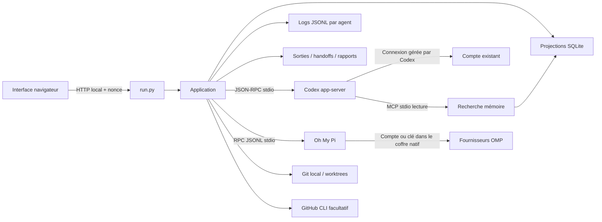

# Architecture locale

## Structure

- `run.py` : HTTP loopback, nonce local par lancement, contrôle Host/Origin, routes et fichiers statiques en liste blanche.
- `server/app.py` : sessions, projections, autorisations, fichiers, worktrees, orchestration, benchmarks et rapports.
- `server/codex.py` : handshake `initialize`/`initialized`, corrélation des réponses JSON-RPC, événements et arrêt des processus.
- `server/omp.py` : transport JSONL OMP, événement ready et réponses corrélées ; catalogue découvert par `omp models --json`.
- `server/omp_session.py` : adaptation des événements observables, tokens, outils hôtes et approbations de fichiers.
- `server/terminal.py` : validation et préparation d’un terminal natif OMP ; commande littérale sans interpolation d’entrée utilisateur.
- `server/store.py` : objets SQLite, journal JSONL ajouté sans réécriture, masquage de motifs connus, hashes d’artefacts.
- `server/memory_mcp.py` : `memory_search` et `memory_read`, lecture uniquement et filtre projet/utilisateur.
- `web/core.js` : état partagé, navigation, API et rendu central avec préservation des champs/scroll.
- `web/views.js` : vues qui projettent cet état ; pas de données d’activité fictives.
- `web/cockpit.js` : graphe, inspecteur, connexions et consommation par fournisseur/consommateur/tâche/modèle/requête.
- `web/forms.js` : formulaires, catalogue, skills et sélection du dossier/worktree.
- `web/app.js` : actions, soumission, raccourcis et rafraîchissement toutes les 1,8 secondes.
- `web/style.css` : variables de design, layouts, états, responsive, réduction du mouvement.

Les fichiers JS se chargent dans cet ordre avec `defer`. Le petit frontend fonctionne sans build ni dépendance. Il partage des variables lexicales dans la page ; une migration en modules ES pourra accompagner l’extension des adaptateurs.

## Sessions et permissions

Un processus app-server par agent, plus un processus de découverte. `account/read` fournit le mode de connexion sans extraction de credentials. `model/list` fournit modèles et efforts. Son catalogue n’est pas une preuve d’accès effectif : seul un tour réussi confirme l’accès pour la requête.

Chaque session démarre/reprend avec `cwd`, `sandbox` et `approvalPolicy=on-request`. `features.multi_agent=false` désactive la délégation native ; les workflows sont pilotés par Atelier. L’application n’offre pas de bypass. Les demandes de commande, fichiers, permissions et questions sont relayées à l’utilisateur. Les requêtes serveur inconnues reçoivent une erreur explicite.

Seuls `turn.status=completed` et les événements correspondants attestent la fin technique d’un tour. Un état `ready` veut dire que l’agent peut recevoir un message. Ni l’un ni l’autre ne vaut validation du résultat.

Le profil Codex reste l’autorité de sandbox, avec les politiques éventuellement gérées sur la machine. La mémoire MCP est en lecture seule, mais le sandbox d’un agent autorisé à écrire du code n’est pas une garantie d’isolation absolue de toutes les données locales. L’app n’est pas un environnement multi-utilisateur hostile.

## Orchestration

Duo : implémentation puis review en lecture seule. Orchestration : plan JSON contraint, 1 à 3 tâches, implémentation séquentielle, review et synthèse. Même worktree partagé pour le workflow. Chaque enfant a sa session, son output et son handoff ; le parent reçoit des extraits bornés et des références de fichiers.

Chaque rôle possède maintenant son moteur (`codex` ou `omp`), son modèle et son effort validés contre le catalogue découvert. Les tâches utilisent cycliquement les 1 à 3 configurations de workers. Le worker ne peut pas dépasser la permission du workflow ; planification, review et synthèse restent en lecture seule. Le graphe projette ces configurations et les étapes effectivement créées, sans transformer les rôles prévus en agents actifs.

La concurrence entre workflows distincts n’est pas encore arbitrée par un scheduler. Utiliser des worktrees distincts si plusieurs travaux écrivent en parallèle. La clôture ne détruit aucune branche ni aucun worktree.

## Mémoire

Le noyau est chargé dans les instructions au démarrage/reprise. Sa taille combinée projet/utilisateur est bornée à 4 000 caractères, avec garde supplémentaire lors de la composition. La réserve est consultée par mots via MCP, extraits de 600 caractères et lecture d’un souvenir de 6 000 caractères maximum. Ce n’est pas de l’embedding sémantique.

Seul l’utilisateur valide les souvenirs dans la V1. Aucun outil MCP de mutation. Les journaux ne sont pas automatiquement promus en mémoire.

OMP reçoit le noyau et les références aux skills accessibles dans son dossier de travail, mais pas le MCP de réserve. Une sélection de skill absente du worktree fait échouer le démarrage au lieu de lui donner un accès hors périmètre.

## Oh My Pi et terminal

Un processus OMP par session, démarré sans outils natifs, extensions, LSP, règles ni skills automatiquement chargés. Seuls les outils hôtes `atelier_read` et, en mode écriture projet, `atelier_write` sont enregistrés. Atelier vérifie la liste des outils actifs. Lecture et écriture résolvent les chemins dans le dossier de session et excluent les répertoires privés et `.env`. Pas de shell, de MCP natif ni de délégation dans cet adaptateur.

Une écriture demande une approbation Atelier avec aperçu ; les arguments sont conservés uniquement en mémoire jusqu’à la réponse. Le chemin et le hash du contenu précédent sont revalidés avant écriture. Une modification concurrente, un refus ou une annulation n’écrit rien. Le mode global OMP reste `always-ask` ; l’autorisation des deux outils hôtes ne remplace pas ces contrôles. L’arrêt expire les approbations en attente.

Le pont utilise le protocole JSONL v1. Les erreurs et frames fragmentées non prises en charge échouent explicitement. Le schéma JSON demandé au planificateur est une instruction de prompt OMP, pas une contrainte de génération native. Les résultats sont ensuite analysés/validés par Atelier. Le texte de raisonnement n’est pas exporté dans les événements Atelier ; les fichiers de session natifs OMP, privés, ont leur propre contenu et restent dans `.atelier/`.

`get_login_providers` expose uniquement les noms et états d’authentification. L’action Connecter prépare un terminal `omp /login <identifiant>` sans outils, laissant le compte OAuth ou la clé API dans le coffre natif. L’accès aux modèles est découvert après actualisation ; aucun secret n’est demandé par le formulaire web.

Le terminal d’agent est distinct des sessions suivies. Son rôle, son modèle, son effort et ses variantes plan/slow/smol sont validés ; seuls les outils natifs de lecture sont proposés. OMP n’offrant pas ici de sandbox OS équivalent à Codex, l’écriture est refusée dans ce parcours externe. Il nécessite la confirmation de lancement, n’envoie pas automatiquement la mission, et ses tokens ne sont pas importés. Le lancement Windows utilise une commande PowerShell encodée avec arguments littéraux.

## Consommation

Chaque prompt crée une projection `request` avec session/consommateur, tâche, workflow, fournisseur et modèle. Les événements d’usage cumulé sont comparés au baseline avant tour : répéter un événement ne double pas les tokens. Un compteur absent ou réinitialisé reste inconnu. Les anciennes mesures de session apparaissent séparément, après soustraction des mesures déjà attribuées ; aucune attribution historique n’est inventée.

OMP normalise l’entrée avec cache lu et écrit, expose le cache lu séparément et déduplique les messages. Seuls les nombres reçus sont agrégés. Le coût facturé et l’équivalent API restent inconnus ; aucun tarif ni estimateur OMP n’est affiché comme une dépense réelle. Le CSV neutralise les cellules pouvant être interprétées comme une formule.

## Benchmarks

Dataset JSON : `title`, `prompt`, `expected`, hash SHA-256, modèle, effort, répétitions et juge. Chaque candidat ouvre une session neuve, lecture seule, mémoire Atelier désactivée. Les instructions natives du CLI peuvent toujours s’appliquer : cette isolation ne constitue pas une VM vierge. Le prompt demande de ne pas utiliser les outils ; il n’est pas une interdiction technique de tous les outils Codex.

Oracle exact : compare les chaînes après `strip()`. Juge modèle : session distincte, verdict JSON `passed`, `reason`, `evidence`; un avis de modèle, pas une validation de runtime. Générateur de cas : résultat proposé à l’utilisateur, aucune campagne déclenchée sans son lancement explicite. Budget de campagne : 50 candidats maximum, les reviews et la génération s’ajoutent.

## Audit et récupération

Événements privés de raisonnement exclus ; appels/résultats observables conservés. Les tokens sont enregistrés tels que rapportés, avec cache lu inclus dans l’entrée. Les sorties et handoffs sont des instantanés de session ; le journal reste la trace complète. Les rapports indiquent `UNVERIFIED` et distinguent déclarations et résultats d’outils.

Après interruption du serveur : sessions arrêtées, demandes périmées retirées, campagnes/workflows `interrupted` avec résultats partiels. Reprise manuelle des sessions par `thread/resume`. Pas de reprise automatique de campagne, pas de replay des effets externes.

Les requêtes en cours passent également à `interrupted`. Pour OMP, la reprise utilise son fichier de session natif ; les nouveaux prompts créent une nouvelle requête de consommation.
