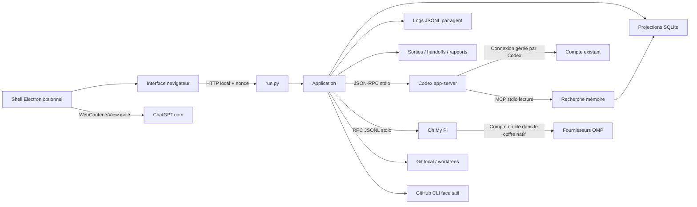

# Architecture locale

## Duplica : représentation native de l'utilisateur

`Application.duplica` supervise les sessions existantes et réutilise la file
TODO, les projections et `on-request`. Le service démarre désactivé. Activer une
portée n'élargit ni le sandbox de l'agent ni ses outils. La priorité des portées
est global → projet → workflow → tâche → agent ; une valeur explicite plus
locale remplace l'héritage. Pause/Stop/contrôle humain imposent un arrêt global
des interventions, indépendamment des portées. Les benchmarks sont exclus.

- `server/duplica.py` : cas d'usage, supervision sérialisée, requêtes humaines,
  contexte, watchdog, continuation et reprise explicite.
- `server/duplica_policy.py` : classification conservatrice des permissions,
  confinement des chemins et réponses connues. Commande composée ou inconnue,
  autorisation réseau/globale et décision contradictoire → utilisateur.
- `server/duplica_backend.py` : port d'agent et adaptation aux sessions de la
  plateforme ; Codex utilise ses événements natifs, sans credentials copiés.
- `server/computer.py` : observation, actions sur observations consommables,
  captures hashées, bridge local et invalidation par génération.
- `desktop/computer.cjs` : capturePage, inventaire de contrôles visibles, clics
  et saisies réels Electron. Aucun JavaScript arbitraire fourni par l'appelant.
  Le navigateur de recette est local, isolé et bloque les destinations distantes.
- `server/duplica_verification.py` : critères de fichiers, processus de tests
  sans shell (60 s), build et parcours GUI avec attentes visibles.
- `server/duplica_memory.py` : miroirs privés du contexte, des décisions,
  métadonnées d'agents, état, observations et événements sous `.atelier/duplica/`.
- `server/duplica_telegram.py` : relais explicitement activé, compte privé
  autorisé, offset persistant, décisions ponctuelles et messages importants.
- `web/duplica.js` : indicateur global, manager, contextes, permissions,
  missions, décisions, timeline, preuves et reprise de contrôle.

Les API `/api/duplica/*` suivent les mêmes contrôles Host/Origin/nonce que les
autres API. Le shell desktop poll les actions puis revalide la génération avant
une interaction. Une observation dure 20 s et ne sert qu'une fois. Un effet
incertain n'est pas rejoué. Une fenêtre modale bloque les contrôles derrière elle.
Chaque action confirmée conserve ses captures avant/après dans l'audit local.

La recette d'une mission est explicitement configurée par l'utilisateur ; son
texte ne devient pas une permission. La supervision conserve la tâche réservée
pendant vérification/correction, puis la file la passe **En revue**. Le statut
Duplica **Vérifiée** correspond aux contrôles définis et ne remplace pas la
recette humaine. Les critères non exécutés restent visibles et empêchent la fin.
Les relances réutilisent le même agent et la même mission, avec une limite
enregistrée. Aucun scheduler concurrent supplémentaire n'est créé.
Une erreur d'accès ou un outil indisponible demande des preuves, sans correction
automatique du code. Les définitions de recette sont identifiées : une recette
finissant après redéfinition ne valide pas les nouveaux critères, et les anciens
bugs remplacés restent historiques, distincts de bugs corrigés et retestés.

Le redémarrage met Duplica en pause, expire les demandes et interrompt les
recettes ; la mémoire et les rapports restent sur disque. L'utilisateur reprend
explicitement après inspection. Un silence déclenche un diagnostic demandé,
jamais un redémarrage automatique aveugle.

Le contrôleur livré couvre Atelier et les applications web locales. La portabilité
du contrat permet un adaptateur Windows/Computer Use supplémentaire ; Excel,
les fenêtres externes et les TUI externes ne sont pas présentés comme automatisés.
Les PTY fournissent seulement PID, ouverture/fermeture et activité de sortie.

## Structure

- `run.py` : HTTP loopback, nonce local par lancement, contrôle Host/Origin, routes et fichiers statiques en liste blanche.
- `server/app.py` : sessions, projections, autorisations, fichiers, worktrees, orchestration, benchmarks et rapports.
- `server/codex.py` : handshake `initialize`/`initialized`, corrélation des réponses JSON-RPC, événements et arrêt des processus.
- `server/omp.py` : transport JSONL OMP, événement ready et réponses corrélées ; catalogue découvert par `omp models --json`.
- `server/omp_session.py` : adaptation des événements observables, tokens, outils hôtes et approbations de fichiers.
- `server/terminal.py` : validation et préparation des terminaux natifs Codex/OMP ; commande littérale sans interpolation d’entrée utilisateur.
- `server/task_queue.py` : réservation exclusive des TODO et du dossier pour le travail automatique, affectations et reprise manuelle après interruption.
- `server/context.py` : fichiers de contexte explicitement choisis, bornes et aperçu distinct de l'historique natif.
- `server/canvas.py` : documents de conception JSON bornés, références projet et contrôle de révision ; aucune exécution.
- `server/session_report.py` : métadonnées factuelles JSON et résumé Markdown/YAML avec références aux preuves.
- `server/tariffs.py` et `server/processes.py` : tarifs saisis/sourcés et inventaire Windows d'exécutables, sans attribution fictive d'activité.
- `server/store.py` : objets SQLite, journal JSONL ajouté sans réécriture, masquage de motifs connus, hashes d’artefacts.
- `server/memory_mcp.py` : `memory_search` et `memory_read`, lecture uniquement et filtre projet/utilisateur.
- `web/core.js` : état partagé, navigation, API et rendu central avec préservation des champs/scroll.
- `web/views.js` : vues qui projettent cet état ; pas de données d’activité fictives.
- `web/cockpit.js` : graphe, inspecteur, connexions et consommation par fournisseur/consommateur/tâche/modèle/requête.
- `web/chat.js` : conversations, panneau de contexte, configuration des skills/fichiers et estimation du brouillon.
- `web/workbench.js`, `web/design.js`, `web/webchat.js` : plans/notifications/quotas/coûts, canvas LogicFlow et ressources autour du navigateur réel.
- `desktop/main.cjs` et `desktop/preload.cjs` : shell local et IPC minimal ; aucun preload distant. Profil de navigateur privé.
- `web/forms.js` : formulaires, catalogue, skills et sélection du dossier/worktree.
- `web/app.js` : actions, soumission, raccourcis et rafraîchissement toutes les 1,8 secondes.
- `web/style.css` : variables de design, layouts, états, responsive, réduction du mouvement.

Les fichiers JS se chargent avec `defer` dans l'ordre de `web/index.html`. La logique frontend reste en JS natif ; le canvas utilise un bundle ESM LogicFlow produit par `npm run vendor`. Le shell optionnel nécessite Electron. Les scripts frontend partagent des variables lexicales ; une migration en modules ES pourra accompagner l'extension des adaptateurs.

## Sessions et permissions

Un processus app-server par agent, plus un processus de découverte. `account/read` fournit le mode de connexion sans extraction de credentials. `model/list` fournit modèles et efforts : toutes les pages sont parcourues avec `includeHidden=true`. Les entrées masquées sont identifiées comme catalogue étendu. Son catalogue n’est pas une preuve d’accès effectif ni une liste de tous les modèles ChatGPT : seul un tour réussi confirme l'accès pour la requête.

Chaque session démarre/reprend avec `cwd`, `sandbox` et `approvalPolicy=on-request`. `features.multi_agent=false` désactive la délégation native ; les workflows sont pilotés par Atelier. L’application n’offre pas de bypass. Les demandes de commande, fichiers, permissions et questions sont relayées à l’utilisateur. Les requêtes serveur inconnues reçoivent une erreur explicite.

Seuls `turn.status=completed` et les événements correspondants attestent la fin technique d’un tour. Un état `ready` veut dire que l’agent peut recevoir un message. Ni l’un ni l’autre ne vaut validation du résultat.

Le profil Codex reste l’autorité de sandbox, avec les politiques éventuellement gérées sur la machine. La mémoire MCP est en lecture seule, mais le sandbox d’un agent autorisé à écrire du code n’est pas une garantie d’isolation absolue de toutes les données locales. L’app n’est pas un environnement multi-utilisateur hostile.

## Orchestration

Par défaut, code et équipes exécutent d'abord un diagnostic/plan en lecture seule. Un tour code terminé mène à `waiting_plan`, sans implémentation. Le clic explicite d'approbation crée un nouveau tour avec le sandbox choisi ; refus/interruption libère la TODO. Les équipes attendent la validation de leur plan avant le premier spécialiste. Les tours de diagnostic ne disposent pas de l'écriture OMP et les tours Codex portent un `sandboxPolicy` explicite. Le mode sans plan est une option humaine visible, pas un fallback automatique.

Duo : implémentation puis review facultative en lecture seule. Orchestration : plan JSON contraint, 1 à 20 tâches au maximum configuré, implémentation séquentielle, review et synthèse facultatives. Même worktree partagé pour le workflow. Chaque enfant a sa session, son output et son handoff ; le parent reçoit des extraits bornés et des références de fichiers.

Chaque rôle possède son moteur (`codex` ou `omp`), son modèle et son effort validés contre le catalogue découvert. Ajouter/retirer de 1 à 8 workers avec nom, rôle et consignes. Les tâches utilisent cycliquement ces configurations ; tous les rôles configurés ne sont donc pas forcément lancés. Le worker ne peut pas dépasser la permission du workflow ; planification, review et synthèse restent en lecture seule. Reconfigurer prépare un nouveau lancement, sans modifier l'exécution historique. Le graphe adapte sa hauteur à l'équipe et distingue rôles prévus et sessions actives.

Les lancements automatiques (`startWork=true`) prennent un bail de tâche et de dossier. Un workflow prend une TODO compatible puis termine ; un agent indépendant peut continuer la file. Les lancements manuels hors file et les benchmarks n'utilisent pas ce bail : des worktrees distincts restent nécessaires pour des travaux concurrents. Aucun scheduler par sous-tâche, graphe de dépendances ni cleanup automatique.

## Chat Et File TODO

Cette section décrit la conversation **CLI**, désormais distincte du mode **ChatGPT**. Le vrai site n'est pas un moteur `executionMode=chat` : il est ouvert dans WebContentsView ou une fenêtre externe, sans injection de mémoire automatique, lecture de credentials, récupération des tokens internes ou contrôle DOM du site. Les ressources sont copiées/déposées volontairement par l'utilisateur. Les résultats asynchrones d'exploration portent une génération et un projet ; une réponse périmée ne remplace pas la plus récente.

`executionMode=chat` impose lecture seule et désactive le backlog ; `code` autorise l'activation explicite de la file. L'UI de création coche la file par défaut pour le travail, jamais pour le chat. L'API sans `startWork` n'envoie pas de mission automatiquement. Les agents déjà prêts peuvent activer la file via une tâche affectée ou l'action de session.

La prise de TODO est atomique sous verrou de file et de stockage : projet, affectation, priorité puis date ; une tâche et un dossier normalisé ne sont réservés qu'à un propriétaire. Les TODO futures réveillent les agents abonnés. Sans TODO/running ni sélection préalable, la mission initiale devient une tâche explicite. Un tour terminé passe à `review`, `UNVERIFIED`, jamais `done`. Échec/interruption restitue la TODO et arrête la file sans retry implicite. Arrêter la file laisse le tour courant finir ; Interrompre coupe le tour. Redémarrage libère les baux et désactive les abonnements : reprise explicite nécessaire.

Le contexte éditable peut changer modèle/effort, noyau mémoire, skills et fichiers de projet. La session native est relancée/reprise sans inférence ; son historique reste conservé. Fichiers : 8 maximum, 64 Ko chacun, 40 000 caractères au total, UTF-8, confinement projet et exclusions sensibles. Ils sont relus à chaque envoi, ajoutés au prompt comme données et listés dans la requête. Les instructions réellement transmises sont visibles ; les skills demeurent des références accessibles dans le dossier de session.

Le panneau montre `tokenUsage.last` entrée/réponse/cache et `total`, ainsi que `modelContextWindow` seulement si reçu. La jauge représente le dernier appel, pas une mesure complète du contexte natif. Brouillon/fichiers : estimation locale caractères/4, hors historique natif et outils, jamais coût facturé. L'API ne prétend pas exposer tout l'historique interne ni la compaction. Les fichiers sélectionnés sont relatifs au projet, pas à un environnement ChatGPT `/mnt/data`.

## Mémoire

Le noyau est chargé dans les instructions au démarrage/reprise. Sa taille combinée projet/utilisateur est bornée à 4 000 caractères, avec garde supplémentaire lors de la composition. La réserve est consultée par mots via MCP, extraits de 600 caractères et lecture d’un souvenir de 6 000 caractères maximum. Ce n’est pas de l’embedding sémantique.

Seul l’utilisateur valide les souvenirs dans la V1. Aucun outil MCP de mutation. Les journaux ne sont pas automatiquement promus en mémoire.

OMP reçoit le noyau et les références aux skills accessibles dans son dossier de travail, mais pas le MCP de réserve. Une sélection de skill absente du worktree fait échouer le démarrage au lieu de lui donner un accès hors périmètre.

## Oh My Pi et terminal

Un processus OMP par session, démarré sans outils natifs, extensions, LSP, règles ni skills automatiquement chargés. Seuls les outils hôtes `atelier_read` et, en mode écriture projet, `atelier_write` sont enregistrés. Atelier vérifie la liste des outils actifs. Lecture et écriture résolvent les chemins dans le dossier de session et excluent les répertoires privés et `.env`. Pas de shell, de MCP natif ni de délégation dans cet adaptateur.

Une écriture demande une approbation Atelier avec aperçu ; les arguments sont conservés uniquement en mémoire jusqu’à la réponse. Le chemin et le hash du contenu précédent sont revalidés avant écriture. Une modification concurrente, un refus ou une annulation n’écrit rien. Le mode global OMP reste `always-ask` ; l’autorisation des deux outils hôtes ne remplace pas ces contrôles. L’arrêt expire les approbations en attente.

Le pont utilise le protocole JSONL v1. Les erreurs et frames fragmentées non prises en charge échouent explicitement. Le schéma JSON demandé au planificateur est une instruction de prompt OMP, pas une contrainte de génération native. Les résultats sont ensuite analysés/validés par Atelier. Le texte de raisonnement n’est pas exporté dans les événements Atelier ; les fichiers de session natifs OMP, privés, ont leur propre contenu et restent dans `.atelier/`.

`get_login_providers` expose uniquement les noms et états d’authentification. L’action Connecter prépare un terminal `omp /login <identifiant>` sans outils, laissant le compte OAuth ou la clé API dans le coffre natif. L’accès aux modèles est découvert après actualisation ; aucun secret n’est demandé par le formulaire web.

Le terminal d’agent est distinct des sessions suivies. Son rôle, son modèle, son effort et ses variantes plan/slow/smol sont validés ; seuls les outils natifs de lecture sont proposés. OMP n’offrant pas ici de sandbox OS équivalent à Codex, l’écriture est refusée dans ce parcours externe. Il nécessite la confirmation de lancement, n’envoie pas automatiquement la mission, et ses tokens ne sont pas importés. Le lancement Windows utilise une commande PowerShell encodée avec arguments littéraux.

## Consommation

Les quotas du compte viennent de `account/rateLimits/read` et de ses notifications : buckets primary/secondary, pourcentages utilisés et dates de réinitialisation, partagés par compte. Ils ne sont pas additionnés aux tokens des requêtes. La durée `turn.durationMs` native inclut les attentes et reste distincte du temps écoulé depuis création. Les tarifs manuels sourcés/datés permettent un équivalent USD par million de tokens ; absence de cache/mesure/tarif requis ou cache écrit non tarifé signifie coût inconnu. Jamais une facture déduite de ChatGPT.

Le terminal Codex est également proposé : modèle/effort découverts, `--sandbox` explicite, `--ask-for-approval on-request`, délégation native désactivée, rôle transmis comme instructions. Les deux terminaux externes restent non suivis, sans prompt automatique. Une préparation ou ouverture ne prouve ni travail ni consommation.

Chaque prompt crée une projection `request` avec session/consommateur, tâche, workflow, fournisseur et modèle. Les événements d’usage cumulé sont comparés au baseline avant tour : répéter un événement ne double pas les tokens. Un compteur absent ou réinitialisé reste inconnu. Les anciennes mesures de session apparaissent séparément, après soustraction des mesures déjà attribuées ; aucune attribution historique n’est inventée.

OMP normalise l’entrée avec cache lu et écrit, expose le cache lu séparément et déduplique les messages. Seuls les nombres reçus sont agrégés. Le coût facturé et l’équivalent API restent inconnus ; aucun tarif ni estimateur OMP n’est affiché comme une dépense réelle. Le CSV neutralise les cellules pouvant être interprétées comme une formule.

## Benchmarks

Dataset JSON : `title`, `prompt`, `expected`, hash SHA-256, modèle, effort, répétitions et juge. Chaque candidat ouvre une session neuve, lecture seule, mémoire Atelier désactivée. Les instructions natives du CLI peuvent toujours s’appliquer : cette isolation ne constitue pas une VM vierge. Le prompt demande de ne pas utiliser les outils ; il n’est pas une interdiction technique de tous les outils Codex.

Oracle exact : compare les chaînes après `strip()`. Juge modèle : session distincte, verdict JSON `passed`, `reason`, `evidence`; un avis de modèle, pas une validation de runtime. Générateur de cas : résultat proposé à l’utilisateur, aucune campagne déclenchée sans son lancement explicite. Budget de campagne : 50 candidats maximum, les reviews et la génération s’ajoutent.

## Audit et récupération

`report.json` est le format canonique compact des faits ; `report.md` contient un frontmatter YAML et des liens/hash vers sorties et logs. Le résumé n'est pas une nouvelle transcription et sa génération ne consomme pas d'inférence. Les notifications sont des projections persistantes liées à la session, distinctes du journal. Le launcher Windows peut transmettre les racines publiques Windows par `CODEX_CA_CERTIFICATE` à Codex sans désactiver TLS ni copier des secrets.

Événements privés de raisonnement exclus ; appels/résultats observables conservés. Les tokens sont enregistrés tels que rapportés, avec cache lu inclus dans l’entrée. Les sorties et handoffs sont des instantanés de session ; le journal reste la trace complète. Les rapports indiquent `UNVERIFIED` et distinguent déclarations et résultats d’outils.

Après interruption du serveur : sessions arrêtées, demandes périmées retirées, campagnes/workflows `interrupted` avec résultats partiels. Reprise manuelle des sessions par `thread/resume`. Pas de reprise automatique de campagne, pas de replay des effets externes.

Les requêtes en cours passent également à `interrupted`. Pour OMP, la reprise utilise son fichier de session natif ; les nouveaux prompts créent une nouvelle requête de consommation.

## Duplica : conversation et compteurs CLI

`DuplicaDiscussion` conserve une session en lecture seule par projet et les
livraisons de ses messages. Atelier et Telegram utilisent cette même session ;
le rôle Duplica reste exclu de la supervision des agents de travail. Une
livraison interrompue n'est pas rejouée au redémarrage. Le choix Travailler pour
moi crée une mission et une portée projet, avec permissions explicites.

`TelegramRelay` associe un code temporaire à un expéditeur privé. `telegram_vault`
chiffre le token avec DPAPI Windows ; `process_environment` empêche sa
transmission aux enfants exécutant les agents, terminaux et recettes. Les
réponses de discussion rejoignent l'outbox persistante du relais.

`NativeUsage` lit uniquement métadonnées et événements de compteurs des
journaux Codex dont la source est `cli`. Les PTY sont enregistrés par identifiant,
projet, PID et date. Une association ambiguë exige un choix ; un thread ne peut
être attribué à deux panneaux. Ces compteurs de session entière sont distincts
des mesures par requête des sessions app-server. Les quotas restent partagés
par compte. Les limites de découverte et la recette sont dans le rapport UX.
