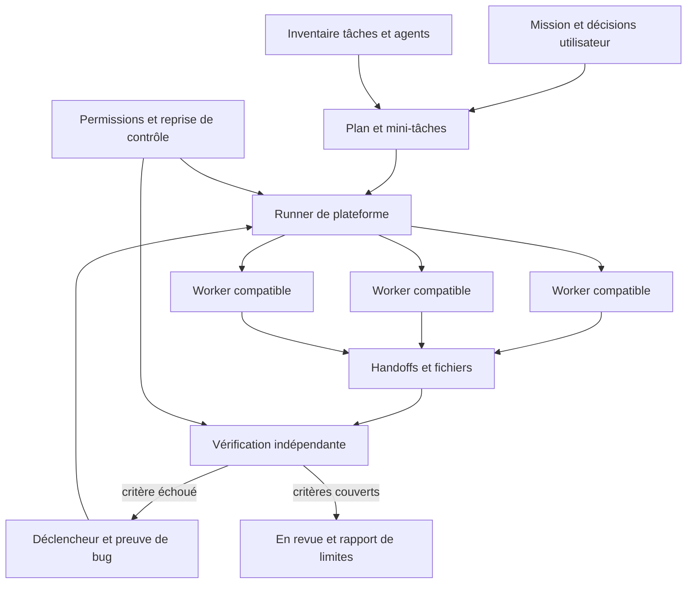

# Harnais de travail Duplica

Duplica transforme une mission autorisée en travail attribué, observe les résultats et fait corriger les critères qui échouent. La planification du modèle et les skills donnent des consignes ; le moteur de plateforme réserve les tâches, démarre les sessions et applique les limites. Un skill n’ajoute ni tool, ni permission, ni preuve d’exécution.

Les demandes sources sont [la mission](references/2026-10-02-duplica-mission.md), [l’intégration transversale](references/2026-10-02-duplica-platform.md), les [retours UI](references/2026-10-03-feedback.md) et les [retours architecture/activité](references/2026-10-03-architecture-memory-feedback.md). Ces références sont des données de conception. La demande actuelle et les permissions configurées déterminent ce qui peut être exécuté.

## Responsabilités

| Couche | Responsabilité | Ce qu’elle ne prouve pas seule |
|---|---|---|
| Demande/mémoire | objectif, préférences validées, décisions sourcées | permission d’un exemple présent dans un document |
| Planification | tâches, dépendances, fichiers et critères | démarrage ou réussite des agents |
| Runner/workflow | réservations, concurrence, sessions, pause/arrêt, persistance | acceptation de la livraison |
| Worker | changements autorisés, handoff et contrôles disponibles | indépendance d’une validation annoncée par lui-même |
| Verifier/ComputerController | recette configurée, sorties, observations/actions | présence d’un outil desktop externe ou couverture de toute l’application |
| Revue utilisateur | acceptation finale du travail | exécution d’un test non observé |

La délégation se fait par les sessions enfants de la plateforme. Les workers ne lancent pas leurs propres arbres de sous-agents. La concurrence tient compte des dépendances et des fichiers de travail ; une consigne textuelle ne remplace pas la réservation du moteur. Un seul opérateur agit sur une fenêtre donnée.

## Contrat de lancement

Le point d’entrée interne est `Duplica.runner.launch(changes)`. Le lancement reçoit le projet et une mission explicite, ou le travail compatible du backlog sélectionné. Les identifiants sont ceux du store du projet, sans catalogue artificiel.

| Champ | Usage |
|---|---|
| `projectId` | projet et périmètre local |
| `goal` | objectif donné par l’utilisateur ; absence possible pour sélectionner le backlog |
| `model`, `effort` | configuration validée à partir du catalogue fournisseur ; aucun remplacement silencieux |
| `sandbox` | `read-only` ou `workspace-write`, selon le choix explicite |
| `maxParallel` | 1 à 8 workers, défaut 4 |
| `maxTasks` | 1 à 20 mini-tâches par plan, défaut 12 |
| `maxContinuations` | 0 à 10 corrections/continuations, défaut 3 |
| `continuous` | continuer le travail compatible du périmètre, défaut `true` |
| `tasks` | plan facultatif préétabli ; sinon planification par le workflow |
| `recipe` | critères et commandes/actions de vérification indépendante |

Une mini-tâche du plan contient `title`, `prompt` et peut définir `id`, `dependsOn`, `files`. La consigne donne le livrable, les critères et la preuve attendue ; les métadonnées donnent les dépendances et les surfaces à protéger. `files` pilote la compatibilité des tâches dans le scheduler ; ce n’est pas une sandbox système par fichier. Le sandbox de session et la discipline du worker restent nécessaires. Les identifiants de dépendances appartiennent au même plan. Un cycle, un doublon ou un chemin hors projet doit être rejeté plutôt qu’exécuté en supposant une intention.

Les limites ne représentent pas un quota de tâches à remplir. Une mission simple peut n’exiger qu’une tâche. « Travailler en continu » signifie traiter du travail utile autorisé puis attendre lorsqu’il n’en reste pas. Cela ne génère pas de nouveaux objectifs ni de faux agents actifs. Les mini-tâches synthétiques de recette restent dans la fixture isolée.

Le profil `on-request` demeure appliqué par `codex app-server` en stdio. La configuration Duplica peut traiter les catégories déjà déléguées ; elle n’élève pas un sandbox lecture seule. Les modèles et efforts viennent de `model/list`. Le choix explicite de Damien pour la mission en cours reste GPT-6.1-Sol, effort max ; aucun nom de modèle n’est ajouté au catalogue produit par ce document.

## État et reprise

Le store persiste un `duplicaRun` avec son `id`, `workflowId`, `status` et ses `taskIds`. Le workflow conserve plan, étapes et sessions enfants ; une étape relie au minimum tâche, titre, session et horodatages utiles. Les événements fournisseur restent la source d’activité et de consommation. Un état `ready` ou un PTY vivant ne veut pas dire qu’un tour est en cours.

Le runner observe le workflow, applique les validations de plan déjà déléguées et attend les workers. Une fin de tour déclenche l’inspection des résultats ; la recette indépendante décide quels critères ont effectivement été vérifiés. Un défaut peut produire une correction bornée avec son déclencheur précis. Une permission non déléguée, un outil absent ou une limite atteinte reste visible avec son motif.

La pause, l’arrêt et la reprise de contrôle arrêtent les nouvelles attributions et invalident les actions GUI pendantes. Un redémarrage du serveur conserve les traces et le travail restant ; il ne rejoue pas automatiquement des effets interrompus. La reprise explicite passe par l’action de travail avec `resumeRunId` et, si nécessaire, une nouvelle `recipe` ; elle conserve modèle, effort et sandbox du run et réinspecte la disponibilité de la tâche. Le runner utilise Codex app-server ; les autres fournisseurs du cockpit ne sont pas implicitement compatibles. Les données privées sous `.atelier/` et les worktrees restent conservés.

La fin technique place les tâches **En revue**, avec validation distincte. Le dossier reste réservé pendant la vérification indépendante pour empêcher une autre tâche de la file de modifier le même checkout. La réservation appartient à un workflow et une configuration de critères précis ; une ancienne vérification ne libère pas un nouveau cycle. Les portées conservent l’héritage global → projet → workflow → tâche → session : une exclusion effective du workflow interrompt son runner.

Sans recette définie ou avec un contrôle non exécuté, le run reste **Preuves manquantes** et attend des critères complétés. La poursuite du backlog reprend après une recette couverte et les permissions nécessaires. Les noms exacts des états et endpoints UI suivent l’implémentation ; ils ne sont pas à déduire du diagramme. Les [preuves et limites constatées](audit/2026-10-03-duplica-harness.md) distinguent cette validation fictive de l’accès au modèle réel.

## Skills et injection

| Rôle | Skill | Usage ciblé |
|---|---|---|
| Planner | [duplica-mission-planner](../skills/duplica-mission-planner/SKILL.md) | intention, inventaire existant, tâches/dépendances/fichiers/oracles |
| Supervision | [duplica-work-supervisor](../skills/duplica-work-supervisor/SKILL.md) | attribution compatible, événements, attentes et reprises bornées |
| Worker | [duplica-worker-handoff](../skills/duplica-worker-handoff/SKILL.md) | périmètre reçu, preuves, limites et résultat exploitable |
| Vérification | [duplica-quality-loop](../skills/duplica-quality-loop/SKILL.md) | preuve indépendante, bug, correction et retest |

La bibliothèque du projet est découverte par `SlashCommands.catalog`, avec plafonds de 500 dossiers/80 commandes et sans suivre les symlinks. Les racines `skills/` et `.agents/skills` sont examinées avant l’exploration générale, qui exclut `build/`, `dist/` et les dépendances déjà ignorées. Sur ce dépôt, l’ancien scan général en premier atteignait 500 dossiers dans un bundle sous `build/` avant de voir un seul skill. Les entrées `skills/duplica-*/SKILL.md` restent donc accessibles indépendamment de ces artefacts de compilation. La découverte ne signifie pas qu’un agent les a lus.

Pour la sélection manuelle de skills du projet, `skills` reçoit les chemins relatifs ; `App.instructions` les traduit en chemins à lire. La limite existante est huit skills par session. Le runner utilise en plus `_skill(name)` pour charger le contenu des skills connus depuis son propre dépôt : planner et supervisor dans le contexte de mission, worker-handoff dans la consigne des workers et quality-loop pour la vérification. Ce chargement permet d’utiliser le harnais sur un autre projet sans y copier la bibliothèque. Il ne transforme pas un chemin absolu arbitraire transmis par le client en skill de confiance. Le contenu du skill ne modifie jamais les permissions.

L’appel `/duplica-mission-planner <demande>` développe le skill dans une discussion qui prend en charge les slash commands du projet. C’est un mode de sélection explicite, pas un lancement de runner. Ne pas confondre cette commande avec une autorisation d’implémenter un plan en lecture seule.

## Vérifier comme Damien

Le harnais conserve ses préférences validées et les critères du parcours, au lieu d’imaginer sa réponse. Pour un écran de navigation, « le nom est accessible » et « le nom est visible » sont deux critères. Le vérificateur observe la barre ouverte/repliée, survole ou focalise l’icône, regarde l’aide et clique pour constater la destination. L’exemple Architecture vient de retours concrets ; il ne demande pas de reconstruire toute l’architecture du code.

Le skill de qualité route vers [atelier-ui-explorer](../skills/atelier-ui-explorer/SKILL.md), [atelier-browser-regression](../skills/atelier-browser-regression/SKILL.md), [atelier-desktop-regression](../skills/atelier-desktop-regression/SKILL.md) ou [atelier-accessibility-check](../skills/atelier-accessibility-check/SKILL.md). Chaque recette conserve préconditions, action, attendu, observé, captures/sorties et révision. Une correction rejoue le même déclencheur puis une variante utile. La quantité de tests ne remplace pas la couverture des critères.

Les recettes internes `MissionVerifier` acceptent des critères fichiers, des commandes `build`/`tests`/`application` sous forme de listes d’arguments sans shell, et des gestes GUI configurés dont `hover`. Une tâche sans interface peut définir explicitement `guiNotApplicable: true` ; une tâche sans compilation peut définir `buildNotApplicable: true`. Ces choix expriment le périmètre de recette, pas un test exécuté. Un retour `not_run` reste une limite et ne devient pas `pass`. Un contrôleur absent permet de continuer les vérifications indépendantes, mais le parcours GUI demeure non vérifié.

Le `ComputerController` livré cible `platform` et `local-browser` via le bridge Electron ; `externalDesktop` reste faux. Le survol déplace la souris dans la fenêtre via une observation fraîche, comme les clics protégés contre les observations périmées. La présence d’un skill computer-use dans le dépôt n’ajoute pas un contrôleur d’autres applications. Les preuves du harnais doivent indiquer l’outil effectivement utilisé.

## Vérification du harnais en développement

Les fixtures emploient un fournisseur fictif et un état privé séparé. Elles doivent démontrer le lancement de plusieurs tâches indépendantes, l’attente d’une dépendance, la sérialisation de fichiers communs, les refus hors périmètre, l’effet pause/arrêt et la distinction entre fin de tour et preuve de test. Une petite mission HTML synthétique peut démontrer fichier produit, défaut visible, correction et retest sans appel d’inférence réel.

La validation de format des skills (`quick_validate.py`) et leur découverte attestent seulement leurs fichiers et métadonnées. Les tests backend/navigateur du runner attestent le flux local couvert. L’accès réel à un modèle, le contrôle d’applications externes et la recette humaine restent des preuves distinctes à rapporter sans les inventer.
