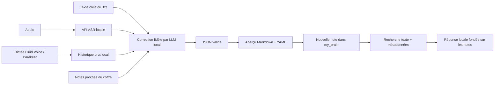

# My Brain — voix vers Obsidian

Vue **My Brain** dans Atelier, accessible par `#brain`. Les serveurs de
transcription et de correction sont locaux. Aucune session Codex, API distante
ou inférence de démonstration n'est lancée par cette vue.

## Déposer un fichier ou importer YouTube

Dans **Boîte vocale**, déposer les audio ou `.txt`, puis cliquer **Traiter la
dictée**. Plusieurs dépôts s'ajoutent à la sélection ; chaque fichier peut être
retiré séparément. Le texte collé reste conservé pendant un import YouTube.

Pour un dossier complet, le glisser sur la zone de dépôt ou cliquer **Choisir
un dossier**, puis **Traiter tout le dossier**. Les sous-dossiers sont parcourus
jusqu’à 40 niveaux, avec au maximum 1 000 fichiers visibles. Les fichiers sont
copiés un par un au service local, qui les traite successivement. Deux barres
séparent la réception des sources du traitement ; une erreur sur un fichier
n’empêche pas les suivants de continuer. Les éléments cachés sont ignorés et
les formats non pris en charge sont signalés individuellement.

Garder la page ouverte jusqu’à la fin de la copie. Ensuite, le traitement
continue tant que le service local et les modèles restent ouverts. Le lot et
ses erreurs restent enregistrés après rechargement de la page, même si ses
traitements sortent des 100 sources récentes. Si la copie est interrompue,
rechoisir le même dossier avec les mêmes chemins, tailles et dates reprend le
même lot sans renvoyer ses sources reçues. **Relancer** reprend un traitement
en erreur ; un redémarrage du service conserve la règle de relance explicite.

Le nom du fichier, son chemin relatif et sa date de modification sont conservés.
La date exposée par le navigateur est **la modification**, pas la création.
Le dossier surveillé natif conserve aussi la création lorsque le système la
fournit. Le fuseau du navigateur ou du système accompagne ces dates.

Dans **Depuis YouTube**, coller le lien d'une vidéo publique puis cliquer
**Importer et transcrire**. La file affiche téléchargement, transcription et
correction. Le MP3 conservé peut être téléchargé depuis l'aperçu, y compris si
la transcription échoue. Une relance réutilise un MP3 complet et vérifié.
L'URL, l'identifiant, le titre, la durée et l'empreinte de la source sont
conservés dans le suivi local ; le champ YAML `source` contient l’URL.

Les imports YouTube exigent `yt-dlp`, `ffmpeg` et `ffprobe`. Sur ce Mac,
`yt-dlp[default]` 2026.8.19 est installé dans le venv privé
`.atelier/tools/media` ; les exécutables FFmpeg déjà installés et Node fourni
sont référencés dans son `bin`. Le service cherche ce dossier, son dossier de
données, `ATELIER_BRAIN_MEDIA_BIN` puis PATH. Aucun cookie, compte YouTube,
configuration utilisateur yt-dlp ou composant JavaScript distant n'est lu.
Les playlists, directs en cours et vidéos demandant une connexion sont refusés.

Bornes YouTube : une vidéo de durée connue, **20 minutes**, MP3 **20 Mo**,
source téléchargée **40 Mo**, conversion temporaire **64 Mo**, délai **180 s**.
Seule la requête de téléchargement contacte YouTube ; ASR et correction restent
sur les serveurs locaux configurés. La disponibilité d'une vidéo reste celle
de YouTube ; une restriction apparaît comme erreur, sans import de cookies.

## Configuration

1. Dans LM Studio, charger le modèle voulu et démarrer le serveur dans
   **Developer**. Dans **My Brain → Configurer**, renseigner l'URL de base,
   habituellement `http://127.0.0.1:1234/v1`.
2. Cliquer **Détecter mes outils** : Atelier lit l’installation Fluid Voice,
   les coffres enregistrés dans Obsidian et le catalogue LLM local. Un unique
   modèle chargé de génération est sélectionné automatiquement. Le catalogue
   LM Studio `/api/v1/models` permet d’écarter les modèles d’embeddings ; sur
   un autre serveur compatible, le choix reste dans `/v1/models`.
   **Lire le catalogue** et le choix manuel restent disponibles. La correction utilise
   `POST /v1/chat/completions` avec sortie JSON structurée ; un mode JSON par
   consigne est disponible pour les serveurs sans schéma contraint.
3. Pour les dictées, choisir **Mes nouvelles dictées Fluid Voice**. Activer
   **Save Transcription History** dans Fluid Voice → Settings, puis la
   surveillance dans My Brain. Atelier lit uniquement les nouveaux `rawText`
   de l’historique local macOS, sans presse-papiers, journaux ou compte importé.
   Les anciennes dictées sont exclues à l’activation ; deux dictées de mots
   identiques restent distinctes grâce à leur identifiant Fluid Voice.
   Aucun serveur audio ou dossier d’arrivée n’est nécessaire pour ce parcours.
   Le modèle installé et observé sur ce Mac est **Parakeet TDT v3 multilingual**.
4. Pour les fichiers audio déposés, choisir **Avec Fluid Voice et son modèle
   installé** : son API native utilise `POST /v1/transcribe` avec un JSON
   contenant le chemin d'un WAV temporaire privé, et retourne `text`. Atelier
   prépare du PCM mono 16 kHz hors des dossiers macOS protégés et découpe en
   segments successifs de 240 secondes. La limite native FluidVoice 1.6.9 de
   300 secondes par fichier n'impose ainsi pas de découpage manuel jusqu'à
   20 minutes ; le texte total reste borné à 16 000 caractères. Les WAV sont
   supprimés après traitement ; la source originale reste dans `.atelier/`.
   Un mot peut être coupé à une frontière de segment : la fidélité reste à relire.
   Le port
   vient de ses préférences, avec le défaut documenté 47733. Cette API doit
   être démarrée dans Fluid Voice ; un fichier de poids présent ou une
   préférence activée ne prouve pas que le serveur écoute. Aucun modèle n’est
   téléchargé, compilé ou dupliqué par Atelier.
   Pour une autre API, renseigner l'URL **complète** du serveur ASR et son identifiant
   de modèle. Le connecteur demande `POST multipart/form-data` avec `file`,
   `model`, `response_format=json`, et attend `{"text":"transcription"}`.
   Si le logiciel ne fournit pas ce protocole, importer son texte ou ses `.txt`
   UTF-8. Le wrapper ASR et ses poids ne sont pas installés par Atelier.
5. Choisir le dossier **existant** du coffre `my_brain`, le sous-dossier des
   nouvelles notes (par défaut `Inbox/Voix`) et, éventuellement, le dossier
   d'arrivée des `.txt`/audio. Dans le desktop, **Choisir** ouvre le sélecteur
   natif. Depuis le navigateur sur macOS, **Choisir** ouvre désormais le
   sélecteur de dossier macOS ; annuler conserve le chemin précédent.
6. Choisir **Autoriser la création de nouvelles notes** pour écrire dans le
   coffre. Cocher l'export automatique pour écrire après chaque correction.
   Sinon, inspecter l'aperçu et cliquer **Créer dans Obsidian**.
7. Le LLM déduit le contexte de chaque dictée. Les trois notes les plus proches
   du coffre peuvent lui apporter titres et courts extraits de vocabulaire.
   Leur sélection lexicale et leurs chemins sont consultables dans le résultat
   et le YAML (`context_sources`). Contexte et glossaire personnalisés sont
   facultatifs, dans un panneau replié. Activer la surveillance
   seulement lorsque les connexions et dossiers sont prêts.

Les URL sont limitées à loopback. Pas de proxy ni redirection HTTP. Si le serveur
requiert une clé, indiquer le **nom** d'une variable du service
`ATELIER_BRAIN_*_API_KEY`, jamais sa valeur. La même variable est utilisée pour
les connecteurs compatibles ; l’API Fluid Voice ne reçoit aucun credential LLM.
Pour deux authentifications différentes, utiliser un
proxy local explicitement configuré. Aucun credential natif n'est lu/copied.

Sources du contrat LM Studio consultées le 3 octobre 2026 :
[endpoints compatibles](https://lmstudio.ai/docs/developer/openai-compat),
[sortie structurée](https://lmstudio.ai/docs/developer/openai-compat/structured-output).
Ces pages documentent le LLM ; elles ne garantissent pas un endpoint ASR.
Le connecteur Fluid Voice est fondé sur les sources officielles **v1.6.9** :
[inférence native](https://github.com/altic-dev/FluidVoice/blob/v1.6.9/Sources/Fluid/Services/LocalAPI/InferenceAPIController.swift),
[configuration du port](https://github.com/altic-dev/FluidVoice/blob/v1.6.9/Sources/Fluid/Services/LocalAPI/LocalAPIModels.swift),
[historique brut](https://github.com/altic-dev/FluidVoice/blob/v1.6.9/Sources/Fluid/Persistence/TranscriptionHistoryStore.swift).

## Traitement



Le prompt demande de conserver les idées, détails, noms, chiffres, opinions,
ton et langues. Il demande de transcrire sans jugement, conseil, résumé ni
réponse au contenu. Les passages ambigus restent signalés, et les instructions
présentes dans une dictée sont des données. Le modèle ne reçoit ni outils ni
accès au coffre. Atelier valide le JSON et sérialise lui-même le YAML ; le
modèle ne choisit pas de chemin de sortie.
Les notes proches sont des données de désambiguïsation : elles ne doivent
jamais ajouter des faits à la transcription. L’absence de notes proches ou de
glossaire n’empêche pas le traitement.
Le filtrage lexical exclut les mots-outils français et anglais afin qu’un
pronom courant ne suffise pas à sélectionner une note sans rapport. Les
métadonnées doivent être déduites de la transcription seule. Ce filtrage ne
garantit pas une pertinence sémantique ; les sources et tags restent à relire.

Le texte brut et la source restent conservés dans les données privées du service.
**Texte brut** est l’onglet par défaut. **Comparer avant / après** montre les
changements calculés à partir des deux textes ; **Proposition IA** montre la
version suggérée, jamais présentée comme validée. **Reprendre le texte** permet
de le modifier dans la zone de saisie avant un nouveau traitement. Si un
brouillon existe, un choix explicite permet de le conserver, ajouter le texte
ou le remplacer. Les fichiers sélectionnés restent en place.

Le prompt système envoyé à LM Studio demande de recopier le texte en l’absence
d’erreur ASR certaine, et de ne corriger que le plus petit fragment nécessaire.
Hésitations, répétitions, contradictions, dialogue, récit, pensées, conseils à
soi-même et phrases inachevées restent présents. Une incohérence de sens
n’autorise pas une réécriture ; le modèle ne prétend pas avoir écouté l’audio.

Le service calcule indépendamment un diff, sans se fier à la liste de
corrections déclarée par le LLM. Il signale changements de nombres/négations,
ajouts/suppressions et réécritures importantes. C’est un contrôle lexical, pas
une preuve de fidélité sémantique. Le texte original reste toujours la référence
exportée, suivi de la proposition IA séparée lorsqu’elle diffère. Les deux sont
affichés comme texte littéral dans Obsidian, pour qu’un commentaire Markdown
ou HTML dicté ne masque pas un passage.

Les nouvelles notes ont un nom dérivé de la date, du titre source et de
l’identifiant interne pour éviter les collisions. L’identifiant et les hashes
servent au suivi et à la protection des fichiers ; ils restent hors du YAML.
Les imports ne remplacent pas une note existante. La remise en forme explicite
sauvegarde note et données précédentes, conserve le chemin pour les liens, et
refuse de remplacer une modification manuelle ou un fichier concurrent.
Elle ne lance pas de modèle. Une intention persistée permet de reprendre une
publication interrompue avant la mise à jour de SQLite.

La surveillance **de dossier** est non récursive et attend une stabilité de deux secondes.
Elle conserve les fichiers source, ne rejoue pas automatiquement les échecs et
s'arrête sur un fichier invalide avec un message visible. **Pause** arrête les
nouveaux imports ; les traitements en file continuent. **Annuler** bloque la
publication locale d'une réponse tardive, mais ne garantit pas l'arrêt de
l'inférence HTTP déjà reçue par le serveur. Après redémarrage, la surveillance
est en pause et les travaux incomplets attendent une relance explicite.

## Nom, dates et en-tête YAML

Le schéma **My Brain v3** est un contrat de l’application : les mêmes 14 champs,
plats, dans le même ordre, avec des types stables. Les listes sont de vraies
listes YAML sur plusieurs lignes ; aucune structure JSON imbriquée ne remplit
les propriétés Obsidian. Les champs inconnus restent vides ou `null`, sans
valeur inventée. Les clés anglaises sont stables pour les outils ; le texte des
sujets/descriptions reste dans la langue de la source.

```yaml
---
schema_version: 3
title: '007 - Réflexions du 2026-10-03'
date: 2026-10-03
date_basis: 'filename'
source: 'Journal/007 - Réflexions du 2026-10-03.txt'
file_number: '007'
subject: 'Organisation personnelle'
description: 'Une réflexion sur mon rythme et des conseils que je me donne.'
content_types:
  - 'reflection'
  - 'self-advice'
topics:
  - 'organisation personnelle'
entities: []
tags:
  - 'organisation'
related_notes: []
language: 'fr'
---
```

Dans le coffre actuel, les types Obsidian sont fixés explicitement : titre et
numéro en Texte (même si leur valeur ressemble à une date ou un nombre), date
en Date, catégories/thèmes/entités/liens en Liste. Les autres propriétés et
réglages du coffre sont conservés. Les résultats anciens remis en forme
peuvent avoir description et catégories vides : la migration n’invente pas
ces informations et ne lance pas une nouvelle inférence.

Le **titre** conserve le nom sans extension, ou la date en l’absence de nom.
`subject` et `description` sont des propositions descriptives du LLM, jamais un
remplacement du texte. `source` garde le chemin relatif, le nom ou l’URL YouTube.
`file_number` est une chaîne pour préserver les zéros initiaux. Les sujets,
entités, tags et liens proposés restent à relire ; les tags purement numériques
sont exclus selon le format Obsidian.

`content_types` accepte plusieurs formes simultanément, dans cet ordre normalisé :
`reflection` (pensée/réflexion), `dialogue`, `story` (récit), `self-advice`
(conseil à soi), `idea`, `summary`, `daily-summary`, `meeting`, `task`, `other`.
Une liste vide signifie indéterminé. Une pensée ne devient pas une tâche par
supposition. `related_notes` contient des liens candidats retrouvés lexicalement,
pas des relations certaines.

Une date complète annoncée dans « résumé du 3 octobre 2026 » est prioritaire
pour `date`. Viennent ensuite le nom du fichier, l’enregistrement, la création,
la modification et l’import. `date_basis` vaut respectivement `summary`,
`filename`, `recorded`, `created`, `modified` ou `imported`. Les dates détaillées,
le fuseau, les candidats et leur provenance restent dans le suivi de l’application.
Les horodatages sont conservés en UTC, avec jour calculé dans le fuseau source ;
les dates calendaires explicites restent inchangées. Une date partielle ou
relative n’acquiert pas d’année ou de jour inventé. Les contradictions sont
visibles dans l’application et les points à vérifier de la note.

CLEF est maintenant identifié : **Cloudflare/CLEF**, compatible Jev/SystemOne.
Sa [fiche officielle](https://huggingface.co/Cloudflare/clef) décrit un modèle
de décision prenant `state` et des `questions` typées (`noul`, `choice`, `score`),
avec probabilités par option. Il n’impose aucun YAML et ne produit pas de
transcription libre. Plusieurs questions `noul` permettraient de reconnaître
plusieurs formes dans la même note. Le présent YAML est donc un choix My Brain,
pas un standard CLEF. Aucun CLEF n’a été installé ni appelé pour cette évolution.
La recherche demeure locale et lexicale ; les catégories viennent du LLM local
configuré, pas d’une décision CLEF simulée.

Sources officielles consultées le 3 octobre 2026 :
[propriétés Obsidian](https://help.obsidian.md/properties),
[tags Obsidian](https://help.obsidian.md/tags),
[API CLEF](https://developers.cloudflare.com/workers-ai/models/clef/),
[messages système LM Studio](https://lmstudio.ai/docs/developer/openai-compat/chat-completions),
[sortie structurée LM Studio](https://lmstudio.ai/docs/developer/openai-compat/structured-output).
JSON reste le contrat de transport interne validé entre LM Studio et Atelier ;
le document produit est bien du Markdown avec frontmatter YAML.

## Recherche et limites

**Explorer mon cerveau** recherche titre, chemin, texte original et YAML sans entraînement.
Les propositions IA non relues des notes v3 sont exclues de cette recherche et
du contexte automatique ; leurs marqueurs internes sont appariés et ne dépendent
pas de l’ordre des propriétés Obsidian.
**Demander au modèle** fournit les cinq premiers résultats, au maximum 4 000
caractères par note, puis présente la réponse et ses sources. Le modèle doit
citer les chemins et reconnaître l'information manquante. Les sources affichées
sont réellement retrouvées ; la qualité de la réponse reste celle du modèle.

La recherche actuelle est **lexicale**, sans embeddings, graphe appris ou
modèle RLCD. Le sens précis de RLCD reste à clarifier. Le YAML structure les
notes ; il n'entraîne pas à lui seul un système de prédiction.

Bornes : 20 fichiers seuls ou 1 000 fichiers par dossier, profondeur 40 niveaux,
chemin relatif 500 caractères et nom de fichier 200 caractères. 20 Mo par audio, 20 minutes par audio
avec Fluid Voice, 16 000 caractères par transcription, 4 000 caractères de
contexte et 4 000 de glossaire. Fluid Voice reçoit des segments de 240 secondes
préparés automatiquement ; au-delà des bornes, découper la source avant import.
Recherche : 2 000 fichiers Markdown
maximum, notes de plus de 256 Kio ignorées, dossiers cachés et symlinks exclus.
Historique projet : les 100 traitements les plus récents du stockage global
sont exposés dans l'état ; les anciens restent conservés sur disque.

## Recette reproductible

Utiliser un Python 3.10+ et Node disponibles ; sur ce Mac le Python système est
3.9, les runtimes fournis par Codex sont utilisés. Les commandes restent :

```sh
PYTHONDONTWRITEBYTECODE=1 python3 -m unittest discover -s tests -v
node --check web/brain.js
PYTHONDONTWRITEBYTECODE=1 python3 tests/brain_fixture.py --port 4354
# Dans une autre session, avec Playwright disponible :
node tests/brain_acceptance.cjs
# Sans Chromium installé, avec Electron du dépôt :
ATELIER_BRAIN_ELECTRON=1 node tests/brain_acceptance.cjs
# Recette de dossiers et dates, avec ses fournisseurs fictifs :
PYTHONDONTWRITEBYTECODE=1 python3 tests/brain_folder_fixture.py --port 4363
ATELIER_BRAIN_ELECTRON=1 node tests/brain_folder_acceptance.cjs
# Fidélité, comparaison et brouillon :
PYTHONDONTWRITEBYTECODE=1 python3 tests/brain_fidelity_fixture.py --port 4365
node tests/brain_fidelity_acceptance.cjs
```

La fixture crée ses propres notes, API et stockage sous `.atelier/`, sans
utiliser le coffre personnel. Redémarrer la fixture avant une nouvelle recette
complète. Les preuves et configurations synthétiques sont conservées dans
`.atelier/brain-browser-evidence/` et `.atelier/brain-browser-fixture/`.
