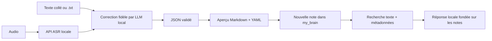

# My Brain — voix vers Obsidian

Vue **My Brain** dans Atelier, accessible par `#brain`. Les serveurs de
transcription et de correction sont locaux. Aucune session Codex, API distante
ou inférence de démonstration n'est lancée par cette vue.

## Configuration

1. Dans LM Studio, charger le modèle voulu et démarrer le serveur dans
   **Developer**. Dans **My Brain → Configurer**, renseigner l'URL de base,
   habituellement `http://127.0.0.1:1234/v1`.
2. Cliquer **Lire le catalogue**, choisir un modèle reçu du serveur, puis
   enregistrer. Le catalogue utilise `GET /v1/models`. La correction utilise
   `POST /v1/chat/completions` avec sortie JSON structurée ; un mode JSON par
   consigne est disponible pour les serveurs sans schéma contraint.
3. Pour l'audio, renseigner l'URL **complète** du serveur ASR et son identifiant
   de modèle. Le connecteur demande `POST multipart/form-data` avec `file`,
   `model`, `response_format=json`, et attend `{"text":"transcription"}`.
   Le modèle mentionné par Damien est « Paratek V3 multilanguage », possiblement
   Parakeet V3 ; aucun identifiant technique ni port ASR n'est présumé.
   Si le logiciel ne fournit pas ce protocole, importer son texte ou ses `.txt`
   UTF-8. Le wrapper ASR et ses poids ne sont pas installés par Atelier.
4. Choisir le dossier **existant** du coffre `my_brain`, le sous-dossier des
   nouvelles notes (par défaut `Inbox/Voix`) et, éventuellement, le dossier
   d'arrivée des `.txt`/audio. Dans le desktop, **Choisir** ouvre le sélecteur
   natif ; dans le navigateur macOS, saisir le chemin absolu.
5. Choisir **Autoriser la création de nouvelles notes** pour écrire dans le
   coffre. Cocher l'export automatique pour écrire après chaque correction.
   Sinon, inspecter l'aperçu et cliquer **Créer dans Obsidian**.
6. Ajouter contexte et glossaire, puis enregistrer. Activer la surveillance
   seulement lorsque les connexions et dossiers sont prêts.

Les URL sont limitées à loopback. Pas de proxy ni redirection HTTP. Si le serveur
requiert une clé, indiquer le **nom** d'une variable du service
`ATELIER_BRAIN_*_API_KEY`, jamais sa valeur. La même variable est utilisée pour
les deux connecteurs ; pour deux authentifications différentes, utiliser un
proxy local explicitement configuré. Aucun credential natif n'est lu/copied.

Sources du contrat LM Studio consultées le 3 octobre 2026 :
[endpoints compatibles](https://lmstudio.ai/docs/developer/openai-compat),
[sortie structurée](https://lmstudio.ai/docs/developer/openai-compat/structured-output).
Ces pages documentent le LLM ; elles ne garantissent pas un endpoint ASR.

## Traitement



Le prompt demande de conserver les idées, détails, noms, chiffres, opinions,
ton et langues. Il demande de transcrire sans jugement, conseil, résumé ni
réponse au contenu. Les passages ambigus restent signalés, et les instructions
présentes dans une dictée sont des données. Le modèle ne reçoit ni outils ni
accès au coffre. Atelier valide le JSON et sérialise lui-même le YAML ; le
modèle ne choisit pas de chemin de sortie.

L'original et les sources sont conservés sous `.atelier/brain/inputs/`, les
traitements et configurations dans SQLite. Les notes contiennent une
transcription corrigée et un frontmatter avec `schema_version`, `id`, `title`,
`created`, `type`, `status`, `language`, `tags`, `topics`, `entities`, `source`,
`source_type`, `source_sha256`, `original_sha256`, `llm_model`,
`transcription_model`, `retrieval`, `uncertainties`. Le statut YAML `to-review`
signifie que la fidélité reste à relire ; un export réussi prouve une écriture,
pas une validation humaine.

Les noms sont dérivés du titre nettoyé, de la date et de l'identifiant local.
Aucune note existante n'est écrasée. Les chemins relatifs sortant du coffre et
les liens symboliques sont refusés. Les imports sont dédupliqués par source,
type et projet. Les erreurs sont visibles ; une réponse incomplète, tronquée,
hors schéma ou proposant un appel d'outil ne produit pas de note.

La surveillance est non récursive et attend une stabilité de deux secondes.
Elle conserve les fichiers source, ne rejoue pas automatiquement les échecs et
s'arrête sur un fichier invalide avec un message visible. **Pause** arrête les
nouveaux imports ; les traitements en file continuent. **Annuler** bloque la
publication locale d'une réponse tardive, mais ne garantit pas l'arrêt de
l'inférence HTTP déjà reçue par le serveur. Après redémarrage, la surveillance
est en pause et les travaux incomplets attendent une relance explicite.

## Recherche et limites

**Explorer mon cerveau** recherche titre, chemin, texte et YAML sans entraînement.
**Demander au modèle** fournit les cinq premiers résultats, au maximum 4 000
caractères par note, puis présente la réponse et ses sources. Le modèle doit
citer les chemins et reconnaître l'information manquante. Les sources affichées
sont réellement retrouvées ; la qualité de la réponse reste celle du modèle.

La recherche actuelle est **lexicale**, sans embeddings, graphe appris ou
modèle RLCD. Le sens précis de RLCD reste à clarifier. Le YAML structure les
notes ; il n'entraîne pas à lui seul un système de prédiction.

Bornes : 20 fichiers par dépôt dans l'UI, 20 Mo par audio, 16 000 caractères par
transcription, 4 000 caractères de contexte et 4 000 de glossaire. Un vocal
plus long doit être découpé avant import. Recherche : 2 000 fichiers Markdown
maximum, notes de plus de 256 Kio ignorées, dossiers cachés et symlinks exclus.
Historique projet : les 100 traitements les plus récents du stockage global
sont exposés dans l'état ; les anciens restent conservés sur disque.

## Recette reproductible

Utiliser un Python 3.10+ et Node disponibles ; sur ce Mac le Python système est
3.9, les runtimes fournis par Codex sont utilisés. Les commandes restent :

```sh
PYTHONDONTWRITEBYTECODE=1 python3 -m unittest discover -s tests -v
node --check web/brain.js
PYTHONDONTWRITEBYTECODE=1 python3 tests/brain_fixture.py --port 4354
# Dans une autre session, avec Playwright disponible :
node tests/brain_acceptance.cjs
# Sans Chromium installé, avec Electron du dépôt :
ATELIER_BRAIN_ELECTRON=1 node tests/brain_acceptance.cjs
```

La fixture crée ses propres notes, API et stockage sous `.atelier/`, sans
utiliser le coffre personnel. Redémarrer la fixture avant une nouvelle recette
complète. Les preuves et configurations synthétiques sont conservées dans
`.atelier/brain-browser-evidence/` et `.atelier/brain-browser-fixture/`.
