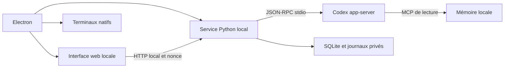

# Système Atelier

Atelier est une application locale de pilotage d'agents IA. Le shell Electron
affiche une interface web, héberge de vrais terminaux et démarre le service
Python local. Codex fournit l'exécution OpenAI par son protocole app-server.
Les formats de distribution, dépendances embarquées et mises à jour sont
décrits dans [RELEASE.md](RELEASE.md).

## Processus et composants

| Composant | Responsabilité |
|---|---|
| `desktop/main.cjs`, `desktop/preload.cjs` | Cycle de vie de la fenêtre, pont IPC limité et contrôle de l'origine des appels. |
| `desktop/service.cjs` | Démarrage du service empaqueté sur un port libre, disponibilité et arrêt lié au parent. |
| `desktop/pty.cjs` | Processus de terminal natifs et échanges avec xterm dans l'interface. |
| `desktop/updates.cjs` | État et préférences des updates, téléchargement et installation explicite. |
| `run.py` | Serveur HTTP loopback, routes, nonce par lancement et ressources statiques autorisées. |
| `server/app.py` | Sessions, projets, tâches, permissions, workflows et projections observables. |
| `server/codex.py` | Transport JSON-RPC stdio, corrélation des réponses et événements du processus Codex. |
| `server/store.py`, `server/memory_mcp.py` | Projections SQLite, journaux JSONL et consultation de mémoire en lecture seule. |
| `server/duplica*.py` | Discussion, supervision activable, contexte et vérifications de Duplica. |
| `web/` | Navigation, vues, disposition des panneaux et actions utilisateur. |

Le mode installé lance un service Python figé par PyInstaller et le payload
Codex natif redistribué avec ses licences. Il ne dépend pas d'une installation
utilisateur de Python, Node.js ou npm. Le développement peut utiliser un service
Python externe. Le processus figé conserve une entrée distincte pour la mémoire
MCP en stdio.

## Interface et sessions

**Chat** présente le site ChatGPT dans une surface navigateur séparée.
L'authentification web et l'authentification Codex restent distinctes.
**Agent** regroupe Duplica et les canaux de discussion. **Code** héberge de vrais
terminaux natifs. Les panneaux peuvent être déplacés et redimensionnés ; les
préférences de disposition sont associées à l'espace de travail.

Les sessions structurées gardent leur mission, projet, modèle, effort,
permissions, état et rapport. Les compteurs proviennent des événements natifs ;
une valeur absente reste inconnue. Un terminal ouvert ne prouve pas qu'un agent
travaille. La fin technique d'un tour ne constitue pas une validation humaine.

## Codex et permissions

Atelier utilise `codex app-server` en stdio. `account/read` et les parcours
natifs gèrent l'état de connexion ; l'application ne lit ni ne copie les
credentials Codex. Les modèles et efforts viennent de `model/list` paginé,
sans liste statique de modèles. Le catalogue ne garantit pas l'accès effectif
du compte à chaque modèle.

Les sessions conservent `approvalPolicy=on-request` et le choix explicite entre
`read-only` et `workspace-write`. Les demandes d'autorisation sont relayées à
l'utilisateur. La délégation native Codex est désactivée dans les sessions
structurées ; les workflows sont pilotés par Atelier. Une portée de supervision
Duplica n'élargit pas les permissions de l'agent.

L'accès HTTP local vérifie Host/Origin et le nonce. Les fichiers statiques sont
servis par liste autorisée. Le pont desktop vérifie la fenêtre, son origine et
la frame appelante. Atelier reste une application pour un utilisateur local,
pas un service partagé destiné à des utilisateurs hostiles.

## Données et reprise

Le profil installé contient les projections SQLite, journaux JSONL, rapports,
préférences et données privées sous `.atelier/`. Les projets restent dans leurs
dossiers. Ce profil est séparé de celui du checkout de développement ; aucune
migration automatique n'écrase les anciennes données.

Les mémoires validées restent distinctes des logs et de l'état d'exécution.
La réserve MCP expose uniquement la recherche et la lecture. Une clôture
conserve les preuves ; les worktrees ne sont pas supprimés automatiquement.
Après redémarrage, la reprise des travaux et de la supervision reste explicite.

## Intégrations facultatives et distribution

Les autres CLI, dont OMP, Claude Code et OpenCode, ainsi que Git, compilateurs
et dépendances des projets, restent externes à l'installateur. Leurs catalogues,
authentifications et capacités sont propres à chaque intégration.

Telegram est facultatif et nécessite un bot dédié associé à un compte privé.
L'association utilise un lien/QR temporaire ; les missions conservent le projet,
le modèle choisi et les permissions explicites. Les tokens du bot et les logs
restent dans le profil privé, hors des archives de distribution.

Les updates viennent des releases GitHub d'Atelier : vérification automatique
activée par défaut, téléchargement automatique au choix et redémarrage confirmé.
Les travaux actifs et terminaux ouverts bloquent l'installation. Le build exclut
les profils, secrets, logs et captures privés ; la publication retient seulement
les installateurs attendus, métadonnées, blockmaps et empreintes SHA-256.

L'état réel des builds, recettes par plateforme et limites de signature est
consigné dans le [rapport de livraison](audit/2026-10-02-desktop-release.md).
