# Ingénierie agentique avancée

## Coûts, benchmarking, specifications transmissibles, onboarding de projets, orchestration et exploitation

Ce document expose une méthode complète pour construire et exploiter des systèmes d’agents IA capables de travailler sur des projets longs, de transmettre leur travail, de mesurer leur coût, de comparer plusieurs moteurs de manière reproductible et de transformer une idée en produit testable.

Il ne s’agit pas d’un catalogue de modèles. Le sujet central est l’architecture : comment organiser la connaissance, les responsabilités, les preuves, les outils, les permissions et les coûts afin qu’une équipe d’agents reste observable, contrôlable et économiquement rationnelle.

---

## Table des matières

1. Mesurer réellement le coût d’un système agentique
2. Construire un benchmark agentique réellement reproductible
3. La specification comme programme intermédiaire
4. Budget de raisonnement, latence et débit
5. Choisir une architecture selon la boucle de feedback
6. Onboarding agentique d’un nouveau projet
7. Roadmap, specs et orchestration
8. Design system et maquette comme contrats de production
9. Permissions, sandbox et intégrité des agents
10. Git, worktrees et durée de vie des artefacts
11. Concevoir un cockpit d’observabilité
12. Mémoire, frictions et boucle de réflexion
13. Router les tâches vers le bon niveau de modèle
14. Valeur, confidentialité et stratégie local-first
15. Architecture de référence
16. De l’idée à une V1
17. Modèle de données d’une plateforme de benchmark
18. Atlas de schémas
19. Checklists, anti-patterns et glossaire

---


---

# 1 — Mesurer réellement le coût d’un système agentique

## 1.1 Pourquoi le nombre de tokens ne suffit pas

Dans un système agentique, dire qu’un run a consommé « beaucoup de tokens » est insuffisant pour piloter le système. Le nombre brut n’a de sens qu’une fois relié à quatre dimensions : la catégorie de tokens, le prix unitaire applicable au moment du run, le rôle de chaque agent et la valeur réellement produite.

Il faut donc distinguer au minimum :

```text
CONSOMMATION D'UN RUN
├── input neuf
├── output généré
├── écriture de cache
├── lecture de cache
├── appels de sous-agents
├── appels outils
└── retries / reprises
```

Deux sessions affichant chacune 5 millions de tokens peuvent avoir des profils économiques radicalement différents. La première peut surtout relire du cache peu cher ; la seconde peut produire beaucoup de sortie onéreuse ou réécrire fréquemment du contexte dans le cache.

La première règle est donc : **ne jamais réduire l’économie d’un run à un compteur global**.

## 1.2 Le coût doit être attribuable

Une session multi-agent doit pouvoir être ventilée par rôle. L’objectif n’est pas seulement de savoir combien coûte le système, mais où se crée le coût.

```text
RUN #184
│
├── cadrage / planification      8.20 €
├── implémentation              31.40 €
├── vérification                 2.10 €
├── reprises                     4.80 €
└── total                       46.50 €
```

Cette décomposition permet de répondre à des questions utiles :

- la planification est-elle disproportionnée ?
- la review coûte-t-elle peu mais évite-t-elle beaucoup de corrections ?
- l’implémentation pourrait-elle être confiée à un moteur moins cher ?
- la moitié du coût vient-elle de retries causés par une consigne ambiguë ?
- un sous-agent est-il systématiquement beaucoup plus cher que les autres pour la même classe de tâches ?

Le coût devient alors un **signal architectural**.

## 1.3 Coût théorique et coût réellement payé

Lorsque l’utilisateur paie un abonnement donnant accès à un quota, le coût marginal de chaque prompt peut ne pas être facturé directement. Pourtant, il reste utile de calculer un équivalent tarifaire API.

Il faut séparer clairement :

```text
coût_facturé_reel
≠
coût_equivalent_api
≠
part_du_quota_consommée
```

Ces trois métriques répondent à trois questions différentes :

- combien ai-je réellement payé ce mois-ci ?
- combien cette charge aurait-elle coûté en paiement à l’usage ?
- quelle fraction de ma capacité disponible ce run a-t-il consommée ?

L’erreur classique consiste à mélanger ces niveaux et à annoncer un « coût » sans préciser sa nature.

## 1.4 Versionner les tarifs

Une grille tarifaire est une donnée temporelle. Si un run de janvier est recalculé en septembre avec le tarif courant, le résultat historique devient faux.

Le système devrait donc versionner les prix :

```text
pricing/
├── provider_A_2026-01-01.json
├── provider_A_2026-05-12.json
└── provider_A_2026-09-01.json
```

Chaque run référence la version de prix utilisée :

```json
{
  "run_id": "run_184",
  "pricing_version": "provider_A_2026-09-01",
  "fx_version": "EURUSD_2026-09-30_1200"
}
```

Ainsi, l’interface peut afficher :

```text
Coût au tarif du run : 12,84 €
Coût recalculé au tarif actuel : 10,92 €
```

sans écraser l’histoire.

## 1.5 Le taux de change est une autre donnée

Le prix source et la conversion monétaire ne doivent pas être fusionnés. La bonne architecture sépare :

```text
usage technique
      ↓
prix unitaire dans devise fournisseur
      ↓
coût fournisseur
      ↓
conversion FX
      ↓
coût affiché utilisateur
```

Cela permet de modifier la devise d’affichage sans toucher au calcul source.

## 1.6 Comprendre le cache

Le cache peut rendre les coûts contre-intuitifs. Un long contexte déjà stocké peut être relu de nombreuses fois. Chaque lecture coûte peu individuellement, mais à grande échelle, elle peut devenir dominante.

Exemple abstrait :

```text
Contexte stable : 300 000 tokens
Nombre de tours : 40

Lecture cumulée potentielle :
300 000 × 40 = 12 000 000 tokens lus
```

Même avec un tarif de lecture bien inférieur au tarif d’entrée neuf, la répétition finit par représenter une part importante du total.

Le tableau de bord doit donc rendre visible :

```text
INPUT NEW       ████
CACHE WRITE     ██
CACHE READ      ██████████████████
OUTPUT          ███
```

Sinon l’utilisateur ne comprend pas pourquoi une conversation longue « coûte » encore alors qu’il n’ajoute presque plus d’informations nouvelles.

## 1.7 Le coût de la mauvaise ergonomie

Une interface mal conçue peut augmenter directement le coût d’inférence.

Exemple : l’utilisateur ne sait pas si le modèle travaille. Il interrompt la session, la relance, puis la réinterrompt. Chaque reprise peut forcer une réinjection de contexte, de nouveaux appels et une nouvelle trajectoire.

```text
incertitude UI
   ↓
interruption humaine
   ↓
reprise
   ↓
contexte relu
   ↓
travail dupliqué
   ↓
coût supplémentaire
```

L’observabilité n’est donc pas seulement un confort ; c’est une **fonction de contrôle économique**.

## 1.8 La métrique correcte : coût total d’acceptation

Le prix d’un premier résultat n’est pas la métrique la plus utile. Il faut mesurer le coût pour arriver à une sortie réellement acceptée.

On peut définir :

```text
CTA = coût planification
    + coût implémentation
    + coût tests
    + coût review
    + coût corrections
    + coût retries
```

CTA = coût total d’acceptation.

Deux moteurs peuvent avoir :

```text
Moteur A
premier résultat : 1 €
3 corrections : 5 €
CTA : 6 €

Moteur B
premier résultat : 3 €
aucune correction : 0,5 € de review
CTA : 3,5 €
```

Le moteur B est alors économiquement meilleur malgré un premier run plus cher.

## 1.9 Mesurer la valeur, pas uniquement la dépense

Un token n’est pas une unité de valeur. Le système doit relier dépense et résultat :

```text
Valeur utile par euro
=
qualité acceptée × temps humain économisé × réutilisabilité
──────────────────────────────────────────────────────────
coût total du run
```

Cette formule n’a pas besoin d’être numériquement exacte. Elle impose le bon raisonnement : **une dépense élevée n’est justifiée que si elle produit un gain proportionné**.

## 1.10 Interface recommandée

```text
┌───────────────────────────────────────────────┐
│ RUN COST                                      │
├───────────────────────────────────────────────┤
│ Duration               18m 42s                │
│ First action            0m 37s                │
│ Input new              1.8 M                  │
│ Cache write            0.4 M                  │
│ Cache read            13.2 M                  │
│ Output                  0.3 M                  │
│                                               │
│ Planning               3.42 €                  │
│ Implementation         7.85 €                  │
│ Review                 0.94 €                  │
│ Retry                   1.10 €                  │
│                                               │
│ Total                  13.31 €                  │
│ Equivalent API         13.31 €                  │
│ Quota impact            2.4 %                  │
└───────────────────────────────────────────────┘
```

L’objectif est de rendre le coût compréhensible immédiatement, sans forcer l’utilisateur à reconstruire les chiffres à partir de logs disparates.


---

# 2 — Construire un benchmark agentique réellement reproductible

## 2.1 Le problème du benchmark naïf

Un benchmark agentique n’est pas seulement :

```text
même prompt → plusieurs modèles → regarder lequel paraît meilleur
```

Dès que les agents disposent de fichiers, d’outils, de navigateur, de mémoire ou de permissions différentes, la comparaison peut être contaminée.

Un modèle peut par exemple :

- lire un artefact laissé par un autre ;
- trouver une version déjà produite dans un dossier voisin ;
- utiliser une mémoire globale inaccessible aux autres ;
- charger des conventions différentes ;
- bénéficier d’un outil de rendu ou de test supplémentaire ;
- être interrompu et relancé, augmentant artificiellement son coût ;
- exécuter la tâche avec un budget de raisonnement différent.

Le benchmark doit donc être pensé comme une expérience contrôlée.

## 2.2 L’unité expérimentale

Chaque participant doit recevoir un environnement propre :

```text
benchmark_run/
├── contestant_A/
│   ├── input/
│   └── output/
├── contestant_B/
│   ├── input/
│   └── output/
├── contestant_C/
│   ├── input/
│   └── output/
└── manifest.json
```

La règle fondamentale est :

> Un agent ne doit pas pouvoir déduire le résultat d’un autre participant par le système de fichiers, la mémoire, les connecteurs ou les transcripts.

## 2.3 Contrôler les variables

Pour comparer des exécutions, il faut documenter :

```text
VARIABLES FIXES
- prompt initial
- artefacts de départ
- langue du prompt
- outils autorisés
- accès réseau
- mémoire
- dossier de travail
- schéma de sortie
- critères de fin

VARIABLES TESTÉES
- moteur/modèle
- budget de raisonnement
- présence ou non d'une specification externe
```

Toute variable non contrôlée devient un facteur de confusion.

## 2.4 Isoler les dossiers

L’isolation par dossier n’est pas uniquement une mesure de sécurité ; elle protège la validité de l’expérience.

```text
Agent A -> /bench/A uniquement
Agent B -> /bench/B uniquement
Agent C -> /bench/C uniquement
```

Les permissions doivent empêcher :

```text
/bench/A  --X--> /bench/B
/bench/A  --X--> /shared/results
```

Si un agent demande à sortir de son espace, la demande doit être visible et refusée sauf justification prévue par le protocole.

## 2.5 L’exploration naturelle peut ressembler à de la triche

Un agent bien entraîné cherche souvent à inspecter l’existant avant d’écrire. Dans un projet normal, c’est une qualité : il évite de dupliquer du code et respecte les conventions.

Dans un benchmark, le même comportement peut invalider la comparaison.

Il faut donc distinguer :

```text
COMPORTEMENT SOUHAITABLE EN PRODUCTION
→ inspecter le projet
→ réutiliser l'existant
→ chercher les conventions

COMPORTEMENT INTERDIT EN BENCHMARK
→ lire le travail d'un concurrent
→ consulter un résultat de référence non autorisé
```

Le sandbox doit résoudre cette contradiction sans demander à l’agent de modifier sa manière naturelle de travailler.

## 2.6 Désactiver les chemins de fuite

Les fuites peuvent venir de :

- connecteurs inter-sessions ;
- mémoire globale ;
- dossier partagé ;
- historique de terminal ;
- cache applicatif ;
- artefacts temporaires ;
- index de recherche ;
- outils de gestion de projet contenant le résultat des autres runs.

Avant le benchmark :

```text
CHECKLIST D'ISOLATION
[ ] mémoire projet désactivée ou identique
[ ] connecteurs non nécessaires désactivés
[ ] lecture hors dossier bloquée
[ ] logs des autres participants non visibles
[ ] aucun résultat précédent dans le workspace
[ ] répertoire initial hashé / vérifié
```

## 2.7 Le transcript fait partie de la preuve

Après le run, il ne suffit pas d’observer le livrable. Il faut inspecter la trajectoire pour vérifier la conformité du protocole.

L’audit doit répondre :

```text
- a-t-il lu uniquement les entrées autorisées ?
- a-t-il utilisé un outil non prévu ?
- a-t-il consulté le réseau ?
- a-t-il ouvert un dossier voisin ?
- a-t-il reçu une information humaine supplémentaire ?
- a-t-il été relancé ?
```

Ainsi, le benchmark mesure réellement le moteur et non un mélange de moteur + contamination expérimentale.

## 2.8 Comparer plusieurs régimes

Une méthodologie particulièrement utile consiste à tester plusieurs chaînes :

```text
A. DIRECT
prompt → modèle → résultat

B. PLANIFIÉ
prompt → planificateur → spec → implémenteur → résultat

C. PLANIFIÉ + VÉRIFICATION
prompt → planificateur → spec → implémenteur → verifier → correction → résultat
```

On peut alors mesurer la valeur du cadrage amont et de la review indépendamment de la puissance brute de l’implémenteur.

## 2.9 Les métriques

Un benchmark agentique sérieux doit collecter au moins :

### Qualité fonctionnelle

- exigences satisfaites ;
- tests réussis ;
- absence d’erreurs bloquantes ;
- fidélité au contrat.

### Qualité perceptuelle

- cohérence visuelle ;
- ergonomie ;
- plausibilité ;
- stabilité de l’animation ou du rendu.

### Économie

- coût total ;
- coût par étape ;
- nombre de tokens ;
- part de cache ;
- quota consommé.

### Temps

- temps total ;
- temps avant première action ;
- temps de génération ;
- temps de vérification ;
- temps humain nécessaire.

### Autonomie

- nombre de demandes à l’humain ;
- nombre de retries ;
- capacité à détecter ses propres erreurs ;
- capacité à utiliser tests/screenshots/console.

## 2.10 Ne pas tout ramener à un score unique

Certaines sorties sont subjectives. Une interface peut être fonctionnelle mais déplaire esthétiquement. Un rendu physique peut être plaisant mais incorrect.

Un score agrégé masque ces différences.

Préférer un profil :

```text
Résultat A
──────────
Fonctionnalité      9/10
Conformité          8/10
Stabilité           9/10
Performance         7/10
Esthétique          subjectif
Coût                0,18 €
Temps               4m12

Résultat B
──────────
Fonctionnalité      8/10
Conformité          9/10
Stabilité           6/10
Performance         9/10
Esthétique          subjectif
Coût                4,80 €
Temps               17m40
```

## 2.11 Conserver les résultats comme dataset longitudinal

Les artefacts doivent survivre à la session. Cela permet de réexécuter le même protocole quand un nouveau moteur apparaît.

```text
benchmarks/
└── galileo_case/
    ├── task.md
    ├── reference_inputs/
    ├── rubric.json
    ├── runs/
    │   ├── 2026-09-A/
    │   ├── 2026-09-B/
    │   └── 2026-10-C/
    └── comparison.json
```

Le benchmark devient alors un instrument de décision interne et non une démonstration ponctuelle.


---

# 3 — La specification comme programme intermédiaire entre intelligence et exécution

## 3.1 Changer le modèle mental

Une specification n’est pas seulement un document de projet. Dans une architecture multi-agent, elle agit comme un **programme intermédiaire** qui transmet l’intention d’un agent planificateur à un agent implémenteur.

```text
INTENTION HUMAINE
      ↓
PLANIFICATEUR
      ↓
SPECIFICATION
      ↓
IMPLEMENTEUR
      ↓
ARTEFACT
```

Plus la specification contraint précisément l’espace des solutions, moins l’implémenteur doit interpréter.

## 3.2 Compression de l’intelligence amont

Le planificateur peut investir beaucoup de raisonnement pour :

- comprendre la demande ;
- choisir une architecture ;
- rechercher une bibliothèque adaptée ;
- définir les interactions ;
- fixer les critères d’acceptation ;
- décrire la physique ou les contraintes métier ;
- imposer une structure de fichier ;
- préciser ce qui ne doit pas être fait.

Cette intelligence est ensuite « compressée » dans la spec.

L’implémenteur n’a plus besoin de refaire tout le raisonnement.

```text
coût élevé une fois
       ↓
SPEC RICHE
       ↓
plusieurs exécutions bon marché
```

Ce principe est particulièrement intéressant lorsqu’une même specification peut être donnée à plusieurs moteurs.

## 3.3 Pourquoi deux implémenteurs peuvent produire presque la même chose

Si la spec décrit suffisamment :

- géométrie ;
- interactions ;
- comportement ;
- palette ;
- états ;
- structure ;
- algorithme attendu ;
- critères de validation ;

alors l’espace de liberté restant est faible.

On peut conceptualiser :

```text
Résultat = f(specification, compétences implémenteur, aléas)
```

Si `specification` porte une très grande part de l’information et si les deux implémenteurs sont capables d’exécuter les instructions, leurs sorties convergent.

Cela explique pourquoi la qualité d’un système multi-agent ne se réduit pas au niveau du dernier modèle de la chaîne.

## 3.4 Mais la spec peut aussi propager une erreur

La même propriété devient un risque.

Si le planificateur comprend mal une contrainte et inscrit cette erreur dans la spec, un bon implémenteur peut l’exécuter fidèlement.

```text
ERREUR DU PLANIFICATEUR
        ↓
encodée dans la spec
        ↓
implémenteur fidèle
        ↓
ERREUR REPRODUITE PROPREMENT
```

C’est une forme de **propagation structurée de défaut**.

Plus la spec est impérative, plus elle réduit la probabilité que l’implémenteur remette en cause l’hypothèse.

## 3.5 Qualité finale = planification × exécution

Un modèle simple utile est :

```text
Q_finale ≈ Q_spec × F_implémentation × Q_validation
```

où :

- `Q_spec` = justesse du cadrage ;
- `F_implémentation` = fidélité et compétence de l’exécuteur ;
- `Q_validation` = capacité de la chaîne à détecter les écarts.

Si l’un des facteurs est faible, le produit final chute.

Une excellente spec confiée à un agent incapable d’exécuter reste mauvaise.

Une excellente exécution d’une mauvaise spec reste mauvaise.

Une chaîne sans validation peut laisser passer les deux.

## 3.6 La spec doit contenir des critères observables

Une specification robuste ne devrait pas seulement dire ce qu’on veut « globalement ». Elle doit définir ce que l’on pourra vérifier.

Mauvais :

```text
Créer une animation réaliste et élégante.
```

Meilleur :

```text
- l'objet répond à une variation de température ;
- les éléments montent/descendent de manière cohérente ;
- l'animation reste fluide lors du changement de valeur ;
- aucun élément ne traverse une paroi ;
- le fichier livré est autonome ;
- le rendu doit fonctionner sans dépendance externe au runtime.
```

La spécification devient ainsi un **oracle partiel**.

## 3.7 Séparer exigences et préférences

Une spec doit distinguer :

```text
MUST
- comportement fonctionnel
- format de sortie
- sécurité
- contraintes de performance

SHOULD
- conventions de design
- ergonomie

PREFERENCE
- goût visuel humain
```

Sans cette séparation, le reviewer peut traiter une préférence esthétique comme une erreur fonctionnelle, ou l’inverse.

## 3.8 Validation avant dépense aval

La spec est un point de levier économique. Si elle déclenche ensuite 10 agents, la vérifier pendant deux minutes avant exécution peut éviter un gaspillage massif.

```text
spec non validée
   ↓
10 agents × 20 min
   ↓
résultat incorrect

vs

spec relue 2 min
   ↓
correction hypothèse
   ↓
10 agents × 20 min utiles
```

Plus le fan-out est grand, plus la validation amont devient rentable.

## 3.9 Le planificateur n’a pas besoin de tout coder

Le planificateur idéal peut être explicitement limité :

```text
ROLE: PLANNER
DO:
- comprendre
- rechercher
- décider
- spécifier
- découper
- définir les oracles

DO NOT:
- implémenter
- modifier le code de production
- consommer du budget sur les tâches mécaniques
```

Cette séparation réduit la tentation du modèle puissant de « garder le volant » et évite de payer son tarif pour des opérations simples.

## 3.10 Quand utiliser cette architecture

Le couple planificateur → implémenteur est particulièrement intéressant lorsque :

- la tâche est longue ;
- plusieurs sous-tâches dépendent d’une même conception ;
- le choix technique est difficile ;
- l’implémentation est volumineuse mais mécanique ;
- plusieurs implémenteurs doivent suivre le même contrat ;
- on veut exécuter localement avec un modèle plus petit.

Il est moins pertinent lorsque :

- la tâche est triviale ;
- écrire la spec coûte plus que faire la tâche ;
- la solution est évidente et locale ;
- l’exécution nécessite autant de raisonnement que la conception.

## 3.11 Le point crucial : l’implémenteur doit observer le monde réel

Une spec ne remplace pas la boucle de feedback.

Un bon implémenteur doit pouvoir :

```text
lire la spec
   ↓
implémenter
   ↓
lancer
   ↓
observer
   ↓
détecter erreur console / rendu / test
   ↓
corriger
```

Deux agents suivant la même spec peuvent diverger fortement si l’un exécute cette boucle et l’autre se contente d’écrire puis de déclarer terminé.

La capacité à **tester ce qu’on vient de construire** est donc une compétence indépendante de la qualité de la specification.


---

# 4 — Budget de raisonnement, latence et débit d’une équipe d’agents

## 4.1 Le piège du « plus de réflexion = mieux »

Les interfaces modernes exposent souvent plusieurs niveaux de raisonnement. Il est tentant d’utiliser le maximum partout, surtout lorsqu’un abonnement rend le coût marginal peu visible.

Mais une architecture efficace doit traiter le budget de raisonnement comme une ressource.

```text
Tâche simple     → budget faible/moyen
Tâche ambiguë    → budget élevé
Architecture     → budget élevé
Nettoyage        → budget faible
Review ciblée    → budget moyen/élevé selon criticité
```

L’objectif est d’acheter de la réflexion seulement là où elle modifie significativement le résultat.

## 4.2 Trois temps à mesurer

Le temps total d’un run est trop grossier. Il faut séparer :

```text
T0 : lancement
T1 : première action observable
T2 : premier artefact testable
T3 : fin du run
```

On obtient :

```text
latence_initiale   = T1 - T0
latence_prototype  = T2 - T0
temps_total        = T3 - T0
```

Un modèle peut avoir un temps total raisonnable mais une latence initiale très mauvaise. Pour l’utilisateur, cette absence de signal crée de l’incertitude.

## 4.3 Le coût de l’inactivité visible

Un agent peut être en train de raisonner sans produire d’action. Techniquement, il travaille. Opérationnellement, l’humain ne sait pas s’il est bloqué.

Cela crée un besoin d’observabilité :

```text
STATUS: reasoning
Elapsed: 08:41
Context loaded: yes
Tool calls: 0
Artifacts: 0
Cancel cost warning: relaunch may reconsume context
```

Le but n’est pas d’exposer une chaîne de pensée, mais de rendre l’état opérationnel visible.

## 4.4 Interrompre un run n’est pas gratuit

Une interruption suivie d’une reprise peut :

- relire le contexte ;
- reconstruire un environnement ;
- relancer des outils ;
- perdre un état non persisté ;
- déclencher une nouvelle facturation de cache ;
- produire un résultat différent.

Donc le bouton « stop/retry » doit être considéré comme une action économique.

L’interface peut afficher :

```text
[ Restart ]
Attention: a new run may reload ~280k context tokens.
```

## 4.5 Débit global > perfection d’un agent

Dans une équipe, la métrique utile est souvent le débit de tâches acceptées par heure, pas la performance maximale d’un agent isolé.

Supposons :

```text
Mode MAX
- 1 tâche en 40 min
- qualité 95

Mode MEDIUM
- 1 tâche en 18 min
- qualité 91
```

Si la review corrige facilement les 4 points de différence, le second régime peut produire plus de valeur totale.

La bonne question est :

> Quel budget de raisonnement maximise le débit d’artefacts acceptés pour un coût donné ?

## 4.6 Reasoning budget adaptatif

L’orchestrateur peut attribuer un budget en fonction de caractéristiques de tâche :

```text
score_complexité = ambiguïté
                 + dépendances
                 + impact
                 + nouveauté
                 + difficulté_de_validation
```

Puis :

```text
0–2  -> low
3–5  -> medium
6–8  -> high
9+   -> very high / human checkpoint
```

Ce score n’a pas besoin d’être parfait. Il évite le défaut opposé : utiliser systématiquement la configuration la plus coûteuse.

## 4.7 L’agent lent peut malgré tout être utile

La latence n’est pas seule. Un moteur lent peut produire :

- une meilleure architecture ;
- une spec réutilisable ;
- moins de corrections ;
- une meilleure exploration documentaire ;
- une meilleure auto-vérification.

Il faut donc comparer :

```text
latence
coût
qualité
réutilisabilité
charge humaine
```

et non seulement le chronomètre.

## 4.8 La première action comme signal de confiance

Dans les systèmes interactifs, la visibilité d’une première action réduit la tendance humaine à interrompre.

Exemples d’événements observables :

```text
00:12 reading task.md
00:18 loading project conventions
00:31 inspecting existing components
00:49 creating worktree
01:02 writing first test
```

Cette télémétrie transforme un écran silencieux en processus compréhensible.

## 4.9 Différencier réflexion et exploration inutile

Un agent peut consommer du budget en explorant trop largement. Pour le détecter, on peut tracer :

```text
ratio_recherche = temps exploration / temps total
ratio_action     = temps outils productifs / temps total
```

Une valeur extrême ne prouve pas un défaut, mais signale une session à inspecter.

## 4.10 Politique pratique

```text
POLICY
1. commencer au niveau moyen par défaut ;
2. augmenter pour architecture, diagnostic difficile, spec critique ;
3. diminuer pour nettoyage, script déterministe, conversion mécanique ;
4. mesurer CTA et non qualité du premier jet ;
5. enregistrer le niveau de raisonnement dans les métadonnées du run ;
6. comparer périodiquement les niveaux sur un corpus interne ;
7. ne pas supposer qu'un niveau plus haut reste meilleur après une mise à jour du modèle.
```

Le budget de raisonnement devient ainsi un paramètre d’exploitation, au même titre que CPU, mémoire ou nombre de workers.


---

# 5 — Choisir une architecture selon la boucle de feedback, pas par habitude

## 5.1 La stack est une décision opérationnelle

Lorsqu’un projet démarre, il est fréquent de choisir la stack que l’on connaît déjà. Dans un environnement agentique, ce réflexe peut coûter cher : chaque seconde de build, chaque étape de packaging et chaque difficulté d’observation est multipliée par le nombre de boucles effectuées par les agents.

La question centrale devient :

> Quelle architecture réduit le temps entre une modification et sa vérification réelle ?

On peut appeler cela le **feedback latency**.

```text
édition
  ↓
compilation / reload
  ↓
lancement
  ↓
observation
  ↓
correction
```

Plus cette boucle est courte, plus un agent peut converger rapidement.

## 5.2 Distribution native vs usage local/web

Avant de choisir un framework natif, il faut demander :

- l’application doit-elle être installée sur plusieurs machines ?
- doit-elle fonctionner hors navigateur ?
- doit-elle accéder à des fonctions système spécifiques ?
- doit-elle être signée/distribuée ?
- ou sert-elle principalement d’outil local de visualisation ?

Si la distribution native n’apporte pas de valeur, un serveur web local avec hot reload peut offrir une boucle beaucoup plus rapide.

```text
APPLICATION NATIVE
modification
   ↓
build
   ↓
package
   ↓
lancement
   ↓
observation

APPLICATION WEB LOCALE
modification
   ↓
hot reload
   ↓
observation
```

Ce choix influence directement le coût en temps et en tokens.

## 5.3 Le coût caché du build

Supposons qu’un build prenne 90 secondes. Un agent effectue 20 itérations :

```text
20 × 90s = 30 minutes d'attente pure
```

Avec 4 agents concurrents, on ajoute éventuellement de la contention CPU, disque et mémoire.

Une architecture plus simple qui réduit cette latence à 3 secondes change entièrement le fonctionnement de l’équipe.

## 5.4 Choisir la technologie qui « parle » à l’agent

Un bon environnement fournit des erreurs structurées :

```text
fichier
ligne
colonne
type d'erreur
attendu
reçu
suggestion éventuelle
```

Un agent est particulièrement efficace lorsqu’il peut entrer dans une boucle déterministe :

```text
écrire
↓
compiler/tester
↓
recevoir feedback précis
↓
corriger
```

Le choix d’un langage ou d’un framework n’est donc pas uniquement un choix de performance runtime. C’est aussi un choix de **qualité du feedback machine**.

## 5.5 Séparer backend et mode de présentation

Un projet peut conserver un backend robuste tout en simplifiant le front ou le mécanisme de distribution.

Par exemple :

```text
BACKEND
- langage fortement typé
- base locale
- API simple

FRONT
- application web locale
- hot reload
- navigateur comme environnement de rendu
```

Cette hybridation peut offrir :

- données locales ;
- backend contrôlé ;
- interface rapidement itérable ;
- aucune chaîne de packaging complexe pendant le prototypage.

## 5.6 Architecture progressive

La stack initiale n’est pas un engagement éternel. On peut concevoir :

```text
V0 : prototype web local
V1 : outil interne stable
V2 : packaging natif si besoin réel
V3 : distribution/signature
```

Cela évite de payer dès le premier jour le coût d’une infrastructure de distribution qui n’apporte aucune valeur au prototype.

## 5.7 La simplicité comme multiplicateur agentique

Dans un projet humain classique, une configuration complexe est parfois tolérable parce qu’un développeur connaît le système.

Dans un projet où plusieurs agents entrent et sortent :

```text
complexité × nombre_d'agents × nombre_d'itérations
```

peut exploser.

Chaque dépendance implicite, commande cachée ou convention non documentée devient un point de friction répété.

La simplicité réduit :

- les tokens de contexte ;
- les erreurs d’installation ;
- le temps de diagnostic ;
- le nombre de questions ;
- les différences entre environnements ;
- les coûts de reprise.

## 5.8 Critères de choix

Une matrice pratique :

| Critère | Question |
|---|---|
| Distribution | Faut-il installer le produit ailleurs ? |
| Feedback | Combien de temps entre edit et observation ? |
| Tests | Les tests sont-ils faciles à lancer automatiquement ? |
| Erreurs | Le compilateur/runtime produit-il des diagnostics exploitables ? |
| Isolation | Peut-on créer un environnement par agent ? |
| Portabilité | Le projet doit-il fonctionner sur plusieurs OS ? |
| Coût | Les builds lourds consomment-ils trop de ressources ? |
| Observabilité | L’agent peut-il voir le résultat ? |

## 5.9 Architecture choisie par le besoin

Le principe à retenir :

```text
NE PAS FAIRE
"Je connais ce framework, donc je l'utilise."

FAIRE
"Quel cycle de développement minimise le coût total pour cette finalité ?"
```

Le bon choix technique est celui qui raccourcit la boucle de preuve tout en satisfaisant les contraintes produit.


---

# 6 — Onboarding agentique d’un nouveau projet

## 6.1 Le but de l’onboarding

L’onboarding transforme un dossier vide en environnement compréhensible par des agents futurs.

L’objectif n’est pas seulement de créer quelques fichiers. Il faut fabriquer une **carte du territoire** : où sont les règles, quelle est la finalité du produit, quelles décisions sont déjà prises, comment tester, comment lancer, quelles zones sont sensibles et quelles erreurs ont déjà été rencontrées.

Un bon onboarding permet à un agent lancé plusieurs jours plus tard de répondre rapidement :

```text
Où suis-je ?
Que construit-on ?
Quelle stack ?
Quelles règles ?
Que puis-je modifier ?
Comment tester ?
Où écrire ?
Où chercher si je bloque ?
```

## 6.2 Commencer par le produit, pas par les fichiers

Avant de créer l’arborescence, l’agent d’onboarding doit comprendre :

- le problème résolu ;
- les utilisateurs ;
- le mode d’utilisation ;
- la durée de vie du projet ;
- la nécessité de distribution ;
- les contraintes de confidentialité ;
- les artefacts manipulés ;
- les workflows futurs.

Une stack ne devrait être décidée qu’après ces réponses.

## 6.3 Arborescence documentaire recommandée

```text
project/
├── README.md
├── AGENTS.md
├── docs/
│   ├── PRODUCT.md
│   ├── ARCHITECTURE.md
│   ├── CONVENTIONS.md
│   ├── COMMANDS.md
│   ├── TROUBLESHOOTING.md
│   ├── SECURITY.md
│   └── QUICK_REFERENCE.md
├── knowledge/
│   ├── FRICTIONS.md
│   ├── DECISIONS.md
│   └── KNOWN_TRAPS.md
├── design/
├── roadmap/
├── tasks/
└── src/
```

Chaque fichier a une fonction précise.

## 6.4 Le fichier racine ne doit pas tout contenir

Le fichier injecté automatiquement à chaque agent doit rester court.

Mauvais :

```text
AGENTS.md = 25 000 tokens de règles
```

Meilleur :

```text
AGENTS.md
- finalité du projet
- règles critiques
- carte documentaire
- commandes essentielles
- fichiers de référence
```

Puis l’agent charge à la demande :

```text
besoin architecture → docs/ARCHITECTURE.md
besoin tests        → docs/COMMANDS.md
incident connu      → knowledge/KNOWN_TRAPS.md
```

C’est un **index orienté action**, pas une encyclopédie injectée en permanence.

## 6.5 Adapter les templates au contexte

Un template d’onboarding ne doit jamais être copié aveuglément.

Exemple : un modèle de projet peut mentionner Python, mais le projet courant utilise un backend compilé. L’agent doit transformer le template.

```text
TEMPLATE
  ↓
lecture besoin projet
  ↓
adaptation
  ↓
document final spécifique
```

Le template donne une structure mentale ; le contenu doit être produit à partir du projet réel.

## 6.6 Sources de vérité

Chaque domaine important doit avoir une source autoritative.

```text
Produit            -> docs/PRODUCT.md
Architecture       -> docs/ARCHITECTURE.md
Design             -> design/SYSTEM.md
Roadmap            -> roadmap/ROADMAP.md
État tâche         -> task store
Code               -> Git main
```

Le système doit éviter que deux fichiers prétendent être simultanément la vérité.

## 6.7 Documents contrôlés par l’humain

Certaines informations structurantes ne doivent pas être modifiables librement par un agent.

Exemples :

- finalité produit ;
- règles de sécurité ;
- contraintes légales internes ;
- conventions fondamentales ;
- architecture approuvée ;
- politique de déploiement.

On peut annoter :

```yaml
ownership: human
agent_write: approval_required
```

Pourquoi ? Parce qu’un agent qui modifie ses propres règles peut progressivement déformer le système.

## 6.8 Quick reference

Le quick reference est un document très court pour reprendre rapidement :

```text
PROJECT: Benchmark Viewer
PURPOSE: comparer des artefacts issus de runs IA
BACKEND: local
FRONT: web
DB: SQLite
RUN: make dev
TEST: make test
SOURCE OF TRUTH: docs/PRODUCT.md
DESIGN: design/SYSTEM.md
TASKS: tasks/
```

L’objectif est de réduire le coût de démarrage de chaque nouvelle session.

## 6.9 Troubleshooting et pièges connus

Un fichier de dépannage doit enregistrer les problèmes reproductibles :

```text
Symptôme
Cause connue
Diagnostic
Commande de vérification
Solution
Contexte où la solution ne s'applique pas
```

Il ne faut pas y mettre chaque erreur ponctuelle. On conserve les informations susceptibles de faire gagner du temps à un futur agent.

## 6.10 Le friction log

Le friction log n’est pas un bug tracker. Il capture ce qui rend le système difficile à utiliser :

- commande obscure ;
- permission demandée trop souvent ;
- build trop lent ;
- outil non trouvé ;
- convention ambiguë ;
- mémoire inutile ;
- workflow qui crée trop de documents ;
- étape manuelle répétitive.

```text
FRICTION
→ observation
→ fréquence
→ impact
→ proposition
→ décision ultérieure
```

Si personne ne relit ce fichier, il devient inutile. Il doit alimenter périodiquement le backlog.

## 6.11 Onboarding générique, pas personnel

Une méthode d’onboarding personnelle peut démarrer sous forme de plugin ou de scripts. Mais si le système doit être utilisé par d’autres, la procédure doit devenir générique.

Elle doit pouvoir demander :

```text
Quel type de projet ?
- développement
- recherche
- rédaction
- opérations
- autre

Durée ?
- ponctuel
- répétitif
- long terme

Sorties ?
- code
- documents
- analyses
- fichiers métier
```

L’onboarding doit produire une structure adaptée au métier au lieu d’imposer un modèle de développement logiciel à tout le monde.

## 6.12 Portabilité

Le projet doit pouvoir être déplacé ou réattaché sans perdre son intelligence accumulée.

Idéalement :

```text
Git clone / copie du dossier
        ↓
code
+ docs
+ mémoire projet
+ tâches exportées
+ décisions
        ↓
reprise sur une autre machine
```

Cette portabilité réduit la dépendance à un service central.


---

# 7 — Roadmap, specs et orchestration : construire avant de coder

## 7.1 Séparer les phases cognitives

Une erreur fréquente consiste à demander au même agent :

```text
comprends mon idée
+ choisis l'architecture
+ dessine l'interface
+ planifie
+ code
+ teste
+ vérifie
```

Cette concentration augmente le contexte, mélange les objectifs et rend les erreurs difficiles à localiser.

Une chaîne plus robuste sépare :

```text
ONBOARDING
    ↓
DESIGN
    ↓
ROADMAP
    ↓
SPECS PAR LOT
    ↓
ORCHESTRATION
    ↓
IMPLEMENTATION
    ↓
VERIFICATION
```

## 7.2 L’agent d’onboarding

Son travail s’arrête quand l’environnement est prêt.

Il ne doit pas profiter de la session pour créer la maquette ou implémenter.

Cette restriction évite le scope creep :

```text
MISSION = préparer le terrain
STOP = onboarding validé et poussé
```

## 7.3 L’agent design

Il reçoit :

- brief produit ;
- éventuel design system de référence ;
- contraintes d’usage ;
- composants existants.

Il produit :

- design system spécifique ;
- maquette ;
- variantes utiles ;
- règles visuelles.

Il ne doit pas nécessairement coder le produit.

## 7.4 L’agent roadmap

La roadmap doit traduire le produit en étapes exécutables.

Exemple :

```text
E1 — Socle
E2 — Catalogue des résultats
E3 — Visionneuse
E4 — Import de runs
E5 — Coûts et métadonnées
E6 — Comparaison
E7 — Finition / packaging
```

Chaque étape possède une spec ou un brief suffisamment précis pour qu’un futur agent comprenne le résultat attendu.

## 7.5 Une roadmap est un repère, pas une prophétie

La roadmap sert à :

- connaître la direction ;
- savoir ce qui reste ;
- reprendre après interruption ;
- séparer les dépendances ;
- contrôler le budget.

Elle doit pouvoir évoluer lorsque l’usage réel révèle une meilleure approche.

## 7.6 Informer l’agent qu’il ne code pas

Une consigne simple change le comportement :

```text
"Tu prépares la roadmap et les specs.
L'implémentation sera réalisée par un autre agent.
Tu t'arrêtes après validation du plan."
```

Le modèle comprend alors qu’il doit produire un artefact transmissible, pas commencer opportunément à écrire du code.

## 7.7 Transformer la roadmap en work packages

Chaque étape peut devenir un chantier :

```text
ROADMAP
│
├── WP-01 Socle
│   ├── task-01
│   ├── task-02
│   └── task-03
│
├── WP-02 Catalogue
│   ├── task-04
│   └── task-05
│
└── WP-03 Comparateur
```

Cette structure permet :

- parallélisation contrôlée ;
- reprise partielle ;
- visibilité ;
- budgets par chantier ;
- review indépendante.

## 7.8 Checkpoint avant exécution

Il faut relire la roadmap avant de lancer les agents.

Le coût du checkpoint est faible par rapport au coût d’une erreur structurante exécutée par dix sous-agents.

Checklist :

```text
[ ] La finalité du produit est correcte
[ ] Les lots couvrent le besoin
[ ] Les dépendances sont cohérentes
[ ] Aucun lot hors scope
[ ] Les critères d'acceptation sont vérifiables
[ ] Le design et la roadmap ne se contredisent pas
[ ] Les tâches coûteuses ont un checkpoint humain
```

## 7.9 L’orchestrateur comme product manager opérationnel

Une fois les artefacts validés, l’orchestrateur doit minimiser son travail métier.

```text
ORCHESTRATEUR
├── lit roadmap
├── sélectionne prochain lot
├── prépare contexte
├── choisit implémenteur
├── surveille
├── valide sortie
├── déclenche review
└── met à jour état
```

Il ne devrait pas écrire lui-même tout le code si un agent spécialisé est disponible.

## 7.10 Handoff entre phases

Le handoff design → roadmap doit référencer :

```text
- brief produit
- design system
- maquette validée
- décisions humaines
- points non résolus
```

Le handoff roadmap → orchestration :

```text
- lots
- dépendances
- specs
- critères de fin
- budget/priority
```

L’orchestrateur n’a alors pas besoin de relire toute la conversation historique.

## 7.11 L’état des tâches doit être fiable

Un tableau de tâches n’aide que s’il reflète la réalité.

Un état périmé augmente la charge cognitive :

```text
tâche réellement terminée
mais affichée "in progress"
       ↓
humain doit vérifier
       ↓
tableau cesse d'être une source de vérité
```

Il faut donc prévoir des routines de réconciliation :

- comparer PR/branches ;
- vérifier artefacts ;
- mettre à jour tâches ;
- détecter doublons ;
- clôturer ce qui est terminé.

## 7.12 Documentation utile, pas cérémoniale

Un document n’a de valeur que s’il réduit une incertitude ou sert une transition.

Il ne faut pas générer :

```text
spec + plan + review + reflection
```

pour chaque micro-modification simplement afin de remplir l’interface.

La quantité documentaire doit être proportionnelle au risque et à la taille de la tâche.


---

# 8 — Design system et maquette comme contrats de production

## 8.1 Réutiliser la méthode, pas copier le produit précédent

Lorsqu’un projet précédent possède un bon document de design, il peut servir de **template de pensée**.

Il faut distinguer :

```text
À RÉUTILISER
- structure du document
- manière de décrire les composants
- niveaux de tokens visuels
- organisation des thèmes
- format des états

À NE PAS COPIER PAR DÉFAUT
- couleurs
- logo
- navigation
- composants métier
- contenu
```

Le but est d’obtenir une cohérence méthodologique sans cloner l’identité d’un ancien produit.

## 8.2 Le design system comme contexte compact

Un design system évite de redécrire à chaque prompt :

- palette ;
- typographie ;
- radius ;
- ombres ;
- espacements ;
- état sélectionné ;
- style des cartes ;
- comportement des panneaux ;
- variantes clair/sombre.

Il transforme des préférences humaines répétitives en règles consultables.

```text
Human taste
   ↓
Design tokens
   ↓
Components
   ↓
Screens
```

## 8.3 La maquette comme contrat de delta

La maquette ne doit pas forcément reproduire tout le logiciel. Elle doit rendre visible ce qui va changer.

Pour un nouveau produit, elle peut être plus large :

```text
navigation
catalogue
viewer
import dialog
comparison mode
```

Mais son rôle reste le même : permettre à l’humain de dire **oui ou non avant l’implémentation coûteuse**.

## 8.4 L’acceptation visuelle est différente d’une review technique

Si une maquette est fonctionnelle mais que l’utilisateur n’aime pas l’emplacement de la navigation, il ne s’agit pas d’un bug au sens technique.

Il faut classifier :

```text
BUG
→ comportement incorrect

NON-CONFORMITÉ
→ ne respecte pas une exigence explicite

PRÉFÉRENCE
→ choix esthétique humain
```

Une review automatique est forte sur les deux premières catégories. Elle ne peut pas décider de la troisième à la place de l’utilisateur.

## 8.5 Ne pas sur-industrialiser la maquette

Pour une préférence visuelle, déclencher :

```text
spec → plan → reviewer → second reviewer → tests
```

peut coûter plus que la valeur de la décision.

La chaîne doit adapter son niveau de cérémonie :

```text
changement esthétique mineur
→ maquette
→ validation humaine
→ implémentation

changement fonctionnel critique
→ spec
→ plan
→ maquette éventuelle
→ tests
→ review
```

## 8.6 La ligne de flottaison

Une interface de comparaison doit présenter l’essentiel immédiatement.

Principe :

```text
AU-DESSUS DU SCROLL
- contexte
- résultat courant
- navigation principale
- comparaison essentielle

SOUS LE SCROLL
- détails
- logs
- métadonnées
- informations secondaires
```

Si l’utilisateur doit scroller avant même de voir l’objet principal, l’interface paie un coût cognitif permanent.

## 8.7 Comparer sans nécessairement classer

Un outil peut afficher deux résultats côte à côte sans imposer un score global.

```text
┌───────────────┬───────────────┐
│ Variante A    │ Variante B    │
│               │               │
│ rendu         │ rendu         │
│               │               │
├───────────────┼───────────────┤
│ coût          │ coût          │
│ durée         │ durée         │
│ spec          │ spec          │
└───────────────┴───────────────┘
```

Cela respecte le fait que certaines préférences restent subjectives.

## 8.8 Métadonnées d’un artefact comparé

Chaque résultat importé devrait comporter :

```json
{
  "task": "case_004",
  "artifact": "index.html",
  "execution_mode": "direct | guided",
  "planner": null,
  "executor": "engine_x",
  "model_version": "...",
  "prompt_variant": "base",
  "spec_ref": null,
  "cost": {},
  "duration_ms": 0
}
```

Le visuel devient alors relié à sa provenance expérimentale.

## 8.9 Une V1 n’a pas besoin d’être belle pour être utile

Le prototype sert à apprendre :

```text
V1
→ navigation maladroite
→ comparaison fonctionne
→ import fonctionne
→ utilisateur observe
→ corrections
→ V2
```

Chercher la perfection avant usage réel retarde la découverte des vrais problèmes.

## 8.10 Feedback humain rapide

L’interface de travail doit permettre :

```text
voir un défaut
↓
capturer / annoter
↓
créer une tâche
↓
dispatcher
↓
revoir maquette
```

La valeur du système vient autant de la vitesse de cette boucle que de la qualité du modèle.


---

# 9 — Permissions, sandbox et intégrité des agents

## 9.1 Deux objectifs différents

Les permissions servent à la fois :

1. protéger la machine et les données ;
2. contrôler ce qu’un agent peut observer dans une expérience.

Ces deux objectifs se recouvrent mais ne sont pas identiques.

## 9.2 Le bypass permission

Un mode permissif maximise la fluidité :

```text
agent
→ ouvre fichier
→ lance commande
→ utilise navigateur
→ écrit
```

sans demander constamment à l’humain.

C’est efficace pour un agent de confiance dans un environnement récupérable, mais le rayon d’explosion est important.

## 9.3 Permission stricte

À l’inverse :

```text
agent demande action
↓
sandbox bloque
↓
humain accepte
↓
action exécutée
```

Cela protège mais peut devenir insupportable si chaque lecture ou screenshot demande une confirmation.

Le système idéal sépare les permissions par **classe de risque**.

## 9.4 Matrice de risque

```text
ACTION                              POLICY
lecture dossier attribué            allow
écriture dossier attribué           allow
lancer serveur local                allow
screenshot navigateur local         allow
lecture dossier voisin              deny/ask
accès réseau arbitraire             ask
suppression fichier temporaire      allow ciblé
suppression récursive               ask/deny
modification règles projet          ask
écriture secrets                    deny
```

La granularité par classe réduit à la fois le risque et la fatigue de validation.

## 9.5 Mode benchmark

Un mode benchmark peut préconfigurer :

```text
READ
✓ dossier participant
✓ spec assignée
✗ autres participants
✗ mémoire globale
✗ résultats précédents

WRITE
✓ dossier participant
✗ ailleurs

TOOLS
✓ navigateur local
✓ console
✓ screenshot
✗ recherche de fichiers globale
```

Ainsi l’agent peut travailler normalement sans contaminer l’expérience.

## 9.6 L’intention de l’agent n’est pas le sujet

Si un agent veut explorer un dossier voisin, il ne faut pas anthropomorphiser en disant qu’il « triche ». Il applique souvent une heuristique saine : inspecter le contexte avant de modifier.

Le système de permissions existe précisément pour exprimer les limites **sans dépendre de l’intention du modèle**.

## 9.7 Les opérations destructrices

Même dans un environnement très permissif, certaines actions devraient rester protégées :

- suppression de base de données ;
- suppression de dossier large ;
- réécriture d’une configuration globale ;
- reset destructif ;
- modification de fichiers racine sensibles.

On peut imposer :

```text
if destructive_scope > threshold:
    require_human_approval()
```

## 9.8 Sauvegardes automatiques

Les permissions ne suffisent pas. Un accident peut toujours arriver.

Avant une opération risquée :

```text
snapshot
↓
action
↓
validation
↓
conserver ou supprimer snapshot
```

Pour les configurations critiques de poste, une sauvegarde périodique réduit le coût d’un incident.

## 9.9 Dossiers contrôlés par l’humain

Les documents qui définissent les règles du système doivent être protégés contre l’auto-modification opportuniste.

```text
policies/
  write: human approval

project source/
  write: agent allowed in worktree
```

Cela évite qu’un agent résolve une contrainte en modifiant la contrainte elle-même.

## 9.10 Permissions et UX

Une bonne interface ne doit pas présenter 20 modes obscurs sans expliquer leurs conséquences.

Elle peut proposer trois profils :

```text
SAFE
- lectures limitées
- écritures confirmées
- destructif interdit

STANDARD
- dossier projet libre
- hors projet confirmé
- destructif confirmé

AUTONOMOUS
- projet libre
- outils locaux libres
- destructif toujours protégé
```

Puis exposer les détails dans Advanced.

## 9.11 Audit des permissions

Chaque événement de permission doit être traçable :

```json
{
  "event": "permission_request",
  "agent": "executor-03",
  "action": "read",
  "target": "/bench/B",
  "decision": "denied",
  "reason": "outside_assigned_workspace"
}
```

Dans un benchmark, ce log permet de prouver qu’un agent n’a pas lu le résultat d’un concurrent.

## 9.12 Principe final

La sécurité ne doit pas reposer sur :

```text
"le modèle devrait comprendre qu'il ne faut pas"
```

mais sur :

```text
contrat + sandbox + permissions + versioning + sauvegardes + audit
```

Le modèle peut alors être traité comme un worker puissant mais faillible.


---

# 10 — Git, worktrees et durée de vie des artefacts

## 10.1 Git comme barrière entre expérimentation et vérité

Dans un système où plusieurs agents modifient du code, le dépôt principal ne doit pas devenir leur espace de brouillon.

Le modèle mental est :

```text
main = état accepté

agent A -> worktree A
agent B -> worktree B
agent C -> worktree C
```

Chaque agent travaille sur une copie logique isolée. Le résultat ne rejoint `main` qu’après validation.

## 10.2 Le diff est un artefact de contrôle

Le diff donne une réponse objective à :

> Qu’est-ce que cet agent a réellement changé ?

```diff
- ancien comportement
+ nouveau comportement
```

L’interface devrait rendre le diff accessible depuis la session elle-même, sans demander à l’utilisateur d’ouvrir un outil externe.

Une vue utile :

```text
SESSION #221
├── transcript
├── modified files (12)
├── diff
├── generated artifacts (3)
├── tests
└── review
```

## 10.3 Le lien session ↔ worktree doit être explicite

Si l’agent crée un worktree de son côté sans enregistrer sa relation avec la session, l’interface peut afficher le mauvais dossier ou ne pas retrouver les modifications.

Il faut une table d’identité :

```json
{
  "session_id": "s-221",
  "task_id": "t-087",
  "branch": "agent/t-087",
  "worktree": "/worktrees/t-087",
  "base_commit": "abc123",
  "head_commit": "def456"
}
```

Cette relation devient la base de toutes les fonctions de visibilité.

## 10.4 Le piège des liens temporaires

Un artefact peut exister au moment du run mais disparaître après nettoyage du worktree.

Mauvaise chaîne :

```text
agent crée /tmp/worktree-184/result.html
↓
UI enregistre ce chemin
↓
worktree supprimé
↓
[Open result] -> 404 / file not found
```

Il faut donc distinguer :

- chemin de travail temporaire ;
- artefact durable.

## 10.5 Promotion d’artefact

Avant de nettoyer un environnement, les livrables utiles doivent être promus :

```text
worktree/result.html
        ↓ promote
artifacts/run-184/result.html
        ↓ stable ref
UI / audit / benchmark
```

Le système peut calculer un hash :

```json
{
  "artifact_id": "a-551",
  "sha256": "...",
  "source_session": "s-221",
  "source_path": "result.html",
  "durable_path": "artifacts/a-551/result.html"
}
```

## 10.6 Nettoyage sûr

Le nettoyage ne doit commencer qu’après :

```text
[ ] commits poussés
[ ] merge connu
[ ] artefacts promus
[ ] aucun processus actif dans le worktree
[ ] task state mis à jour
```

Sinon le système peut supprimer le seul exemplaire d’un résultat.

## 10.7 Git comme mémoire de code, pas comme mémoire métier totale

Git est excellent pour :

- code ;
- docs ;
- décisions versionnées ;
- scripts ;
- specs.

Il ne remplace pas nécessairement :

- logs runtime volumineux ;
- métriques de session ;
- secrets ;
- cache ;
- fichiers temporaires.

L’architecture doit décider ce qui appartient au dépôt et ce qui appartient à l’observabilité.

## 10.8 Branches et reprise

Une tâche interrompue peut être reprise par un nouvel agent si l’état est explicite :

```text
Task T-087
Branch agent/t-087
Worktree /worktrees/t-087
Last commit def456
Spec specs/T-087.md
Next action "fix failing test x"
```

Le chat précédent devient optionnel.

## 10.9 Afficher le contexte Git à l’utilisateur

```text
┌──────────────────────────────────────┐
│ Task T-087                           │
│ Branch: agent/t-087                  │
│ Base:   main@abc123                  │
│ Head:   def456                       │
│ Files:  12 changed                   │
│ +241 / -83                           │
│ Status: review                       │
│ [Open diff] [Open artifacts]         │
└──────────────────────────────────────┘
```

Cette vue réduit fortement l’opacité des agents.


---

# 11 — Concevoir un cockpit d’observabilité pour agents

## 11.1 L’interface doit répondre à des questions opérationnelles

Un cockpit agentique n’est pas un terminal décoré. Il doit répondre immédiatement :

```text
Qui travaille ?
Sur quoi ?
Depuis combien de temps ?
Avec quel modèle ?
Dans quel dossier ?
Quel coût ?
Quel état ?
Qu'a-t-il produit ?
Qu'attend-il ?
```

Si l’utilisateur doit ouvrir cinq menus ou trois sites externes, le cockpit échoue à sa fonction.

## 11.2 Une session comme objet de premier rang

La session doit agréger :

```text
SESSION
├── identité agent
├── modèle / configuration
├── task / sprint
├── worktree
├── transcript
├── cost & tokens
├── modified files
├── artifacts
├── tests
├── review
├── permissions
└── status
```

Ce regroupement permet de raisonner à partir du travail réel plutôt que de fenêtres de terminal indépendantes.

## 11.3 Overlay de coût

Le coût est particulièrement utile s’il est visible sans quitter la tâche.

```text
┌────────────────────────────┐
│  RUN USAGE                 │
│  4.2M tokens               │
│  € 5.18 equiv.             │
│  quota 1.7%                │
│  ↗ details                 │
└────────────────────────────┘
```

L’overlay peut être discret et repositionnable, mais il doit rester cohérent avec le layout pour ne pas créer de bugs de redimensionnement.

## 11.4 Afficher l’activité sans exposer le raisonnement privé

On peut rendre visible :

```text
reading docs/ARCHITECTURE.md
creating branch agent/T-12
running targeted tests
opening browser preview
waiting for review
```

sans afficher la chaîne de pensée interne.

Cela réduit le besoin de surveiller la console brute.

## 11.5 Le statut doit être plus riche que « running »

États utiles :

```text
QUEUED
INITIALIZING
REASONING
READING
IMPLEMENTING
TESTING
WAITING_PERMISSION
WAITING_SUBAGENT
REVIEWING
BLOCKED
COMPLETED
FAILED
```

Avec un `reason_code`, l’interface peut expliquer pourquoi un agent semble immobile.

## 11.6 Unifier les panneaux équivalents

Si deux écrans affichent « fichiers modifiés / résultats / documents », ils devraient partager le même composant, avec des sources de données différentes.

Cela apporte :

- cohérence UX ;
- moins de code ;
- moins de bugs ;
- moins de coût de maintenance agentique ;
- transfert d’apprentissage utilisateur.

## 11.7 Résultats directement ouvrables

Un artefact généré doit être accessible depuis la session :

```text
Artifacts
├── index.html          [Open]
├── report.json         [Open]
└── preview.png         [Open]
```

Le bouton `Open` doit pointer vers l’artefact durable, pas vers un chemin de worktree éphémère.

## 11.8 Capturer les frictions depuis le cockpit

Une petite gêne répétée devient une tâche :

```text
UI bug observé
   ↓
Capture
   ↓
Annoter
   ↓
Create task
   ↓
Dispatch
```

Ce mécanisme transforme l’usage réel en backlog d’amélioration.

## 11.9 Coût de la mauvaise sélection de modèle

Si un bouton « confier » réutilise silencieusement le dernier modèle choisi, une erreur d’interface peut déclencher un moteur très coûteux pour une tâche simple.

L’UI doit rendre explicite :

```text
Dispatch
Model: [ economical-medium ▼ ]
Estimated class: low complexity
```

Les décisions économiques importantes ne doivent pas être cachées dans un état implicite.

## 11.10 Interface pour non-développeur

Un cockpit destiné à un public large doit masquer progressivement la complexité :

```text
NIVEAU 1
Task / status / result

NIVEAU 2
Files / diff / tests

NIVEAU 3
Logs / worktree / raw commands / permissions
```

Le système ne doit pas obliger un utilisateur non technique à interpréter une commande shell dangereuse.

## 11.11 Éviter la redondance fonctionnelle

Quand deux tableaux suivent les mêmes objets, l’un devient souvent obsolète.

Mieux :

```text
mêmes données
├── vue liste
└── vue kanban
```

plutôt que deux systèmes concurrents de tâches.

## 11.12 Cockpit = réduction de charge cognitive

La valeur finale est :

```text
moins de mémorisation humaine
+ moins de navigation
+ moins d'incertitude
+ moins d'erreurs de dispatch
+ reprise plus rapide
```

L’interface devient une mémoire opérationnelle externe pour l’humain autant que pour les agents.


---

# 12 — Mémoire, frictions et boucle de réflexion

## 12.1 Trois types d’information

Il faut distinguer :

```text
ÉTAT
ce qui est vrai maintenant

HISTORIQUE
ce qui s'est passé

MÉMOIRE
ce qui mérite d'influencer le futur
```

Une tâche `in progress` appartient à l’état. Un transcript appartient à l’historique. Une règle « cette commande échoue sur tel environnement » peut devenir mémoire.

## 12.2 La mémoire projet

Elle contient des informations stables spécifiques :

- conventions ;
- décisions ;
- pièges ;
- contraintes ;
- préférences produit ;
- architecture ;
- leçons réutilisables.

Elle ne doit pas devenir une copie du transcript.

## 12.3 Mémoire utilisateur et mémoire projet

```text
USER MEMORY
- habitudes transversales
- environnement général
- préférences récurrentes

PROJECT MEMORY
- architecture projet
- décisions locales
- erreurs locales
- historique utile
```

Un projet ne devrait pas recevoir automatiquement la totalité de la mémoire d’un autre.

## 12.4 Reflect à la fin d’un run

Une phase de réflexion structurée peut demander :

```text
1. Qu'est-ce qui a ralenti le travail ?
2. Quelle information manquait ?
3. Une règle existante était-elle fausse ?
4. Une mémoire a-t-elle réellement aidé ?
5. Un outil a-t-il été inutile ?
6. Une erreur est-elle susceptible de se reproduire ?
```

Ce n’est pas une confession du raisonnement interne ; c’est un post-mortem opérationnel.

## 12.5 Friction ≠ incident

Une friction peut être :

- demander trois permissions inutiles ;
- chercher un fichier pendant dix minutes ;
- utiliser un build très lent ;
- avoir deux vues redondantes ;
- devoir recopier un coût manuellement ;
- perdre un artefact après nettoyage.

Ces problèmes ne font pas toujours échouer le run, mais ils dégradent le système.

## 12.6 Friction log exploitable

```yaml
id: F-031
observation: "preview link invalid after worktree cleanup"
frequency: recurring
impact: medium
likely_cause: ephemeral path persisted in UI
proposed_action: promote artifacts before cleanup
status: open
```

Le friction log devient une source de backlog.

## 12.7 Routine périodique

Une automatisation peut relire les frictions chaque semaine :

```text
FRICTIONS
   ↓
cluster similaires
   ↓
fréquence + impact
   ↓
proposition de tâches
   ↓
validation humaine
   ↓
backlog
```

Ainsi le système apprend de son usage sans écrire arbitrairement dans les règles fondamentales.

## 12.8 Évaluer l’utilité des souvenirs

On peut mesurer :

```text
memory_id
retrieval_count
useful_count
contradiction_count
last_used
```

Un souvenir jamais utilisé peut être archivé. Un souvenir souvent contredit doit être corrigé.

## 12.9 Éviter l’auto-corruption

Les agents peuvent proposer :

```text
memory_update_proposal
```

mais les règles structurantes doivent être validées avant promotion.

```text
subagent
↓
proposal
↓
orchestrator / policy checker
↓
accept / reject
↓
memory durable
```

## 12.10 Mémoire portable

Quand la mémoire projet se trouve dans des fichiers versionnés ou exportables, elle peut suivre le projet sur une autre machine.

Cela réduit la dépendance à une base centrale :

```text
project bundle
├── code
├── docs
├── decisions
├── memory
└── task export
```

## 12.11 Réattacher un workspace

Un cockpit peut retirer un workspace de l’interface sans supprimer le projet. Lorsqu’il est réattaché, il peut reconstruire :

- dernières sessions ;
- tâches ;
- mémoire ;
- panneaux utiles ;
- état Git.

Cette séparation entre **existence du projet** et **présence dans l’interface** est importante pour la longévité du système.

## 12.12 Capitaliser ou ne pas écrire

La règle essentielle :

> Une information enregistrée mais jamais relue n’est pas de la mémoire utile ; c’est du stockage.

Chaque mécanisme de mémoire doit donc avoir un chemin de consommation clair.


---

# 13 — Router les tâches vers le bon niveau de modèle

## 13.1 Le modèle le plus puissant n’est pas le bon défaut

Dans un système multi-agent, chaque tâche possède un besoin cognitif différent.

Exemples :

```text
architecture nouvelle         → intelligence élevée
choix bibliothèque            → recherche + jugement
implémentation bien spécifiée → exécution moyenne
nettoyage worktrees           → faible
conversion de format          → faible/moyenne
review critique               → moyenne/élevée
```

Utiliser le moteur maximal pour tout gaspille quotas, temps et argent.

## 13.2 Décomposer valeur de décision et volume d’exécution

Une tâche peut avoir :

```text
10% décision difficile
90% exécution mécanique
```

Architecture optimale :

```text
modèle puissant
→ résout les 10%
→ produit spec/plan

modèle économique/local
→ exécute les 90%
```

C’est la logique fondamentale du routing économique.

## 13.3 Le local pour les tâches déterministes

Un modèle local est particulièrement intéressant lorsque :

- les données sont sensibles ;
- la tâche est fréquente ;
- le protocole est très précis ;
- la latence réseau n’apporte rien ;
- le coût cloud devient significatif ;
- on dispose d’un oracle/test automatique.

Exemples :

```text
cleanup script
format conversion
classification interne
extraction structurée
implémentation très cadrée
réconciliation de tâches
```

## 13.4 Le local n’est pas magique

Le coût réel inclut :

```text
matériel
+ électricité
+ temps d'administration
+ refroidissement
+ stockage
+ maintenance
+ vitesse plus faible éventuelle
```

Il faut comparer sur le coût total, pas seulement « 0 € par token ».

## 13.5 Une petite intelligence guidée peut battre une grande intelligence mal cadrée

Un modèle plus petit reçoit :

- la bonne bibliothèque ;
- les bonnes conventions ;
- une spec précise ;
- des tests ;
- un dossier isolé ;

et peut produire un résultat très correct.

```text
petit modèle brut
→ nombreuses décisions à prendre
→ erreurs

petit modèle guidé
→ décisions déjà cadrées
→ exécution
```

Le contexte et l’outillage réduisent le besoin d’intelligence générale.

## 13.6 Mais le guidage peut transmettre les défauts

Le routing planner→executor n’est rentable que si le planner est fiable sur le domaine.

Si la spec contient une mauvaise hypothèse, l’exécuteur économique peut la reproduire parfaitement. Il faut donc conserver un verifier ou un oracle indépendant.

## 13.7 Score de routing

L’orchestrateur peut estimer :

```text
complexité décisionnelle
ambiguïté
criticité
données sensibles
volume d'exécution
facilité de test
budget disponible
```

Puis choisir une classe :

```text
CLASS S -> planner haut de gamme + review forte
CLASS A -> modèle général fort
CLASS B -> modèle moyen
CLASS C -> modèle local/économique
```

## 13.8 Escalade

Commencer moins cher ne signifie pas rester bloqué.

```text
agent économique
↓
échec oracle 2 fois
↓
escalade modèle supérieur
↓
si ambiguïté conceptuelle
→ retourner au planner
```

Ainsi la puissance coûteuse est appelée à la demande.

## 13.9 Mesurer le routing

Pour chaque classe de tâche :

```text
acceptance_rate
median_cost
median_time
human_interventions
retry_rate
```

Le système peut apprendre qu’un modèle local est excellent pour `cleanup` mais mauvais pour `architecture`.

## 13.10 Modèles spécialisés

Au lieu d’un seul modèle local généraliste, on peut imaginer :

```text
base model
├── adapter/code-style
├── adapter/accounting
├── adapter/research
└── adapter/support
```

Le transcript évoque cette direction conceptuelle : spécialiser davantage les petits modèles pour des métiers ou tâches précises plutôt que leur demander de tout faire.

## 13.11 Principe économique

```text
puissance maximale
≠
valeur maximale
```

Le bon système utilise l’intelligence la moins chère capable de satisfaire le contrat avec un niveau de risque acceptable.


---

# 14 — Valeur, confidentialité et stratégie local-first

## 14.1 Transformer du calcul en valeur

L’inférence consomme des ressources physiques. Mais la dépense de calcul ne garantit aucune valeur économique.

Chaîne réelle :

```text
énergie / infrastructure
        ↓
calcul
        ↓
tokens / actions
        ↓
artefact
        ↓
usage humain
        ↓
valeur éventuelle
```

La dernière flèche n’est jamais automatique.

## 14.2 Mesurer la valeur utile

Un système peut produire énormément de code, d’images ou de documents sans créer de bénéfice.

Il faut demander :

- ce résultat est-il utilisé ?
- économise-t-il du temps humain ?
- réduit-il une erreur ?
- permet-il un revenu ?
- crée-t-il une capacité réutilisable ?
- évite-t-il une dépense future ?

La productivité agentique doit être mesurée par résultat utile, pas par volume généré.

## 14.3 Les prix actuels ne sont pas une constante architecturale

Les abonnements, quotas et tarifs peuvent évoluer. Une architecture durable ne doit pas dépendre de l’hypothèse que l’intelligence la plus chère restera toujours abondante.

D’où l’intérêt de :

- specs transmissibles ;
- routing ;
- modèles locaux ;
- abstraction provider ;
- mesure des coûts ;
- benchmark interne.

Le système peut migrer vers une nouvelle source de calcul sans réinventer le workflow.

## 14.4 Minimiser les données centralisées

Si une information n’a pas besoin d’être stockée sur un serveur tiers, ne pas la centraliser peut réduire :

- surface de sécurité ;
- responsabilité ;
- complexité de gestion ;
- risque de fuite ;
- dépendance au service.

Exemple : des tâches et une mémoire projet peuvent parfois voyager avec le dépôt au lieu d’être hébergées dans une base distante.

## 14.5 Portabilité par projet

```text
project/
├── code
├── docs
├── memory
├── task export
└── artifacts index
```

Le projet peut être déplacé par un mécanisme de synchronisation choisi par l’utilisateur.

Cette stratégie est particulièrement intéressante pour les outils personnels ou petites équipes.

## 14.6 Données sensibles

Les transcriptions sources expriment une forte prudence à propos de l’envoi de données sensibles vers des fournisseurs distants. Le principe architectural généralisable est valide : **la sensibilité des données doit influencer le routing**.

```text
public data          -> cloud possible
internal low-risk    -> cloud selon politique
confidential         -> provider approuvé / isolation forte
highly sensitive     -> local / infrastructure dédiée selon politique
```

Les affirmations juridiques précises du transcript ne sont pas reprises ici comme règles de droit : elles nécessiteraient une vérification externe spécifique.

## 14.7 Data minimization

Même si un service est autorisé, on peut réduire ce qui lui est envoyé :

- extraits pertinents plutôt que dépôt complet ;
- secrets supprimés ;
- données personnelles masquées si possible ;
- outils limités ;
- mémoire sélective ;
- journaux nettoyés des credentials.

## 14.8 Local-first ≠ local-only

Le local-first signifie :

```text
la donnée et l'état principal restent sous contrôle de l'utilisateur
```

Cela n’interdit pas l’usage ponctuel d’un moteur distant.

Architecture hybride :

```text
LOCAL
- files
- memory
- task state
- logs
- artifacts

REMOTE
- reasoning spécialisé lorsque autorisé
```

## 14.9 Compétence durable : construire les workflows

Même si les modèles et prix changent, les compétences suivantes restent utiles :

- décomposer ;
- spécifier ;
- isoler ;
- tester ;
- auditer ;
- mesurer ;
- router ;
- préserver l’état ;
- concevoir des handoffs.

La valeur n’est donc pas seulement dans le modèle du moment, mais dans l’architecture qui permet de remplacer ce modèle.


---

# 15 — Architecture de référence : de l’idée au système agentique exploitable

## 15.1 Vue générale

```text
                           HUMAN
                             │
                    intention / contraintes
                             │
                             ▼
                    ┌────────────────┐
                    │   ONBOARDING   │
                    └───────┬────────┘
                            │
            ┌───────────────┼────────────────┐
            │               │                │
            ▼               ▼                ▼
        PRODUCT DOC     ARCHITECTURE      CONVENTIONS
            │               │                │
            └───────────────┼────────────────┘
                            ▼
                  ┌──────────────────┐
                  │ DESIGN / ROADMAP │
                  └────────┬─────────┘
                           │
                    human checkpoint
                           │
                           ▼
                 ┌────────────────────┐
                 │   ORCHESTRATOR     │
                 └─────────┬──────────┘
                           │
         ┌─────────────────┼─────────────────┐
         ▼                 ▼                 ▼
      EXECUTOR A        EXECUTOR B        VERIFIER
         │                 │                 │
      worktree          worktree           audit
         │                 │                 │
         └─────────────────┼─────────────────┘
                           ▼
                    tests / evidence
                           │
                           ▼
                         MERGE
                           │
                           ▼
                    durable artifacts
                           │
             ┌─────────────┼─────────────┐
             ▼             ▼             ▼
          METRICS        REFLECT       MEMORY
```

## 15.2 Les plans de données

Le système gagne à séparer plusieurs « plans ».

### Plan de contrôle

```text
orchestrator
roadmap
state machine
dependency graph
budgets
permissions
```

### Plan d’exécution

```text
agents
worktrees
tools
browser
compiler
tests
```

### Plan de connaissance

```text
product docs
architecture
memory
known traps
frictions
```

### Plan d’observabilité

```text
logs
transcripts
usage
cost
diffs
artifacts
reviews
```

Cette séparation empêche une seule base ou un seul fichier de devenir la source de tout.

## 15.3 Lifecycle d’un projet

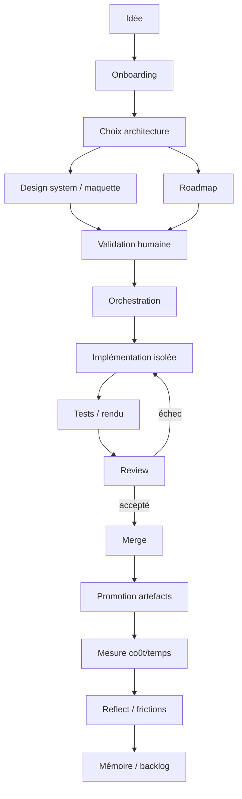

## 15.4 Structure de fichiers de référence

```text
project/
├── AGENTS.md
├── docs/
│   ├── PRODUCT.md
│   ├── ARCHITECTURE.md
│   ├── CONVENTIONS.md
│   ├── COMMANDS.md
│   └── TROUBLESHOOTING.md
├── design/
│   ├── SYSTEM.md
│   └── mockups/
├── roadmap/
│   ├── ROADMAP.md
│   └── specs/
├── tasks/
├── memory/
│   ├── SUMMARY.md
│   ├── DECISIONS.md
│   ├── KNOWN_TRAPS.md
│   └── FRICTIONS.md
├── runs/
│   └── <run_id>/
│       ├── manifest.json
│       ├── logs/
│       ├── handoffs/
│       ├── outputs/
│       └── metrics.json
├── artifacts/
└── src/
```

## 15.5 Manifeste d’un run

```json
{
  "run_id": "run-20260930-001",
  "task_id": "T-041",
  "spec_ref": "roadmap/specs/T-041.md",
  "orchestrator": "planner-class-A",
  "agents": ["executor-01", "verifier-01"],
  "budget": {
    "max_cost": 8.0,
    "max_duration_min": 30
  },
  "sandbox": {
    "read_scope": ["project", "assigned_worktree"],
    "write_scope": ["assigned_worktree"]
  },
  "pricing_version": "pricing-2026-09"
}
```

## 15.6 Machine à états

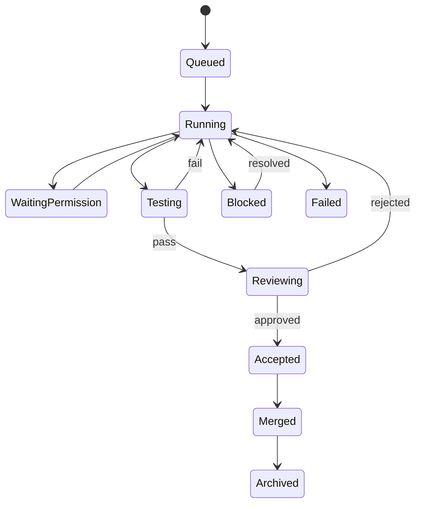

L’état doit venir d’événements observables, pas de la simple déclaration de l’agent.

## 15.7 Politique de routing

Pseudo-règles :

```text
IF task.type == cleanup
  route economical/local

IF task.requires_architecture
  route strong planner

IF task.has_precise_spec AND tests_are_strong
  route economical executor

IF executor fails oracle twice
  escalate

IF data.sensitivity == high
  restrict remote providers
```

## 15.8 Politique de documentation

```text
micro bug
→ oracle + fix + review courte

feature moyenne
→ spec + implementation + tests + review

nouveau produit
→ onboarding + design + roadmap + specs + orchestration
```

Le workflow est proportionné à la tâche.

## 15.9 Politique d’artefacts

```text
TEMPORARY
worktree files
browser screenshots de debug
build caches

DURABLE
final outputs
validated specs
review report
benchmark artifacts
important screenshots
```

Les artefacts durables doivent être promus avant nettoyage.

## 15.10 Mesures essentielles

Par run :

```text
cost_total
cost_by_role
time_total
time_to_first_action
tokens_by_class
human_interventions
retries
tests_failed
reviews_count
acceptance_status
```

Par type de tâche :

```text
median_cost
p90_cost
median_time
acceptance_rate
retry_rate
best_routing_class
```

## 15.11 Boucle d’amélioration du système

```text
RUN
 ↓
OBSERVE
 ↓
FRICTIONS
 ↓
ANALYZE
 ↓
RULE / TOOL / UI CHANGE
 ↓
EVALUATE
 ↓
KEEP or REVERT
```

L’architecture agentique elle-même doit être traitée comme un produit expérimental.

## 15.12 Principe final

Le système mature n’est pas celui qui possède le plus d’agents. C’est celui qui :

- sait exactement pourquoi chaque agent existe ;
- donne le contexte minimal suffisant ;
- isole les actions ;
- rend la progression observable ;
- vérifie avec des preuves ;
- conserve les artefacts importants ;
- mesure le coût total ;
- apprend des frictions ;
- permet de remplacer un moteur sans perdre le workflow.

Autrement dit : **l’intelligence du système réside autant dans son architecture de contrôle que dans les modèles qu’il appelle.**


---

# 16 — De l’idée à une V1 : workflow complet et profond

## 16.1 Phase 0 — Clarifier l’intention

Avant toute création de fichiers, écrire une phrase :

```text
Je veux construire X
pour Y
afin de Z.
```

Puis préciser les non-objectifs :

```text
NOT IN V1
- authentification multi-utilisateur
- cloud sync
- marketplace
- scoring automatique
```

Les non-objectifs sont essentiels : les agents ont tendance à enrichir une idée si le périmètre est ambigu.

## 16.2 Phase 1 — Choisir le niveau de produit

Questions :

```text
outil personnel ?
outil équipe ?
produit public ?
prototype de démonstration ?
benchmark interne ?
```

La réponse influence :

- sécurité ;
- packaging ;
- architecture ;
- base de données ;
- observabilité ;
- qualité de finition ;
- coût acceptable.

## 16.3 Phase 2 — Onboarding

Lancer un agent dont la mission est exclusivement :

```text
comprendre
questionner
structurer
initialiser docs + dépôt
```

Livrables :

```text
PRODUCT.md
ARCHITECTURE.md
CONVENTIONS.md
COMMANDS.md
AGENTS.md
```

Stop condition : l’environnement est prêt pour des agents spécialisés.

## 16.4 Phase 3 — Architecture

Décider :

```text
web / native / CLI
local / cloud / hybride
DB locale / distante
hot reload / build
artefacts temporaires / durables
```

Le choix doit être justifié par la boucle d’usage, pas par prestige technique.

## 16.5 Phase 4 — Design

Si le produit a une UI :

1. design system ;
2. wireframe ;
3. maquette ;
4. validation humaine.

La maquette doit couvrir les parcours principaux, pas forcément chaque détail.

## 16.6 Phase 5 — Roadmap

Créer 5 à 10 lots cohérents plutôt que 50 tâches microscopiques immédiatement.

```text
WP1 socle
WP2 données
WP3 vue principale
WP4 import
WP5 comparaison
WP6 métriques
WP7 finition
```

Puis détailler le lot courant au moment de son exécution.

## 16.7 Phase 6 — Specs juste-à-temps

Éviter de spécifier 50 pages pour une fonctionnalité prévue dans trois semaines. Le projet évoluera.

```text
Roadmap = long horizon, faible détail
Spec = horizon court, détail élevé
```

C’est une forme de progressive elaboration.

## 16.8 Phase 7 — Orchestration

L’orchestrateur choisit les sous-agents selon la tâche.

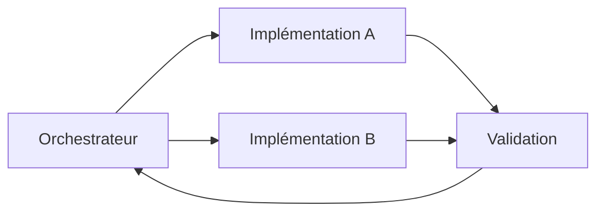

Chaque agent dispose d’un scope de fichiers et d’un contrat de sortie.

## 16.9 Phase 8 — Boucle de preuve

L’agent ne doit pas déclarer « terminé » sur la seule base du code écrit.

```text
code
↓
compile/test
↓
launch
↓
observe
↓
screenshot/log
↓
compare oracle
↓
fix
```

La preuve doit être proportionnée à la feature.

## 16.10 Phase 9 — Human acceptance

L’humain vérifie surtout :

- intention ;
- UX ;
- arbitrages ;
- critères subjectifs ;
- risques non codifiables.

L’IA vérifie plutôt :

- tests ;
- schéma ;
- cohérence ;
- règles ;
- différences.

## 16.11 Phase 10 — Merge et promotion

Avant merge :

```text
[ ] review acceptée
[ ] tests pertinents passent
[ ] diff cohérent
[ ] artefacts utiles promus
[ ] tâche reliée à la branche
[ ] coût enregistré
```

## 16.12 Phase 11 — Usage réel

Une V1 n’est qu’une hypothèse. Il faut l’utiliser.

```text
V1
↓
usage
↓
frictions
↓
priorités réelles
↓
V2
```

Les améliorations les plus utiles émergent souvent de petites irritations répétées plutôt que de grandes idées initiales.

## 16.13 Phase 12 — Reflect

À la fin d’un chantier :

```text
Qu'avons-nous appris ?
Qu'est-ce qui a coûté trop cher ?
Quelle étape était inutile ?
Quel outil manquait ?
Quelle règle doit changer ?
Quelle information mérite une mémoire durable ?
```

Cette boucle fait évoluer le système d’ingénierie lui-même.


---

# 17 — Modèle de données d’une plateforme de benchmark et d’observation

## 17.1 Entités minimales

Une application qui compare des runs agentiques peut être construite autour de :

```text
BENCHMARK_CASE
MODEL_PROFILE
RUN
PROMPT_VARIANT
SPEC
ARTIFACT
COST_BREAKDOWN
EVALUATION
```

## 17.2 Relations

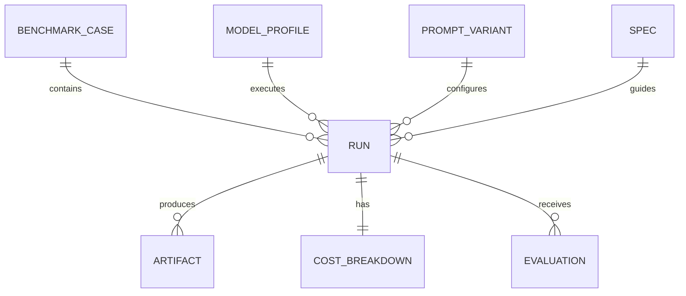

## 17.3 Benchmark case

```json
{
  "id": "case-galileo-001",
  "title": "Interactive physical object",
  "task_ref": "tasks/case-galileo.md",
  "rubric_ref": "rubrics/case-galileo.json",
  "created_at": "..."
}
```

## 17.4 Run

```json
{
  "id": "run-001",
  "case_id": "case-galileo-001",
  "execution_mode": "direct",
  "executor_profile": "model-profile-12",
  "planner_run_id": null,
  "spec_id": null,
  "status": "completed",
  "started_at": "...",
  "ended_at": "..."
}
```

Pour une exécution guidée :

```json
{
  "execution_mode": "spec_guided",
  "planner_run_id": "run-plan-09",
  "spec_id": "spec-09"
}
```

## 17.5 Coût

```json
{
  "run_id": "run-001",
  "input_tokens": 0,
  "output_tokens": 0,
  "cache_write_tokens": 0,
  "cache_read_tokens": 0,
  "equivalent_cost_usd": 0.0,
  "display_cost_eur": 0.0,
  "pricing_version": "...",
  "fx_version": "..."
}
```

## 17.6 Artefact

```json
{
  "id": "artifact-44",
  "run_id": "run-001",
  "type": "html",
  "path": "artifacts/run-001/index.html",
  "sha256": "...",
  "preview_path": "artifacts/run-001/preview.png"
}
```

## 17.7 Evaluation

Il faut séparer évaluations automatiques et humaines.

```json
{
  "run_id": "run-001",
  "evaluator": "human",
  "criteria": {
    "functional": 0.9,
    "physics_plausibility": 0.7,
    "performance": 0.8
  },
  "subjective_notes": "..."
}
```

Le champ esthétique peut rester descriptif plutôt que numérique.

## 17.8 Interface catalogue

```text
┌──────────────────────────────────────────────┐
│ Case: Interactive object                    │
├──────────────────────────────────────────────┤
│ Direct A        Guided by Spec X             │
│ [preview]       [preview]                    │
│ 0.12 €          0.04 € impl + plan 3.00 €   │
│ 04:12           06:40                        │
│ [Open]          [Open]                       │
└──────────────────────────────────────────────┘
```

## 17.9 Comparaison

L’application devrait permettre :

```text
- sélectionner plusieurs runs ;
- côte à côte ;
- synchroniser certaines interactions ;
- afficher coûts ;
- afficher specs ;
- voir métadonnées ;
- ouvrir artefact brut ;
- consulter transcript si autorisé.
```

## 17.10 Ne pas confondre comparaison et compétition

Le but d’un laboratoire interne est de comprendre :

- quel moteur convient à quelle tâche ;
- quelle spec améliore quel exécuteur ;
- quelle configuration coûte trop cher ;
- quel workflow est robuste.

Un classement unique « meilleur modèle » détruit cette information multidimensionnelle.


---

# 18 — Atlas de schémas pour raisonner sur un système agentique

## 18.1 Pipeline général

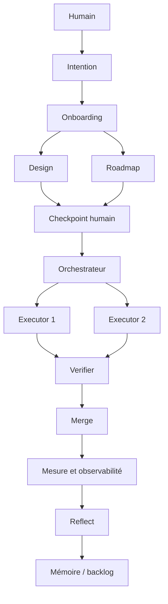

## 18.2 Planifier cher, exécuter moins cher

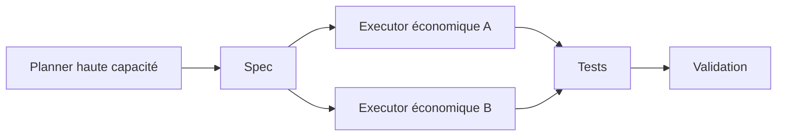

## 18.3 Propagation d’une erreur de spec

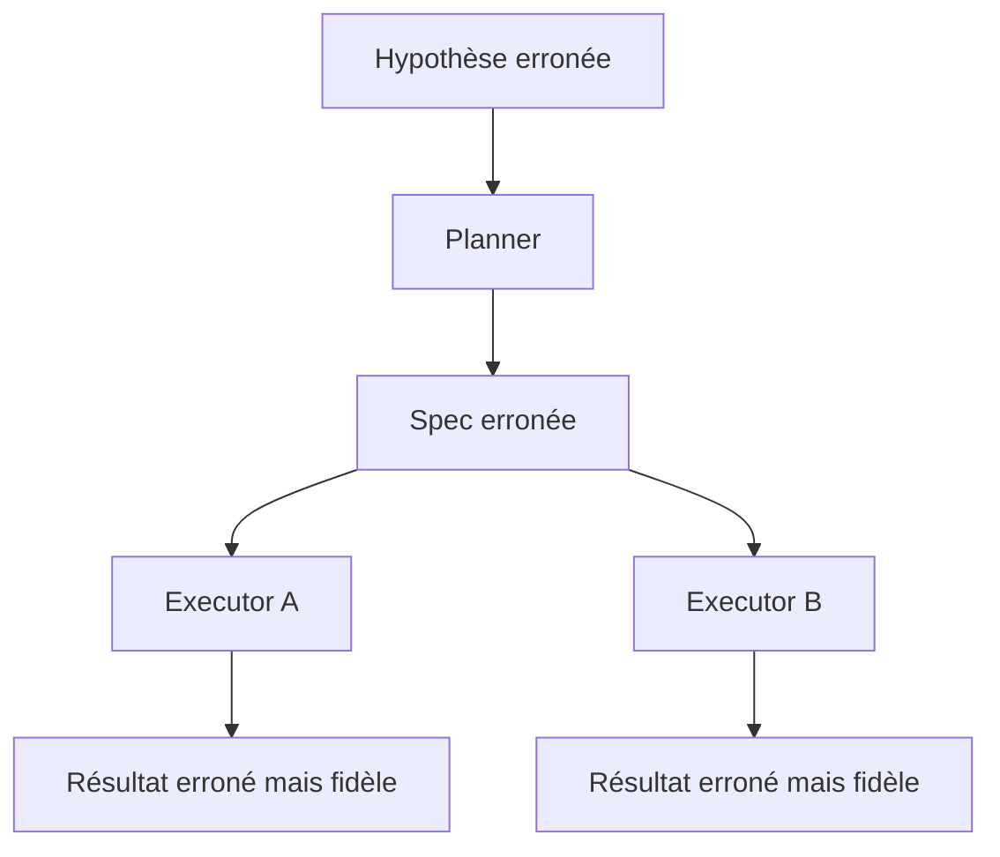

## 18.4 Boucle d’auto-vérification

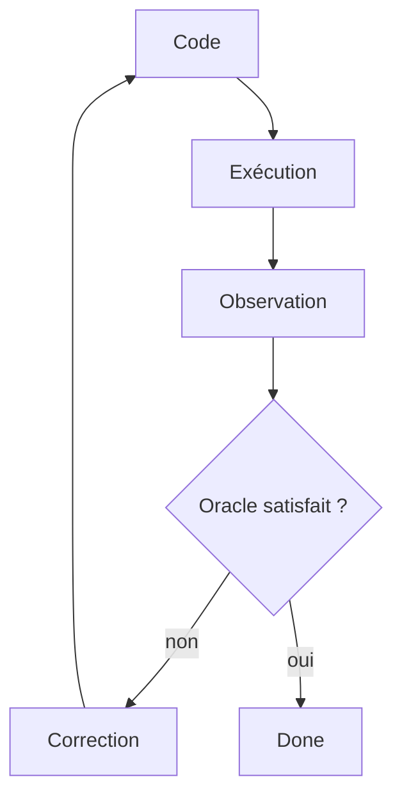

## 18.5 Isolation benchmark

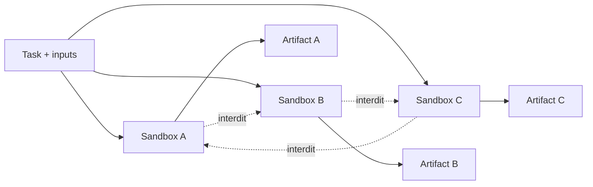

## 18.6 Cycle économique

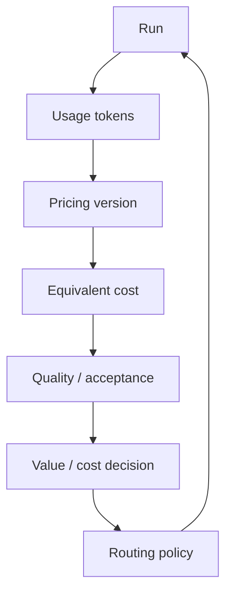

## 18.7 Mémoire et friction

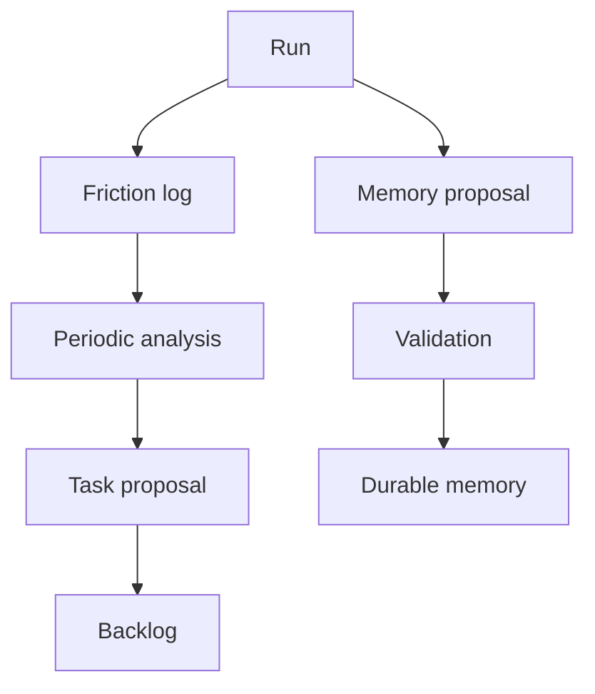

## 18.8 Artefact durable

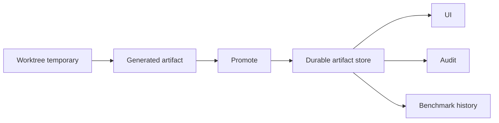

## 18.9 Échelle de permissions

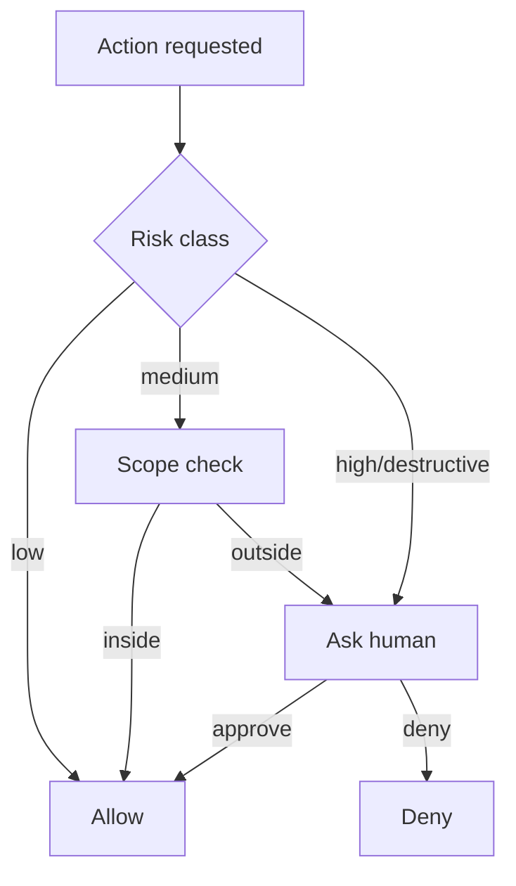

## 18.10 État vs logs vs mémoire

```text
              SYSTEM
                 │
      ┌──────────┼──────────┐
      │          │          │
      ▼          ▼          ▼
    STATE       LOGS       MEMORY
      │          │          │
 où en est-on ?  │     que garder ?
                 │
          que s'est-il passé ?
```

## 18.11 Couche de contrôle

```text
┌─────────────────────────────────────┐
│ CONTROL PLANE                       │
│ roadmap · scheduler · budgets       │
│ permissions · routing · policies    │
├─────────────────────────────────────┤
│ EXECUTION PLANE                     │
│ agents · tools · worktrees · tests  │
├─────────────────────────────────────┤
│ KNOWLEDGE PLANE                     │
│ docs · memory · decisions · specs   │
├─────────────────────────────────────┤
│ OBSERVABILITY PLANE                 │
│ logs · cost · diffs · artifacts     │
└─────────────────────────────────────┘
```


---

# 19 — Checklists, anti-patterns et glossaire

## 19.1 Checklist avant nouveau projet

```text
[ ] finalité écrite
[ ] utilisateurs identifiés
[ ] non-objectifs écrits
[ ] niveau produit choisi
[ ] contraintes données/confidentialité identifiées
[ ] stack justifiée par le besoin
[ ] boucle de feedback évaluée
[ ] dépôt initialisé
[ ] source de vérité produit définie
[ ] onboarding généré
```

## 19.2 Avant lancement d’un grand chantier

```text
[ ] spec relue
[ ] maquette validée si UI
[ ] dépendances connues
[ ] scope fichiers défini
[ ] worktree prêt
[ ] modèle/routing choisi
[ ] budget coût/temps défini
[ ] oracles/tests disponibles
[ ] artefacts attendus définis
```

## 19.3 Avant benchmark

```text
[ ] mêmes inputs
[ ] dossiers vides/isolés
[ ] mêmes permissions
[ ] mémoire identique ou désactivée
[ ] connecteurs désactivés
[ ] versions des modèles enregistrées
[ ] niveau de raisonnement enregistré
[ ] méthode de coût figée
[ ] transcript activé
[ ] protocole d'évaluation écrit avant résultats
```

## 19.4 Avant merge

```text
[ ] tests ciblés passent
[ ] review terminée
[ ] diff inspectable
[ ] pas de fichiers hors scope
[ ] artefacts durables promus
[ ] tâche mise à jour
[ ] coût enregistré
[ ] frictions importantes capturées
```

## 19.5 Anti-pattern : le super-agent universel

```text
Un agent
→ planifie
→ code
→ teste
→ juge son propre code
→ modifie la mémoire
→ valide
```

Problèmes : contexte énorme, absence d’indépendance, coût élevé, faible auditabilité.

## 19.6 Anti-pattern : max reasoning partout

Symptômes :

- latence énorme ;
- quota consommé ;
- peu de gain qualitatif ;
- faible throughput.

Correction : budget adaptatif.

## 19.7 Anti-pattern : spec non vérifiée fan-out massif

```text
mauvaise spec
× 10 agents
= 10 erreurs cohérentes
```

Correction : checkpoint avant parallélisation.

## 19.8 Anti-pattern : résultat lié au worktree temporaire

Symptôme : l’UI affiche un lien mort après cleanup.

Correction : promotion des artefacts.

## 19.9 Anti-pattern : tout mettre dans la mémoire

Symptômes : contexte gonflé, souvenirs contradictoires, récupération bruyante.

Correction : résumé court + mémoire sélective + archivage.

## 19.10 Anti-pattern : permissions soit nulles soit totales

Correction : classes de risque et scopes explicites.

## 19.11 Anti-pattern : mesurer uniquement les tokens

Correction : coût total d’acceptation, temps, charge humaine, qualité, retries.

## 19.12 Anti-pattern : benchmark contaminé

Si un agent peut lire les résultats précédents, la comparaison n’est plus interprétable.

Correction : sandbox + audit transcript.

## 19.13 Anti-pattern : documentation cérémoniale

Créer des specs/plans/reviews sans usage réel augmente coûts et bruit.

Correction : documentation proportionnelle au risque.

## 19.14 Glossaire

**Artefact durable** — fichier promu hors environnement temporaire afin de survivre au run.

**Benchmark direct** — exécution où le modèle reçoit la demande sans specification produite par un autre modèle.

**Benchmark guidé** — exécution où un planner produit d’abord une specification transmise à l’exécuteur.

**Cache read** — tokens relus depuis un mécanisme de cache ; leur tarif peut être différent de l’entrée neuve.

**Cache write** — tokens écrits dans le cache pour réutilisation future.

**Checkpoint humain** — point où une décision humaine est requise avant d’engager la suite.

**Coût total d’acceptation (CTA)** — somme des coûts de planification, exécution, tests, review et corrections nécessaires pour obtenir un résultat accepté.

**Design system** — règles visuelles réutilisables servant de contexte stable aux agents.

**Executor** — agent chargé de réaliser une tâche déjà cadrée.

**Feedback latency** — temps entre une modification et l’observation de son effet réel.

**Friction** — difficulté opérationnelle qui ralentit ou complique le workflow sans être nécessairement un bug.

**Handoff** — objet structuré qui permet à un autre agent de reprendre un travail sans relire toute la session.

**Onboarding** — transformation d’un projet en environnement documenté et navigable par de futurs agents.

**Oracle** — condition observable utilisée pour déterminer si un résultat est correct.

**Planner** — agent chargé de comprendre, rechercher, décider et produire un plan/specification.

**Promotion d’artefact** — copie ou déplacement d’un livrable depuis un espace temporaire vers un stockage durable.

**Reasoning budget** — quantité de calcul/réflexion allouée à un agent pour un run.

**Routing** — choix du moteur, de l’agent ou du workflow adapté à une tâche.

**Sandbox** — environnement contrôlé limitant ce qu’un agent peut lire, écrire ou exécuter.

**Source de vérité** — représentation considérée comme autoritative pour un domaine donné.

**Spec** — contrat décrivant résultat attendu, contraintes et critères observables.

**Worktree** — copie de travail Git isolée permettant à plusieurs agents de modifier le même dépôt sans écrire directement sur la branche principale.

---

# Conclusion — Le système compte plus que le modèle isolé

Une architecture agentique robuste repose sur une idée simple : un modèle n’est qu’un composant d’un système plus grand.

Le résultat dépend simultanément de la qualité du cadrage, de la précision de la specification, de l’isolation du worker, de la vitesse de la boucle de feedback, de la qualité des tests, de la capacité à observer le rendu réel, du mécanisme de review, de la persistance des artefacts, de la mémoire du projet et du coût acceptable.

Le pattern général peut être condensé ainsi :

```text
INTENTION
   ↓
ONBOARDING
   ↓
ARCHITECTURE + DESIGN + ROADMAP
   ↓
CHECKPOINT HUMAIN
   ↓
ORCHESTRATION
   ↓
EXECUTION ISOLÉE
   ↓
PREUVES / TESTS / RENDU
   ↓
REVIEW
   ↓
MERGE + ARTEFACTS DURABLES
   ↓
MESURE COÛT / TEMPS / QUALITÉ
   ↓
REFLECT
   ↓
MÉMOIRE + AMÉLIORATION DU SYSTÈME
```

Le système mature ne cherche donc pas l’autonomie maximale à tout prix. Il cherche la meilleure combinaison de délégation, contrôle, économie, observabilité et apprentissage cumulatif.

La question centrale n’est plus :

> « Quel modèle est le meilleur ? »

mais :

> « Quelle architecture permet d’obtenir de manière reproductible un résultat accepté, au coût et au risque appropriés, tout en conservant assez de preuves et de contexte pour continuer demain ? »
