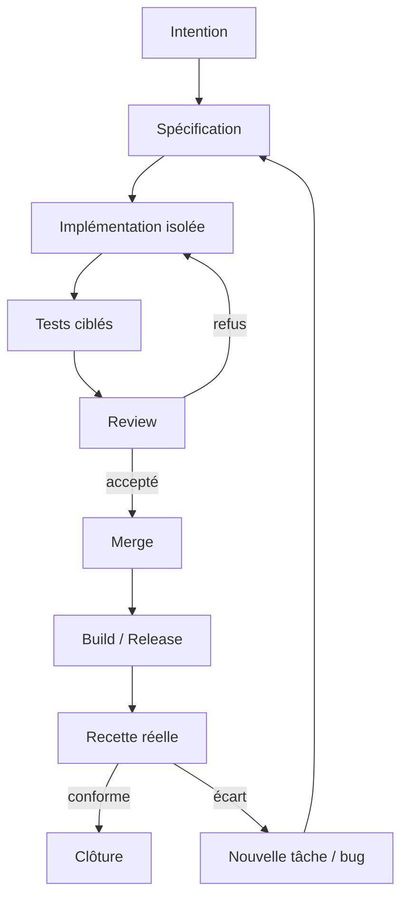
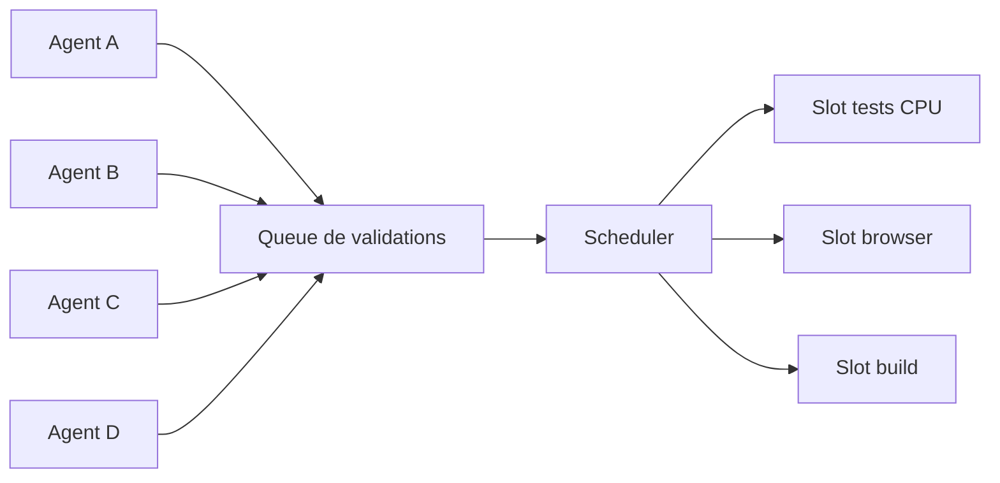
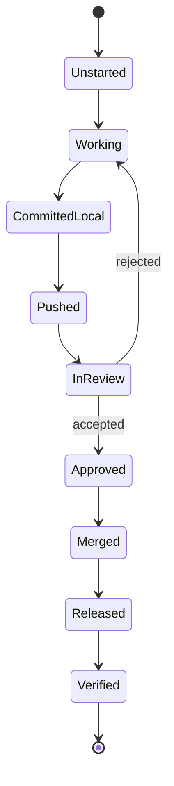
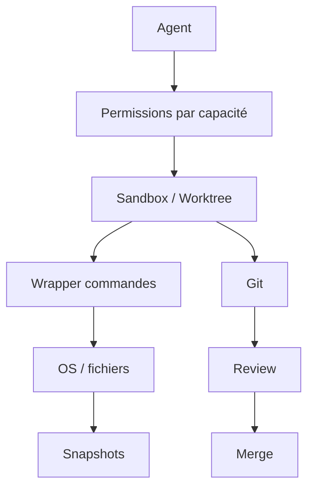
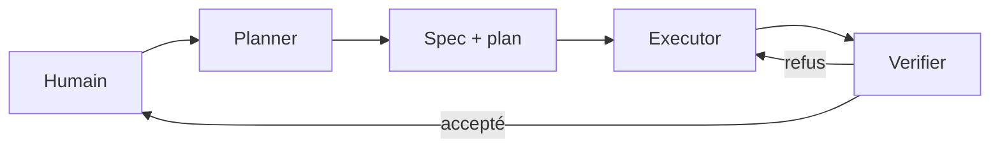
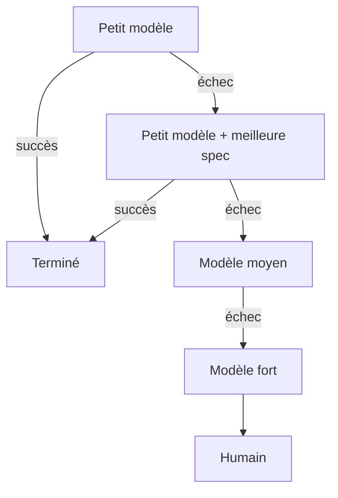
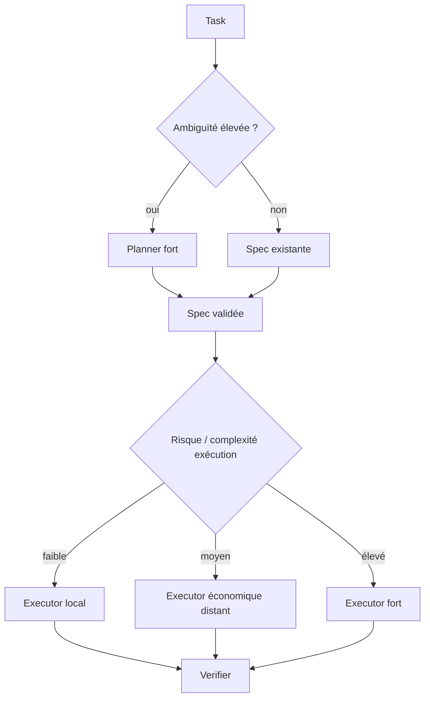
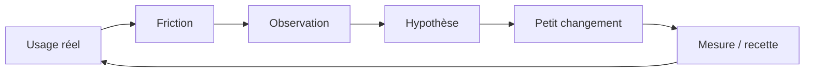
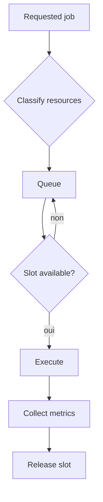
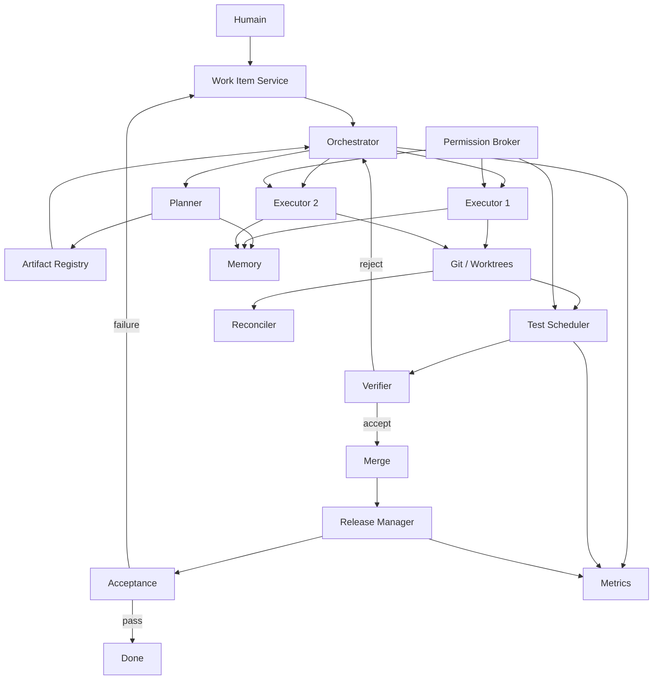

# Ingénierie avancée des systèmes agentiques multi-agents — Volume II

## Recette, preuves, ressources, sécurité, traçabilité, benchmarking et délégation hiérarchique

Ce document expose une architecture complète pour exploiter des agents logiciels sur des projets réels. Il ne se limite pas à la génération de code : il traite le système de production dans son ensemble, depuis l'intention humaine jusqu'à la recette d'une release, en passant par la planification, l'isolation Git, les tests, la review, la mémoire, les permissions, l'observabilité, les coûts et la répartition du travail entre agents de capacités différentes.

L'objectif est de répondre à une question plus difficile que « comment faire coder un agent ? » :

> **Comment construire un environnement où plusieurs agents peuvent produire, vérifier, transmettre et reprendre du travail de manière fiable, économique, observable et récupérable ?**

Le document adopte une approche d'ingénierie. Les agents sont considérés comme des composants probabilistes insérés dans une infrastructure déterministe. La fiabilité du résultat final dépend donc autant de la qualité de l'environnement — états, preuves, tests, droits, artefacts, files d'attente, reprise — que du modèle lui-même.

---

## Architecture mentale du document

```text
INTENTION HUMAINE
      │
      ▼
CADRAGE / SPECIFICATION
      │
      ▼
PLANIFICATION ET DECOMPOSITION
      │
      ├──────────────┐
      ▼              ▼
EXECUTION A       EXECUTION B        ...
      │              │
      └──────┬───────┘
             ▼
        PREUVES LOCALES
             │
             ▼
      REVIEW / VALIDATION
             │
             ▼
           MERGE
             │
             ▼
      RELEASE COMPLETE
             │
             ▼
        RECETTE REELLE
             │
             ├── accepté → mémoire / clôture
             └── défaut → nouvel oracle / correctif
```

Autour de cette chaîne se trouvent quatre plans transversaux :

```text
┌──────────────────────────────────────────────────────────────┐
│ CONTEXTE & MEMOIRE                                           │
│ specs, décisions, historique, provenance, handoffs          │
├──────────────────────────────────────────────────────────────┤
│ RESSOURCES                                                   │
│ CPU, RAM, GPU, ports, navigateurs, files d'attente          │
├──────────────────────────────────────────────────────────────┤
│ SECURITE                                                     │
│ sandbox, capacités, snapshots, restauration, audit          │
├──────────────────────────────────────────────────────────────┤
│ ECONOMIE                                                     │
│ tokens, coût, quotas, temps humain, latence, rework          │
└──────────────────────────────────────────────────────────────┘
```

---

## 00 — Inventaire conceptuel des deux sources

Les deux sources font apparaître une étape plus mature de l'ingénierie agentique. Le problème n'est plus seulement de « faire coder une IA », ni même seulement de coordonner plusieurs agents. Le sujet devient : **comment exploiter durablement une équipe d'agents sur une vraie base de code, avec des ressources finies, des erreurs différées, des branches parallèles, des coûts variables et des besoins de reprise après plusieurs heures ou plusieurs jours**.

Les concepts principaux sont les suivants.

### 0.1 La recette est distincte de la review

La review automatisée valide du code, des tests et des contrats formels. Elle ne remplace pas l'usage réel du produit. Une fonctionnalité peut :

- compiler ;
- passer ses tests ;
- être acceptée par un reviewer ;
- être mergée ;
- puis révéler un problème dès la première utilisation réelle.

La recette post-release devient donc une phase explicite.

### 0.2 Une feature réussie peut générer de nouveaux défauts périphériques

Modifier un formulaire, ajouter un champ ou rendre un composant dynamique peut déplacer d'autres éléments, casser une hiérarchie visuelle ou introduire un état intermédiaire non prévu.

Le système doit traiter la sortie d'une feature comme une nouvelle entrée d'observation.

### 0.3 Le bug fix mature commence par un oracle

Au lieu de « modifier puis voir », on cherche à :

1. reproduire le défaut ;
2. définir ce qui prouve objectivement le défaut ;
3. créer un test rouge ;
4. corriger ;
5. faire passer ce test au vert.

### 0.4 Les tests eux-mêmes peuvent devenir une ressource concurrente

Une suite complète très lourde, parfaitement raisonnable avec un développeur unique, peut devenir catastrophique avec cinq agents concurrents.

Le problème n'est alors plus la correction logique du code, mais l'**ordonnancement des ressources de validation**.

### 0.5 Tous les contrôles ne doivent pas être exécutés au même moment

Le système distingue progressivement :

- tests locaux ciblés pendant l'implémentation ;
- gates adaptées à la surface modifiée ;
- review ;
- validation complète multi-plateforme au moment d'une release.

### 0.6 L'état réel du projet est distribué

Il existe simultanément dans :

- la branche principale ;
- les worktrees ;
- des commits locaux ;
- des branches distantes ;
- les cartes de tâches ;
- les documents de spécification ;
- les sessions d'agents ;
- les builds ;
- la base applicative.

Un « travail terminé » dans une conversation n'implique pas nécessairement un « travail présent dans le produit ».

### 0.7 Il faut distinguer travail fait, travail commité, travail poussé, travail mergé et travail releasé

Ces états doivent être observables séparément.

### 0.8 Les permissions sont un problème de conception, pas un simple réglage

Un niveau trop restrictif bloque des workflows utiles. Un niveau trop permissif permet des commandes destructrices. La question n'est donc pas « permission ou pas permission », mais :

> Quelle capacité minimale doit être accordée à quel agent, pour quelle tâche, dans quel périmètre, avec quelle possibilité de restauration ?

### 0.9 Les sauvegardes locales sont un garde-fou contre les erreurs agentiques

Des répertoires sensibles peuvent être copiés ou versionnés avant l'exécution d'agents ayant des droits importants.

### 0.10 Un agent hérite de la qualité locale du dépôt

Un dépôt mal structuré, sans tests ni conventions, fournit un mauvais signal implicite. L'agent reproduit souvent ce qu'il observe.

### 0.11 La spécification peut agir comme « compilation de l'intelligence »

Un modèle coûteux peut transformer une intention vague en une spécification très précise. Cette spécification peut ensuite être exécutée par plusieurs modèles différents.

### 0.12 La qualité du plan influence fortement la reproductibilité

Deux implémenteurs distincts recevant la même spécification détaillée peuvent produire des résultats étonnamment proches. Cela suggère qu'une part importante de la variance se situe **avant** le code, dans les choix explicités par le plan.

### 0.13 Mais un bon plan ne compense pas un implémenteur qui ne vérifie pas son résultat

Si le modèle exécuteur n'ouvre pas le résultat, ne lit pas les erreurs et ne teste pas, il peut livrer quelque chose d'inutilisable malgré une excellente spécification.

### 0.14 Benchmarking : il faut séparer planification et exécution

Comparer seulement « modèle A contre modèle B » mélange plusieurs capacités :

- compréhension ;
- planification ;
- choix technologiques ;
- code ;
- debugging ;
- vérification visuelle ;
- optimisation.

Un protocole plus riche croise planificateurs et implémenteurs.

### 0.15 Le coût pertinent est le coût total pour atteindre un résultat acceptable

Une implémentation très bon marché qui demande cinq itérations peut coûter plus cher qu'une première passe plus coûteuse mais correcte.

### 0.16 Le temps humain est une variable du coût

Le meilleur pipeline n'est pas forcément celui qui minimise les tokens, mais celui qui minimise le coût total :

```text
coût total = coût modèles + temps humain + temps machine + coût des erreurs + coût des reprises
```

### 0.17 Une interface de pilotage doit réduire la charge cognitive

Si l'utilisateur doit maintenir manuellement l'état des cartes, la plateforme devient un travail supplémentaire. Les états devraient autant que possible être dérivés d'événements réels : commit, review, merge, release, test, etc.

### 0.18 Le produit doit évoluer à partir de l'usage réel

Une fonction qui semblait importante lors de sa conception peut devenir inutile. Une fonction non anticipée peut devenir centrale. Il faut accepter la suppression et la simplification.

### 0.19 La traçabilité compense la perte de connaissance implicite de l'humain

Quand un humain a écrit lui-même un système, il conserve une mémoire tacite de ses points fragiles. Avec du code produit par des agents, cette mémoire doit être externalisée dans les artefacts du projet.

### 0.20 Le système optimal est hybride

Il combine :

- automatisation ;
- vérification déterministe ;
- modèles de capacités différentes ;
- contrôle humain aux décisions importantes ;
- isolation ;
- mémoire ;
- observabilité ;
- contraintes de ressources.

---

## 01 — De la release à la recette : fermer réellement la boucle

### 1.1 Pourquoi « merge » n'est pas synonyme de « terminé »

Dans un système agentique, le workflow technique peut donner l'illusion d'une clôture :

```text
code → tests → review → merge
```

Pourtant cette chaîne prouve seulement un sous-ensemble des propriétés recherchées. Elle ne prouve pas nécessairement que le logiciel, dans son environnement final, se comporte comme prévu.

Il faut donc compléter le cycle :

```text
Intention
   ↓
Spécification
   ↓
Implémentation
   ↓
Tests
   ↓
Review
   ↓
Merge
   ↓
Build / Release
   ↓
Recette réelle
   ↓
Observation de nouveaux écarts
   ↓
Correctifs
```

La recette est une **preuve d'usage**, pas une preuve abstraite.

### 1.2 Review et recette ne répondent pas aux mêmes questions

La review demande par exemple :

- le contrat est-il respecté ?
- les tests couvrent-ils le changement ?
- le code est-il cohérent ?
- les invariants sont-ils préservés ?

La recette demande :

- l'utilisateur peut-il réellement accomplir l'action ?
- l'ordre des champs reste-t-il intuitif ?
- les données réelles ressemblent-elles aux données de test ?
- le binaire distribué contient-il bien la dernière correction ?
- le comportement est-il correct après redémarrage ?
- une authentification expirée change-t-elle le résultat ?
- l'installation sur une autre machine fonctionne-t-elle ?

Ces dimensions sont complémentaires.

### 1.3 La release comme frontière d'intégration

Une release matérialise plusieurs choses :

1. un état précis du code ;
2. un processus de compilation ;
3. un packaging ;
4. éventuellement une signature ;
5. un mécanisme de mise à jour ;
6. une installation réelle.

On doit donc conserver l'identité de la release testée.

Exemple d'artefact :

```yaml
release_id: 2026.09.30-rc3
commit: a18f9c2
platform: windows-x64
build_profile: release
signed: false
installer_sha256: ...
created_at: ...
```

Sans cette identité, un bug observé peut provenir d'un ancien build et conduire à corriger du code déjà corrigé.

### 1.4 Le piège du « j'ai déjà vu fonctionner »

Dans un environnement multi-worktrees, l'affirmation :

> « Pourtant cette fonction marchait hier »

peut être vraie sans contredire le bug présent.

Il est possible que :

- le correctif existe dans un worktree ;
- il ait été commité mais non poussé ;
- il ait été poussé mais non mergé ;
- il ait été mergé après le commit de release ;
- le build ait été produit depuis une mauvaise branche ;
- l'application installée soit une version précédente.

D'où la nécessité d'une chaîne de provenance :

```text
Session agent
    │
    ├─ task_id
    ├─ worktree_id
    ├─ branch
    ├─ commits
    ↓
Merge commit
    ↓
Release commit
    ↓
Build artifact
    ↓
Installation testée
```

### 1.5 La recette génère un nouveau backlog

La recette ne doit pas être vue comme un examen final qui produit uniquement « accepté/refusé ». Elle est aussi un mécanisme de découverte.

Exemple :

```text
Feature A ajoutée
      ↓
recette
      ├─ A fonctionne
      ├─ un champ voisin est déplacé
      ├─ un état vide est contre-intuitif
      └─ des données historiques polluent l'écran
```

La feature peut être valide tout en générant trois tâches périphériques.

### 1.6 La recette doit être structurée

Une recette robuste peut être organisée en scénarios :

```text
Scénario R1 — premier lancement
Scénario R2 — compte existant
Scénario R3 — compte absent
Scénario R4 — session expirée
Scénario R5 — redémarrage application
Scénario R6 — upgrade depuis version précédente
Scénario R7 — machine propre
Scénario R8 — données historiques
```

Pour chaque scénario :

```yaml
preconditions:
actions:
expected:
observed:
status:
evidence:
```

### 1.7 Recette exploratoire et recette de non-régression

Deux formes sont utiles.

#### Recette exploratoire

L'humain manipule réellement le produit et détecte les frictions imprévues.

#### Recette codifiée

Les comportements stabilisés deviennent ensuite des tests automatisés ou semi-automatisés.

La direction naturelle est :

```text
Découverte humaine
      ↓
Bug / friction
      ↓
Correctif
      ↓
Test reproductible
      ↓
Non-régression automatisée
```

### 1.8 Pourquoi la donnée de production ou quasi-production compte

Une base de développement propre peut masquer :

- des comptes historiques ;
- des dossiers résiduels ;
- des jetons expirés ;
- des migrations incomplètes ;
- des valeurs obsolètes ;
- des configurations accumulées.

La robustesse d'un système n'est donc pas seulement sa capacité à fonctionner avec une base idéale, mais avec une base qui a une histoire.

### 1.9 Mermaid — boucle complète d'une modification



### 1.10 Règle opérationnelle

Une tâche n'est réellement terminée que lorsque son **niveau de preuve requis** a été satisfait.

Pour une petite modification interne :

```text
merge + tests ciblés
```

Pour une interaction utilisateur :

```text
merge + tests + preuve visuelle ou recette
```

Pour un installateur :

```text
merge + build + installation sur cible + lancement réel
```

Le statut « done » doit donc dépendre du type de travail.

---

## 02 — Bug fixing agentique : oracle, reproduction, test rouge, correction

### 2.1 Le principal danger : corriger le symptôme au lieu de la cause

Quand on demande simplement :

> « Corrige ce problème. »

un agent peut choisir l'intervention la plus locale et la plus rapide. Cela peut produire un pansement parfaitement cohérent avec la formulation, mais incorrect par rapport à l'intention.

Exemple abstrait :

```text
Symptôme : l'interface propose une mise à jour qui échoue.

Mauvais correctif :
    afficher un message d'erreur plus propre.

Cause réelle possible :
    la détection de version est incorrecte.

Bon objectif :
    ne proposer une mise à jour que si elle existe réellement.
```

Le problème n'est pas l'intelligence brute du modèle. Le problème est **l'oracle**.

### 2.2 Qu'est-ce qu'un oracle ?

Un oracle est un mécanisme qui permet de décider si le comportement observé est correct ou incorrect.

Il peut être :

- un test automatisé ;
- une valeur attendue ;
- une capture de référence ;
- un invariant métier ;
- une comparaison avec un autre système ;
- une propriété mathématique ;
- un comportement utilisateur précis.

Sans oracle, l'agent optimise une impression de correction.

### 2.3 Chaîne bug fix robuste

```text
Signalement
   ↓
Reproduction
   ↓
Localisation de la surface fautive
   ↓
Formulation de l'oracle
   ↓
Test rouge
   ↓
Hypothèse de cause
   ↓
Correction
   ↓
Test vert
   ↓
Tests voisins
   ↓
Review
   ↓
Recette
```

### 2.4 Pourquoi produire le test avant la correction ?

Si le test est écrit après le code, il risque de valider ce que le code fait déjà.

Le test rouge force le système à exprimer :

> « Voici une propriété actuellement fausse que la correction doit rendre vraie. »

Exemple :

```python
# pseudo-code
assert detect_update(installed="3.1", available="3.1") is False
```

Avant correction : échec.
Après correction : succès.

### 2.5 La reproduction doit être la plus proche possible de l'environnement réel

Un bug d'authentification, d'installation ou de lancement peut dépendre de :

- l'OS ;
- le shell ;
- les variables d'environnement ;
- un cache ;
- un token expiré ;
- une version du CLI ;
- un chemin utilisateur ;
- un processus déjà ouvert.

La reproduction doit donc préciser l'environnement.

### 2.6 Utiliser des sous-agents pour enquêter, pas seulement pour coder

Une investigation peut être décomposée :

```text
Agent principal
│
├─ enquête A : état Git / worktrees
├─ enquête B : logs runtime
├─ enquête C : reproduction UI
├─ enquête D : configuration / cache
└─ enquête E : comparaison avec version antérieure
```

Puis l'agent principal agrège les faits avant de proposer le patch.

Le bénéfice est maximal lorsque les enquêtes sont **indépendantes** et produisent des preuves.

### 2.7 Ne pas corriger avant d'avoir la causalité minimale

Une discipline utile :

```text
1. Je sais reproduire.
2. Je sais mesurer l'échec.
3. J'ai une hypothèse falsifiable.
4. Je modifie.
```

Cela évite :

```text
modifier → essayer → modifier → essayer → modifier → hasard
```

### 2.8 Arbre de diagnostic

```text
Le défaut existe-t-il sur la version réellement installée ?
│
├─ Non → problème de version / provenance
│
└─ Oui
   │
   ├─ reproductible avec données propres ?
   │    ├─ Oui → bug déterministe
   │    └─ Non → état / migration / cache / données historiques
   │
   ├─ reproductible sur autre OS ?
   │    ├─ Oui → logique commune
   │    └─ Non → couche plateforme
   │
   └─ test automatique possible ?
        ├─ Oui → test rouge
        └─ Non → scénario de recette instrumenté
```

### 2.9 Le correctif doit traiter la couche correcte

On peut distinguer :

```text
[Présentation]
[État UI]
[Logique applicative]
[Adaptateur provider]
[CLI / process]
[Authentification]
[Système de fichiers]
[OS]
```

Une erreur visible dans l'interface ne signifie pas que la cause est dans l'interface.

### 2.10 La preuve doit survivre à l'agent

Un agent peut comprendre le bug puis disparaître. Il faut conserver :

```yaml
bug:
reproduction:
oracle:
root_cause:
red_test:
fix:
validation:
known_limits:
```

Cette fiche devient un artefact de maintenance.

---

## 03 — Contention des ressources et architecture des tests multi-agents

### 3.1 Le changement d'échelle

Une chaîne CI conçue pour un développeur humain suppose souvent une fréquence relativement faible de pushes. Avec plusieurs agents autonomes, le nombre d'événements augmente fortement.

Supposons :

```text
6 agents
× 3 itérations de correction
× 1 push par itération
= 18 déclenchements
```

Si chaque déclenchement lance 45 minutes de tests lourds, la stratégie devient impraticable.

### 3.2 Le paradoxe de la qualité

Ajouter davantage de tests peut **réduire** la qualité si cela crée :

- des timeouts artificiels ;
- des tests qui se perturbent mutuellement ;
- des agents bloqués ;
- des résultats non déterministes ;
- des ressources saturées ;
- des développeurs qui contournent les contrôles.

Le principe n'est donc pas « toujours plus de tests », mais :

> **le bon test, au bon niveau, au bon moment.**

### 3.3 Une taxonomie utile des validations

#### Niveau 0 — contrôles immédiats

- syntaxe ;
- formatage ;
- typage ;
- lint local.

#### Niveau 1 — tests ciblés

Uniquement les modules modifiés et leurs dépendances proches.

#### Niveau 2 — tests de composant

Front, backend, adaptateur, intégration locale.

#### Niveau 3 — review et gates de PR

Contrôles nécessaires avant merge.

#### Niveau 4 — intégration large

Interaction de plusieurs sous-systèmes.

#### Niveau 5 — matrice plateforme

Windows / Linux / macOS ou autres cibles.

#### Niveau 6 — release

Suite complète, packaging, installation, signature, smoke tests.

### 3.4 Stratégie pyramidale

```text
                    ┌────────────────────┐
                    │  Release complète  │  rare
                    └─────────┬──────────┘
                         ┌────┴────┐
                         │Intégration│
                         └────┬────┘
                    ┌─────────┴─────────┐
                    │ Tests de composant│
                    └─────────┬─────────┘
              ┌───────────────┴──────────────┐
              │ Tests ciblés + lint + types │  fréquents
              └──────────────────────────────┘
```

Le volume d'exécution diminue lorsque le coût de la validation augmente.

### 3.5 Gates conditionnelles par surface modifiée

L'agent ou le système peut calculer les chemins touchés :

```text
frontend/**      → front tests
backend/**       → backend tests
installer/**     → packaging tests
shared/**        → front + back
platform/linux/** → Linux-specific tests
```

Pseudo-règle :

```text
required_gates = union(gates_for(changed_paths))
```

### 3.6 Le scheduler devient un composant d'architecture

Quand plusieurs agents partagent une machine, il faut parfois traiter les tests lourds comme des jobs ordonnancés.



Le scheduler peut connaître :

- CPU disponible ;
- RAM ;
- GPU ;
- ports exclusifs ;
- bases de test ;
- navigateurs ;
- durée estimée.

### 3.7 Classes de ressources

```yaml
job: e2e_front
cpu: 4
gpu: 0
ram_gb: 6
exclusive_resources:
  - browser_profile
  - port_5173
estimated_duration_s: 180
```

Un système de ce type évite que deux agents détruisent mutuellement leurs environnements de test.

### 3.8 Les tests de performance nécessitent l'exclusivité

Un test avec seuil de latence est très sensible à la contention.

Exemple :

```text
attendu < 250 ms
```

Si un autre agent compile en parallèle, le test peut échouer sans régression logicielle.

Donc :

```text
benchmark de performance → machine calme / slot réservé
```

### 3.9 Déporter la suite complète à la release

Une stratégie pragmatique :

```text
chaque task : ciblé
chaque merge : gates critiques
chaque release : suite exhaustive
```

Cela transforme la release en **barrière de cohérence globale**.

### 3.10 Le bypass doit être gouverné

Un bypass de tests peut être légitime pour un correctif très local, mais il doit être :

- explicite ;
- journalisé ;
- limité à certains rôles ;
- compensé par une validation ultérieure.

Exemple :

```yaml
bypass:
  reason: "UI spacing only"
  approved_by: human
  skipped: [full_platform_matrix]
  mandatory_later: release_gate
```

### 3.11 Mesures à suivre

Une architecture multi-agents devrait mesurer :

```text
queue_wait_time
validation_runtime
failure_rate
flaky_failure_rate
resource_saturation
retries_per_task
time_to_merge
```

Le but est d'optimiser le système de production, pas seulement chaque agent.

### 3.12 Règle fondamentale

Si ajouter un agent double la concurrence mais ne double pas le débit utile, le goulot se trouve ailleurs.

On doit raisonner comme sur un système distribué :

```text
Débit global ≤ capacité du goulot d'étranglement
```

Ajouter des travailleurs derrière un goulot n'améliore pas nécessairement la production.

---

## 04 — État distribué, worktrees, branches et reprise de travaux

### 4.1 Le véritable objet à gérer n'est pas « une conversation »

Dans un développement agentique, une session de chat n'est qu'une vue temporaire sur un état beaucoup plus large.

Le travail existe simultanément dans plusieurs systèmes :

```text
              ┌─────────────┐
              │   Task DB   │
              └──────┬──────┘
                     │
┌─────────────┐  ┌────▼────┐  ┌──────────────┐
│ Conversation│  │ Worktree│  │ Documents    │
└──────┬──────┘  └────┬────┘  └──────┬───────┘
       │              │               │
       └──────────────┼───────────────┘
                      ▼
                    Git
                      │
        ┌─────────────┼─────────────┐
        ▼             ▼             ▼
     commit         remote        main
                                     │
                                     ▼
                                  release
```

### 4.2 Les états doivent être explicites

Au minimum :

```text
UNSTARTED
WORKING
COMMITTED_LOCAL
PUSHED
IN_REVIEW
REVIEW_REJECTED
APPROVED
MERGED
RELEASED
VERIFIED
```

Confondre ces états est une source majeure d'erreurs.

### 4.3 Exemple de machine à états



### 4.4 Pourquoi les worktrees deviennent difficiles à suivre

Plusieurs agents peuvent :

- créer leur worktree à des emplacements différents ;
- laisser un worktree après merge ;
- travailler depuis un ancien worktree ;
- créer des commits jamais poussés ;
- reprendre le worktree d'un autre agent.

La gestion doit donc être centralisée ou au minimum inventoriée.

### 4.5 Registre des worktrees

```yaml
worktree_id: wt_042
project_id: p_01
task_id: t_81
branch: feat/account-refresh
path: /workspace/wt_042
created_by: agent_17
status: active
head_commit: 8ab7...
remote_state: ahead_by_2
last_activity: ...
```

### 4.6 Reconciliation périodique

Un processus de reconciliation compare :

```text
registre interne
↕
git worktree list
↕
git branches
↕
remote
↕
tasks
```

Il peut détecter :

- worktree orphelin ;
- branche mergée mais non nettoyée ;
- commits locaux non poussés ;
- tâche marquée terminée sans merge ;
- carte active sans branche correspondante.

### 4.7 Ne jamais nettoyer avant d'auditer

La séquence correcte :

```text
Découvrir
   ↓
Classifier
   ↓
Vérifier commits non publiés
   ↓
Vérifier merge
   ↓
Sauvegarder si ambigu
   ↓
Nettoyer
```

Une commande de suppression récursive lancée trop tôt peut détruire du travail légitime.

### 4.8 L'identité du travail doit suivre le code

L'idéal est que chaque commit ou branche transporte indirectement :

```text
task_id
sprint_id
agent/session
spec_version
```

Pas nécessairement dans le code, mais dans les métadonnées Git, messages de commit ou système de suivi.

### 4.9 Le panneau de conversation doit être lié au worktree réel

Pour afficher les fichiers modifiés en direct, l'interface doit connaître le `cwd` réel de l'agent.

```text
Pane
 ├─ session_id
 ├─ task_id
 ├─ worktree_id
 ├─ cwd
 ├─ branch
 └─ head_commit
```

Sinon, l'interface risque de lire `main` pendant que l'agent travaille ailleurs.

### 4.10 Reprendre après plusieurs jours

Le système doit pouvoir reconstruire :

```text
Pourquoi cette tâche existe ?
Qu'est-ce qui a été décidé ?
Qu'est-ce qui a été fait ?
Qu'est-ce qui reste ?
Où est le code ?
Quelles preuves existent ?
Quel est le prochain geste ?
```

La reprise ne devrait pas dépendre du transcript complet.

### 4.11 Handoff minimal

Un bon handoff peut tenir dans :

```yaml
objective:
current_state:
completed:
remaining:
branch:
worktree:
commits:
known_issues:
validation_done:
next_action:
```

### 4.12 Le système doit pouvoir dire « je ne sais pas »

Si un worktree et une carte divergent, il vaut mieux afficher :

```text
⚠ état incohérent — reconciliation requise
```

plutôt que de déduire silencieusement qu'une tâche est terminée.

---

## 05 — Permissions, sandbox, sauvegardes et sécurité opérationnelle

### 5.1 Le dilemme central

Un agent de développement utile doit pouvoir :

- lire le projet ;
- modifier des fichiers ;
- exécuter des commandes ;
- lancer des tests ;
- utiliser Git ;
- parfois installer des dépendances ;
- parfois écrire hors du projet.

Mais chacune de ces capacités augmente la surface de risque.

### 5.2 Deux extrêmes inefficaces

#### Trop restrictif

```text
Agent → demande permission → attend
      → demande permission → attend
      → demande permission → attend
```

Le débit s'effondre et l'humain devient un bouton d'autorisation.

#### Trop permissif

```text
Agent → shell complet → suppression récursive erronée
```

Une erreur unique peut endommager l'environnement de travail.

### 5.3 Principe : capacités minimales adaptées au rôle

Un reviewer n'a pas besoin des mêmes droits qu'un implémenteur.

```text
Planner       : lecture + recherche
Implementer   : lecture/écriture projet + tests
Reviewer      : lecture + tests + commentaires
Release agent : build + signature + publication contrôlée
Cleanup agent : suppression strictement bornée
```

### 5.4 Capability model

Plutôt qu'un niveau unique « safe / yolo », utiliser des capacités :

```yaml
capabilities:
  filesystem:
    read: [project, docs]
    write: [assigned_worktree]
    delete: [assigned_worktree/tmp]
  process:
    run: [git, test_runner, compiler]
  network:
    domains: [package_registry]
  git:
    commit: true
    push: false
  mcp:
    task_write: true
    memory_write: false
```

### 5.5 Le sandbox doit correspondre au périmètre réel

Le meilleur sandbox n'est pas seulement un réglage du CLI. C'est un environnement :

```text
workspace isolé
+ filesystem borné
+ variables d'environnement contrôlées
+ secrets minimaux
+ réseau limité
+ quotas CPU/RAM
```

### 5.6 Sauvegarder ce qui est difficile à reconstruire

Certains répertoires utilisateur sont peu volumineux mais extrêmement coûteux à perdre :

- configurations d'IDE ;
- clés et profils non secrets exportables ;
- snippets ;
- environnements de développement ;
- réglages d'applications ;
- fichiers de projet non versionnés.

Une stratégie simple :

```text
snapshot quotidien
+ snapshot avant opération à risque
+ conservation glissante
```

### 5.7 Protection contre les commandes destructrices

Un wrapper de shell peut intercepter :

```text
rm -rf /
rm -rf $HOME
recursive delete outside worktree
format disk
registry destructive operations
```

Il peut imposer :

```text
if destructive && outside_allowed_root:
    deny
```

### 5.8 Nettoyage : rôle spécialisé

Un agent de cleanup devrait disposer d'un protocole strict :

```text
1. inventorier
2. classifier
3. vérifier merge
4. vérifier commits non poussés
5. afficher plan de suppression
6. exécuter dans racines autorisées
7. produire rapport
```

### 5.9 Les permissions font partie de l'UX

Si un paramètre important est caché tout en bas d'un long formulaire, l'opérateur peut oublier qu'un agent est lancé en mode restreint ou permissif.

Les permissions critiques doivent être :

- visibles ;
- compréhensibles ;
- proches de l'action de lancement ;
- accompagnées d'une sémantique claire.

### 5.10 Niveaux recommandés

Au lieu de noms ambigus, exposer des profils :

```text
LECTURE
MODIFICATION DU WORKTREE
DÉVELOPPEMENT STANDARD
DÉVELOPPEMENT + INSTALLATION
ADMINISTRATION / MAINTENANCE
```

Chaque profil doit montrer ce qu'il autorise réellement.

### 5.11 Les agents ne doivent pas gérer automatiquement tous les outils externes

Une intégration système exposée automatiquement à chaque projet augmente :

- la surface de contexte ;
- la surface de permissions ;
- le risque d'actions non pertinentes.

Les outils devraient être montés à la demande.

### 5.12 Sécurité par restauration

Empêcher toute erreur est impossible. Une architecture robuste ajoute donc :

```text
prévention
+ détection
+ limitation d'impact
+ restauration
```

Exemples :

```text
Git → restauration du code
snapshots → restauration config
sandbox → limitation impact
logs → investigation
review → détection logique
```

### 5.13 Mermaid — défense en profondeur



### 5.14 Principe opérationnel

Plus une action est difficile à annuler, plus elle doit être :

- rare ;
- explicite ;
- observable ;
- limitée ;
- précédée d'une sauvegarde.

---

## 06 — Traçabilité, mémoire et transfert de contexte

### 6.1 Le problème de la connaissance tacite

Quand une personne écrit elle-même un logiciel, elle garde une mémoire implicite :

- telle zone est fragile ;
- telle bibliothèque a été choisie pour une raison précise ;
- telle solution a été abandonnée ;
- tel bug ne survient que sous un OS ;
- telle fonction dépend d'un état historique.

Avec des agents, cette mémoire tacite disparaît plus vite parce que l'auteur du code peut ne jamais être relancé.

La solution est d'externaliser le raisonnement utile.

### 6.2 Les artefacts comme mémoire de projet

Un projet agentique mature accumule :

```text
specifications
plans
reviews
bugs reproduits
oracles
résultats de tests
captures
commits
rapports de release
post-mortems
mémoire projet
```

Ces artefacts constituent une **mémoire institutionnelle**.

### 6.3 Mémoire utilisateur et mémoire projet

Séparer :

#### Mémoire utilisateur

Préférences transversales :

- style de code ;
- habitudes de travail ;
- machine ;
- conventions générales ;
- règles personnelles.

#### Mémoire projet

Connaissances locales :

- architecture ;
- pièges ;
- décisions ;
- chemins ;
- bugs historiques ;
- processus de release.

Cette séparation évite qu'un projet pollue un autre.

### 6.4 La mémoire ne doit pas remplacer les artefacts canoniques

Une mémoire disant :

> « Le module X utilise le mécanisme Y »

peut devenir fausse après refactor.

La hiérarchie de confiance devrait être :

```text
code / tests / config actuelle
        >
artefacts récents
        >
mémoire projet
        >
mémoire utilisateur
        >
connaissance pré-entraînée
```

### 6.5 Le bon souvenir est un accélérateur, pas une vérité

Un souvenir utile dit :

```text
« Lors d'une précédente release, ce test échouait quand le cache local contenait une ancienne racine de compte. Vérifier ce cas si un symptôme proche réapparaît. »
```

Il ne dit pas :

```text
« La cause de ce bug est toujours le cache. »
```

### 6.6 Journal d'événements

Une architecture robuste peut maintenir un event log :

```yaml
- event: task_created
  task_id: T42
- event: worktree_created
  task_id: T42
  path: ...
- event: red_test_committed
- event: implementation_completed
- event: review_rejected
- event: implementation_revised
- event: review_accepted
- event: merged
- event: released
- event: acceptance_failed
```

À partir de ce journal, l'interface peut reconstruire l'état au lieu de demander aux agents de déplacer manuellement des cartes.

### 6.7 Event sourcing léger

On peut représenter l'état comme :

```text
state(t) = reduce(events[0:t])
```

Avantages :

- historique explicable ;
- reprise ;
- audit ;
- correction d'état ;
- moins de synchronisations manuelles.

### 6.8 Le handoff doit conserver les décisions, pas tout le transcript

Un transcript de centaines de milliers de tokens est un mauvais artefact de passation.

Il faut distiller :

```text
Décision D1 — bibliothèque A retenue
Raison — support multi-plateforme
Alternative rejetée — B, car dépendance système
Preuve — test P3
```

### 6.9 Structure d'un journal de décision

```yaml
id: ADR-017
decision: "Use process-local refresh instead of web endpoint"
context:
options:
chosen:
reasoning:
consequences:
validation:
```

### 6.10 Conserver le « pourquoi » évite les régressions architecturales

Sans le « pourquoi », un futur agent peut remplacer une solution par une autre apparemment plus simple et réintroduire un ancien défaut.

### 6.11 Documents attachés à la tâche

La tâche devient un conteneur d'information :

```text
Task
├── objective
├── spec
├── plan
├── oracle
├── worktree
├── diff
├── review
├── acceptance
└── decisions
```

### 6.12 Les documents doivent être utiles, pas décoratifs

Créer un plan pour une correction triviale uniquement parce que l'interface affiche une case « plan » est une mauvaise optimisation.

Le document doit répondre à une fonction :

- réduire l'ambiguïté ;
- transmettre ;
- vérifier ;
- expliquer ;
- permettre une reprise.

### 6.13 Définir les documents requis selon le type de travail

```yaml
feature:
  required: [spec, plan, review]

bugfix:
  required: [reproduction, oracle, review]

ui_tweak:
  required: [visual_target, acceptance]

cleanup:
  required: [inventory, deletion_report]
```

### 6.14 Mesurer l'utilité de la mémoire

Pour chaque souvenir :

```text
retrieval_count
useful_count
contradicted_count
last_verified
linked_tasks
```

Le système peut ensuite archiver les souvenirs jamais utiles ou souvent contredits.

### 6.15 Principe

Le véritable « contexte » d'un projet n'est pas la fenêtre de contexte d'un modèle. C'est l'ensemble structuré des preuves, décisions et états permettant à n'importe quel agent autorisé de reprendre le travail.

---

## 07 — Interface opératoire : réduire la charge cognitive au lieu de la déplacer

### 7.1 Une interface d'orchestration a un objectif différent d'un IDE classique

Un IDE classique suppose que l'humain sait :

- quelle branche il a ouverte ;
- quel fichier il modifie ;
- quel terminal lui appartient ;
- quel processus il a lancé.

Dans un environnement multi-agents, ces hypothèses ne tiennent plus.

L'interface doit répondre immédiatement :

```text
Qui travaille ?
Sur quoi ?
Où ?
Depuis quand ?
Dans quel worktree ?
Avec quel niveau de permissions ?
Quel est le prochain blocage ?
Qu'est-ce qui nécessite mon attention ?
```

### 7.2 Le dashboard ne doit pas devenir un second travail

Si l'humain doit maintenir manuellement :

- les statuts ;
- les cartes ;
- les dates ;
- les assignations ;
- les documents ;

alors le dashboard augmente la charge cognitive.

La règle :

> **Tout état dérivable d'un événement système doit être dérivé automatiquement.**

### 7.3 Exemples d'états dérivables

```text
branche créée → task = working
review demandée → task = in_review
merge détecté → task = merged
release contenant le commit → task = released
recette acceptée → task = verified
```

### 7.4 Les vues doivent être des projections d'un même état

Au lieu d'avoir un tableau de tâches et un système de sprints redondants :

```text
                    État canonique
                         │
          ┌──────────────┼──────────────┐
          ▼              ▼              ▼
       Liste          Kanban        Timeline
```

Les vues changent ; les objets restent les mêmes.

### 7.5 Vue Kanban utile

```text
┌──────────────┬──────────────┬──────────────┬──────────────┐
│ À faire      │ En cours     │ Review       │ Vérifié      │
├──────────────┼──────────────┼──────────────┼──────────────┤
│ T-81         │ T-72         │ T-65         │ T-51         │
│ T-82         │ T-76         │              │ T-55         │
└──────────────┴──────────────┴──────────────┴──────────────┘
```

La valeur n'est pas de déplacer les cartes. La valeur est de **voir instantanément** le portefeuille de travail.

### 7.6 Filtres importants

- actif maintenant ;
- terminé mais non recetté ;
- bloqué ;
- review rejetée ;
- commits non poussés ;
- ancien / stale ;
- créé par un agent ;
- créé par l'humain.

### 7.7 Importance des timestamps

Sans date de création et dernière activité, une carte ancienne ressemble à une carte récente.

Champs utiles :

```text
created_at
started_at
last_agent_activity
reviewed_at
merged_at
verified_at
```

### 7.8 La hiérarchie visuelle reflète la fréquence d'usage

Une interface qui accumule les fonctions au fil des mois finit par enterrer les contrôles essentiels.

Il faut observer :

```text
usage_frequency(control)
criticality(control)
```

Un contrôle rare mais critique peut rester visible ; un contrôle rare et faible doit être relégué.

### 7.9 Exemple : lancement d'un agent

Au lieu d'un formulaire énorme :

```text
Provider
Compte
Mode
Modèle
Permissions
Worktree
Connecteurs
Mémoire
Autres options...
```

on peut privilégier :

```text
[Provider] [Modèle]
[Mode de travail]
[Permissions : Développement standard ▼]

Options avancées ▸
```

### 7.10 Progressive disclosure

Les options expertes apparaissent quand nécessaire.

```text
Simple par défaut
      ↓
Avancé sur demande
```

Cette logique diminue les erreurs de configuration.

### 7.11 Les états vides doivent être intelligents

Si un seul compte existe, le système peut le présélectionner.

Si aucun compte n'existe :

```text
Aucun compte configuré
[Configurer]
```

Éviter un pseudo-choix « Par défaut » qui ne signifie rien.

### 7.12 L'interface doit exposer les divergences

Exemple :

```text
Task: T42       state = MERGED
Worktree: WT42  ahead_by = 2
```

Ceci est incohérent. Il faut l'afficher.

### 7.13 Visualiser les fichiers modifiés en direct

Une vue utile :

```text
┌──────────────── Terminal agent ────────────────┐
│                                                │
└────────────────────────────────────────────────┘
┌──────────────── Modifications ─────────────────┐
│ src/a.ts           +42  -8                     │
│ src/b.rs           +11  -2                     │
│ tests/x.rs         +31  -0                     │
└────────────────────────────────────────────────┘
```

Mais cette vue n'est fiable que si le panneau connaît le worktree réel de l'agent.

### 7.14 Le transcript n'est pas l'interface principale

Le transcript est utile pour l'audit. Pour l'opération quotidienne, il faut plutôt :

```text
objectif
état
actions en cours
risques
questions
preuves
coût
```

### 7.15 UX agentique = réduction de l'incertitude

Le critère central n'est pas la beauté de l'interface mais :

> En combien de secondes l'opérateur comprend-il la situation et sait-il où intervenir ?

---

## 08 — La spécification comme langage de transfert entre intelligence et exécution

### 8.1 Séparer « comprendre quoi faire » et « écrire le code »

Une observation majeure apparaît lorsqu'un modèle fort prépare précisément le travail et qu'un autre l'exécute.

Le pipeline devient :

```text
Intention vague
     ↓
Modèle de conception
     ↓
Spécification exécutable
     ↓
Modèle d'implémentation
     ↓
Artefact
```

La spécification agit comme un **canal de compression de raisonnement**.

### 8.2 Une bonne spécification réduit l'espace de recherche

Sans spécification détaillée, l'implémenteur doit décider :

- architecture ;
- librairie ;
- structure de fichiers ;
- comportement ;
- cas limites ;
- méthode de test.

Avec une bonne spécification, plusieurs choix sont déjà fixés.

On peut voir la tâche comme un espace de solutions `S`.

```text
Prompt vague : |S| très grand
Spec précise : |S'| << |S|
```

L'implémenteur a moins de chemins où s'égarer.

### 8.3 Une spec utile contient des contraintes observables

```yaml
objective:
non_goals:
functional_requirements:
behavioral_invariants:
technical_constraints:
expected_interactions:
performance_constraints:
acceptance_scenarios:
verification_method:
```

### 8.4 La spec doit distinguer résultat et moyen

Mauvais :

```text
« utilise exactement telle fonction et fais telle boucle »
```

si ce choix n'est pas réellement nécessaire.

Mieux :

```text
« la simulation doit rester stable à 60 FPS avec N particules ;
la gravité doit pouvoir être inversée ;
les particules doivent se déposer sans traverser les obstacles. »
```

Puis préciser les moyens uniquement lorsqu'ils constituent une décision architecturale.

### 8.5 Le planificateur peut transférer des connaissances actualisées

Un modèle plus fort ou mieux informé peut imposer :

- une bibliothèque moderne ;
- une API correcte ;
- une convention récente ;
- une stratégie de test ;
- un pattern de sécurité.

Le modèle exécuteur n'a plus à choisir parmi des alternatives qu'il connaît mal.

### 8.6 Pourquoi deux implémenteurs peuvent produire des résultats proches

Si la spécification contient :

- structure UI ;
- algorithme ;
- constantes ;
- palette ;
- interaction ;
- logique de simulation ;
- critères visuels ;

alors une grande partie du design a déjà été décidée.

Les implémenteurs traduisent essentiellement la même représentation intermédiaire.

Analogie compilateur :

```text
Intention humaine
      ↓
IR conceptuelle = spécification
      ↓
Backend A → code A
Backend B → code B
```

### 8.7 Mais une spécification erronée propage l'erreur

Le planificateur peut halluciner :

```text
mauvaise API
mauvaise hypothèse physique
mauvaise contrainte
mauvais choix de librairie
```

Un exécuteur docile reproduira fidèlement cette erreur.

Donc la spec elle-même doit être validée.

### 8.8 Vérification de la spec

```text
Spec
 ↓
check faisabilité
 ↓
check documentation
 ↓
prototype minimal si doute
 ↓
validation humaine / reviewer
 ↓
implémentation
```

### 8.9 La meilleure spec n'est pas la plus longue

Une spec très longue peut augmenter :

- le coût ;
- les contradictions ;
- la surcharge de contexte ;
- la rigidité.

Le bon objectif : **densité informationnelle élevée**.

### 8.10 Mesure de densité utile

On peut imaginer :

```text
D = décisions utiles / tokens de spécification
```

Il ne s'agit pas d'une métrique absolue, mais d'un principe d'optimisation.

### 8.11 Contrat d'acceptation

Une spécification transférable doit finir par des tests de contrat :

```text
AC1 — action X produit Y
AC2 — si condition Z, aucune opération destructive
AC3 — après redémarrage, état conservé
AC4 — performance < seuil
AC5 — comportement visuel conforme à référence
```

### 8.12 Spécification et autonomie

Plus la spec est précise, plus un agent moins puissant peut être autonome sur l'exécution.

Mais autonomie ≠ absence de vérification.

```text
spec précise
   ↓
exécution autonome
   ↓
preuve obligatoire
```

### 8.13 Pattern Planner → Executor → Verifier



Ce pattern sépare trois capacités différentes :

- concevoir ;
- produire ;
- juger.

---

## 09 — Benchmark reproductible des agents et des pipelines

### 9.1 Pourquoi un benchmark « même prompt, modèles différents » est insuffisant

Un résultat final agrège de nombreuses capacités :

```text
compréhension
+ planification
+ connaissance du domaine
+ choix technique
+ implémentation
+ debugging
+ auto-vérification
+ optimisation
```

Si un modèle échoue, on ne sait pas quelle composante est responsable.

### 9.2 Décomposer le benchmark

Une matrice plus informative :

```text
                 Executor E1   Executor E2   Executor E3
Planner P0       P0→E1         P0→E2         P0→E3
Planner P1       P1→E1         P1→E2         P1→E3
Planner P2       P2→E1         P2→E2         P2→E3
```

`P0` peut être le prompt brut sans planificateur.

Cela permet de mesurer séparément :

- effet du planner ;
- effet de l'executor ;
- interaction planner × executor.

### 9.3 Contrôle des variables

Pour comparer correctement :

```text
même tâche
mêmes fichiers initiaux
mêmes permissions
même accès mémoire
même temps limite
même accès réseau
mêmes outils
même machine si possible
mêmes critères d'évaluation
```

### 9.4 Isoler la mémoire

Un agent qui peut lire :

- une ancienne solution ;
- un autre essai ;
- un benchmark précédent ;

contamine l'expérience.

Donc créer un environnement propre :

```text
benchmark/<run_id>/
  input/
  workspace/
  output/
```

avec sandbox stricte.

### 9.5 Capturer tous les artefacts du run

```yaml
run_id:
planner:
executor:
prompt_hash:
spec_hash:
start_time:
end_time:
input_tokens:
output_tokens:
cache_tokens:
cost:
files_changed:
test_results:
manual_score:
auto_score:
```

### 9.6 Ne pas perdre les coûts après redémarrage

Si les métriques sont disponibles pendant la session mais disparaissent ensuite, elles doivent être persistées immédiatement.

```text
session event → metrics collector → benchmark database
```

### 9.7 Évaluer plusieurs axes

Pour une simulation graphique :

```text
fonctionnalité       0–5
stabilité            0–5
physique             0–5
performance          0–5
fidélité au brief    0–5
qualité visuelle     0–5
code maintainable    0–5
```

Mais attention : une note humaine doit être documentée.

### 9.8 Préférer les métriques objectives quand possible

Exemples :

- FPS médian ;
- nombre de tests passés ;
- erreurs console ;
- temps d'exécution ;
- mémoire consommée ;
- conformité d'un invariant ;
- nombre d'itérations.

### 9.9 Les benchmarks visuels doivent inclure un test de runtime

Un fichier qui « ressemble » au résultat dans le code mais qui ne s'ouvre pas correctement doit être pénalisé fortement.

Pipeline :

```text
build
 ↓
open
 ↓
interact
 ↓
inspect console
 ↓
measure
 ↓
screenshot / video
```

### 9.10 L'auto-vérification est une capacité à part entière

Deux modèles peuvent écrire un bug. Celui qui :

1. lance le résultat ;
2. observe l'erreur ;
3. la corrige ;

produit un meilleur résultat final.

Le benchmark doit donc enregistrer :

```text
first_pass_quality
final_quality_after_self_debug
```

### 9.11 Comparer coût et qualité

Plutôt qu'un seul classement :

```text
axe X = coût total
axe Y = qualité
```

On cherche la frontière de Pareto.

```text
qualité ↑
        |          ● A
        |      ● B
        |  ● C
        |        ● D  ← dominé
        +----------------→ coût
```

### 9.12 Temps total et temps modèle

Distinguer :

```text
wall_clock_time
model_active_time
human_intervention_time
queue_wait_time
```

Un modèle très rapide peut attendre 40 minutes un gate.

### 9.13 Répéter les runs

Les modèles sont stochastiques. Un seul essai ne suffit pas à conclure.

Minimum utile pour comparer :

```text
n ≥ 3 par combinaison
```

Mieux encore, plusieurs catégories de tâches.

### 9.14 Tâches de benchmark

Créer un panier :

```text
B1 — UI simple
B2 — simulation / logique
B3 — bug réel
B4 — refactor
B5 — intégration API
B6 — packaging multi-plateforme
B7 — optimisation performance
B8 — compréhension d'une codebase existante
```

### 9.15 Éviter l'overfitting au benchmark

Une tâche purement artificielle peut favoriser certaines stratégies sans être représentative du travail réel.

Il faut combiner :

- tâches synthétiques contrôlées ;
- tâches réelles anonymisées ;
- tâches visuelles ;
- tâches de maintenance.

### 9.16 Mesurer l'effet du planner

Définir :

```text
Δplanner(E) = score(P1→E) - score(P0→E)
```

Si `Δplanner` est élevé pour un petit executor, le planner apporte beaucoup.

### 9.17 Mesurer l'efficacité économique

```text
Efficiency = acceptable_outputs / total_cost
```

ou :

```text
CostToAcceptance = somme des coûts jusqu'au premier résultat acceptable
```

C'est cette métrique qui correspond le mieux à un usage réel.

### 9.18 Le benchmark comme outil de routing

Une fois les données accumulées :

```text
si task_type = UI_simple → route E2
si task_type = architecture → route P1 + E3
si task_type = bug_complexe → route P2 + E1 + verifier
```

Le benchmark alimente donc directement l'orchestrateur.

---

## 10 — Optimiser coût, qualité, latence et attention humaine

### 10.1 Il n'existe pas un « meilleur modèle » absolu

Une architecture réelle optimise plusieurs axes :

```text
qualité
coût
latence
autonomie
fiabilité
consommation de ressources
attention humaine
```

Un modèle excellent mais très cher peut être mauvais pour 80 % des tâches.

### 10.2 Fonction de coût élargie

On peut écrire :

```text
C_total = C_model
        + C_compute
        + C_human
        + C_rework
        + C_failure
        + C_delay
```

#### C_model
Tokens ou facturation API.

#### C_compute
CPU, GPU, RAM, électricité, machine occupée.

#### C_human
Temps passé à surveiller, corriger, expliquer.

#### C_rework
Itérations supplémentaires.

#### C_failure
Dommages ou restauration.

#### C_delay
Valeur perdue à cause d'un pipeline bloqué.

### 10.3 Cheap-first n'est pas toujours économique

```text
Petit modèle : 0,10 € × 12 itérations = 1,20 € + 25 min humain
Gros modèle  : 1,50 € × 1 itération = 1,50 € + 2 min humain
```

Le second peut être économiquement meilleur.

### 10.4 Expensive-first n'est pas toujours rationnel

À l'inverse, utiliser le modèle le plus cher pour :

- déplacer un champ ;
- changer une icône ;
- renommer un label ;

est un gaspillage si un modèle léger le fait correctement.

### 10.5 Routing par complexité

```text
Tâche mécanique
→ executor économique

Tâche ambiguë
→ planner fort

Tâche longue mais bien spécifiée
→ executor économique

Tâche risquée
→ executor fiable + verifier fort
```

### 10.6 Budget par tâche

Le système peut allouer :

```yaml
max_cost: 2.00
max_runtime_min: 30
max_iterations: 4
```

À dépassement :

```text
pause → résumé → escalade
```

### 10.7 Escalade progressive



### 10.8 Compaction du contexte

Une longue conversation coûte plus cher à chaque tour et peut souffrir de context rot.

Stratégie :

```text
conversation longue
   ↓ seuil
résumé structuré
   ↓
nouvelle fenêtre logique
```

Conserver hors contexte :

- décisions ;
- artefacts ;
- état ;
- fichiers.

### 10.9 Compression des sorties outils

Les logs volumineux peuvent être réduits :

```text
50 000 lignes de tests
       ↓ filtre
12 échecs + traces pertinentes
```

Ceci réduit coût et bruit.

### 10.10 Coût de la planification

Le planner lui-même doit être évalué.

Si :

```text
C_planner = 10 €
C_executor = 0,05 €
```

mais que l'executor seul coûte 0,50 € après itérations, le planner n'est pas économiquement justifié sur cette tâche.

### 10.11 Quand le planner devient rentable

Plus probable lorsque :

- la tâche est longue ;
- plusieurs executors vont réutiliser le plan ;
- le coût d'une erreur est élevé ;
- le domaine nécessite des choix techniques difficiles ;
- la tâche est répétée.

### 10.12 Amortissement d'une spec

Si une spec coûte `S` et est réutilisée `n` fois :

```text
coût de planification par exécution = S / n
```

D'où l'intérêt des specs réutilisables pour benchmarks ou familles de tâches.

### 10.13 Utiliser le quota comme ressource

Dans un abonnement plafonné, le coût marginal apparent peut être nul jusqu'au quota, mais la ressource reste rare.

Il faut raisonner en :

```text
quota_remaining
reset_time
priority_of_work
```

### 10.14 Scheduler économique

```text
si quota modèle fort élevé → planification lourde
si quota faible → réserver aux tâches critiques
si modèle local disponible → déléguer exécution
```

### 10.15 Le meilleur pipeline minimise le coût d'acceptation

La métrique finale :

```text
combien a coûté un résultat effectivement accepté ?
```

et non :

```text
combien a coûté le premier message ?
```

---

## 11 — Délégation à des modèles moins coûteux et exécution locale

### 11.1 Le principe de hiérarchie des capacités

Toutes les étapes d'une tâche ne nécessitent pas le même niveau de raisonnement.

Un pipeline efficace peut séparer :

```text
Conception difficile
      ↓
modèle fort
      ↓
spécification
      ↓
exécution répétitive
      ↓
modèle plus petit / local
```

### 11.2 Pourquoi un petit modèle peut devenir meilleur lorsqu'il est bien cadré

Un petit modèle peut être faible sur :

- choix d'architecture ;
- recherche de la meilleure bibliothèque ;
- arbitrage entre plusieurs patterns ;
- compréhension d'un objectif vague.

Mais il peut être très correct sur :

- traduction d'un plan explicite en code ;
- modifications localisées ;
- tests ciblés ;
- adaptations mécaniques.

Le planner externalise une partie de la difficulté.

### 11.3 Le petit modèle comme backend d'exécution

Analogie :

```text
Planner = compilateur haut niveau
Spec    = représentation intermédiaire
Executor local = backend
```

L'objectif n'est pas de faire du petit modèle un architecte universel, mais de lui donner un problème déjà réduit.

### 11.4 Intérêt de l'exécution locale

- coût marginal faible ;
- confidentialité ;
- débit élevé si matériel disponible ;
- disponibilité indépendante d'un quota externe ;
- possibilité de lancer beaucoup de petites tâches.

### 11.5 Limites locales

- mémoire ;
- vitesse ;
- contexte ;
- support outils ;
- connaissances moins récentes ;
- qualité variable en agentique.

### 11.6 Routing hybride



### 11.7 Adapter la taille du modèle au sous-problème

Une grosse tâche peut être décomposée en :

```text
architecture → modèle fort
migration simple → modèle moyen
écriture de tests → modèle local
renommage mécanique → script déterministe
```

Tous les sous-problèmes ne devraient même pas être confiés à un LLM.

### 11.8 Déterministe avant génératif

Si une transformation peut être exprimée comme :

```text
AST rewrite
regex sûre
migration schema
script de copie
```

il peut être préférable d'utiliser du code déterministe.

### 11.9 L'executor doit disposer d'une boucle de preuve

Même local :

```text
spec
 ↓
code
 ↓
test / browser / compiler
 ↓
feedback
 ↓
correction
```

Sans cette boucle, la différence de capacité entre modèles devient beaucoup plus visible.

### 11.10 Réutilisation de specs

Une bibliothèque de specs de référence peut devenir un actif :

```text
specs/
  ui_form_refactor.md
  cli_adapter.md
  release_check.md
  bugfix_template.md
```

Elles servent de patterns de travail.

### 11.11 Risque : transformer le petit modèle en simple exécutant aveugle

Si la spec est incohérente, un modèle très docile peut empirer la situation.

Prévoir un mécanisme :

```text
si contradiction détectée → stop + question
si API introuvable → stop + preuve
si test impossible → stop + escalade
```

### 11.12 Séparer « authority » et « capability »

Un petit modèle peut avoir la capacité de modifier des fichiers mais pas l'autorité de :

- choisir une nouvelle architecture ;
- modifier une dépendance centrale ;
- supprimer des données ;
- publier une release.

### 11.13 Économie à l'échelle

Supposons :

```text
1 planner fort
+ 10 executors locaux
```

Si la spec est partageable, le coût de réflexion est amorti et la production devient largement locale.

### 11.14 Ce qu'il faut benchmarker

Pour savoir si cette stratégie est viable :

```text
qualité executor seul
qualité planner→executor
coût planner
coût executor
itérations
interventions humaines
temps total
```

### 11.15 Le but final

Utiliser la ressource d'intelligence la plus chère uniquement là où sa valeur marginale est réelle.

---

## 12 — Évolution du produit par l'usage : supprimer, fusionner, simplifier

### 12.1 Le piège de l'accumulation

Une application agentique évolue vite. Chaque friction produit une idée :

```text
ajouter compte
ajouter permissions
ajouter worktree
ajouter mémoire
ajouter mode duo
ajouter orchestration
ajouter connecteurs
...
```

Chaque ajout semble raisonnable isolément. Ensemble, ils créent une interface confuse.

### 12.2 La dette produit

On parle souvent de dette technique. Ici existe aussi une **dette d'interface et de workflow** :

- fonctions redondantes ;
- contrôles peu utilisés ;
- états hérités ;
- écrans créés pour une ancienne architecture ;
- paramètres sans signification actuelle.

### 12.3 Une fonction utile hier peut devenir inutile

Exemple générique :

```text
Avant : l'humain entretenait la mémoire manuellement.
Après : entretien automatique.
Conséquence : le bouton manuel devient une dette.
```

La suppression est une amélioration.

### 12.4 Mesurer l'usage réel

On peut instrumenter :

```text
open_count
change_count
last_used
success_after_use
```

Pour chaque contrôle.

### 12.5 Matrice utilité × fréquence

```text
                  fréquence
              faible        forte
utilité forte  garder       centraliser
utilité faible supprimer    simplifier
```

### 12.6 Fusionner des concepts qui représentent le même état

Si « tâches » et « sprints » sont deux représentations du même portefeuille, mieux vaut :

```text
même modèle de données
+ plusieurs vues
```

plutôt que deux systèmes parallèles.

### 12.7 Architecture de vues

```text
Work items
  ├─ list view
  ├─ kanban view
  ├─ sprint view
  └─ activity view
```

### 12.8 Concevoir à partir de la charge cognitive

Une fonction peut être techniquement pratique mais mentalement coûteuse.

Question :

> Est-ce que cette fonction permet à l'utilisateur de penser moins, ou lui demande-t-elle de maintenir un nouvel état ?

### 12.9 Le bon dashboard est presque passif

Il devrait surtout :

- observer ;
- agréger ;
- signaler ;
- permettre d'intervenir.

Il ne devrait pas obliger l'humain à faire de la saisie d'état permanente.

### 12.10 De la fascination initiale à l'outil quotidien

Dans une phase exploratoire, on ajoute beaucoup de possibilités. Dans une phase mature, on cherche :

```text
moins de boutons
moins d'états
moins d'exceptions
plus d'automatisation fiable
plus de visibilité
```

### 12.11 Roadmap fondée sur les frictions

Prioriser :

```text
P0 — bloque le travail
P1 — risque de perte / sécurité
P2 — charge cognitive récurrente
P3 — amélioration de confort
P4 — idée spéculative
```

### 12.12 « Fonctionne » n'est pas « terminé »

Une application réellement utilisée produit sans cesse :

- nouveaux cas ;
- données historiques ;
- incompatibilités ;
- demandes de simplification.

La stabilité signifie que le système sait absorber ces changements, pas qu'il n'évolue plus.

### 12.13 Boucle usage-driven



### 12.14 Ne pas transformer chaque idée en feature

Une bonne discipline :

```text
idée
 ↓
fréquence du besoin ?
 ↓
coût actuel ?
 ↓
solution déjà existante ?
 ↓
prototype
 ↓
usage réel
 ↓
intégration ou abandon
```

### 12.15 L'abandon est une information

Une feature supprimée peut laisser une note :

```yaml
idea: manual_project_kanban
result: redundant_with_work_items
reason: maintenance_cost_exceeded_benefit
```

Cela évite de réinventer la même idée six mois plus tard.

---

## 13 — Architecture de référence enrichie

Ce chapitre assemble les concepts en un système cohérent.

### 13.1 Vue globale

```text
┌──────────────────────── HUMAN CONTROL PLANE ────────────────────────┐
│ Intention │ Validation │ Priorités │ Permissions │ Recette          │
└───────────────────────────────┬──────────────────────────────────────┘
                                │
                                ▼
┌────────────────────── ORCHESTRATION PLANE ─────────────────────────┐
│ Task decomposition │ Routing │ Budgets │ Scheduling │ Handoffs     │
└─────────────┬─────────────────┬──────────────────┬───────────────────┘
              │                 │                  │
              ▼                 ▼                  ▼
        ┌──────────┐      ┌──────────┐       ┌──────────┐
        │ Planner  │      │ Executor │       │ Verifier │
        └────┬─────┘      └────┬─────┘       └────┬─────┘
             │                 │                  │
             └─────────────┬───┴──────────────┬───┘
                           ▼                  ▼
                ┌──────────────────┐  ┌──────────────────┐
                │ Artifact / Memory│  │ Evidence / Tests │
                └────────┬─────────┘  └────────┬─────────┘
                         │                     │
                         ▼                     ▼
┌──────────────────────── EXECUTION PLANE ────────────────────────────┐
│ Worktrees │ Shell │ Compiler │ Browser │ Build │ Package │ Git      │
└───────────────────────────────┬──────────────────────────────────────┘
                                │
                                ▼
┌──────────────────────── SAFETY PLANE ───────────────────────────────┐
│ Sandbox │ Capabilities │ Snapshots │ Audit │ Cleanup │ Recovery     │
└──────────────────────────────────────────────────────────────────────┘
```

### 13.2 Les plans fonctionnels

#### Human control plane

L'humain décide :

- objectif ;
- arbitrages ambigus ;
- seuil de qualité ;
- droits élevés ;
- acceptation finale.

#### Orchestration plane

Le système transforme l'objectif en travail distribuable.

#### Execution plane

Les agents produisent des modifications et preuves.

#### Safety plane

Le système limite les dommages et permet la restauration.

### 13.3 Services logiques

```text
Task Service
Project Memory Service
Agent Session Service
Worktree Registry
Git State Reconciler
Test Scheduler
Artifact Registry
Metrics Collector
Permission Broker
Release Manager
Acceptance Tracker
```

### 13.4 Modèle de données minimal

#### WorkItem

```yaml
id:
project_id:
parent_id:
type:
objective:
status:
priority:
created_at:
updated_at:
```

#### AgentRun

```yaml
id:
work_item_id:
role:
model_class:
started_at:
ended_at:
status:
budget:
permissions_profile:
worktree_id:
```

#### Evidence

```yaml
id:
work_item_id:
type: test|review|screenshot|benchmark|acceptance
location:
result:
created_at:
```

#### Worktree

```yaml
id:
work_item_id:
path:
branch:
head_commit:
remote_state:
status:
```

### 13.5 Event bus

Événements possibles :

```text
TASK_CREATED
RUN_STARTED
WORKTREE_CREATED
SPEC_APPROVED
RED_TEST_CREATED
CODE_COMMITTED
REVIEW_REJECTED
REVIEW_ACCEPTED
MERGED
RELEASE_CREATED
ACCEPTANCE_FAILED
ACCEPTANCE_PASSED
WORKTREE_CLEANED
```

### 13.6 Statut calculé

Le statut de la tâche peut être dérivé :

```text
if acceptance_passed: VERIFIED
elif release_contains_commit: RELEASED
elif merged: MERGED
elif review_accepted: APPROVED
elif review_started: IN_REVIEW
elif commit_exists: WORKING
else: TODO
```

### 13.7 Scheduler de ressources



### 13.8 Routage des agents

Entrées :

```text
task_type
ambiguity
risk
size
expected_runtime
budget
quota_remaining
benchmark_history
```

Sortie :

```text
planner_class
executor_class
verifier_class
parallelism
```

### 13.9 Exemple de policy

```yaml
rules:
  - when: task.type == "ui_tweak" and task.risk == "low"
    executor: cheap
    verifier: visual

  - when: task.ambiguity == "high"
    planner: strong
    executor: medium

  - when: task.risk == "high"
    planner: strong
    executor: strong
    verifier: independent
```

### 13.10 Provenance de release

```text
release
├─ commit
├─ included work items
├─ build logs
├─ test matrix
├─ artifacts
└─ acceptance report
```

### 13.11 Observabilité

Dashboard de production :

```text
Active agents: 4
Queued tests: 2
CPU: 71%
RAM: 54 GB / 64 GB
Blocked tasks: 1
Unpushed commits: 2
Awaiting review: 3
Awaiting acceptance: 5
Cost today: ...
```

### 13.12 SLO agentiques

Exemples :

```text
95% des tâches simples mergées < 30 min
0 suppression hors workspace
100% des merges liés à une task
100% des releases traçables à un commit
< 5% tests flaky
```

### 13.13 Failure domains

Limiter les domaines de panne :

```text
agent A → worktree A
agent B → worktree B
build lourd → slot build
browser test → profil isolé
cleanup → racines strictes
```

### 13.14 Architecture finale Mermaid



---

## 14 — Protocoles, checklists et expériences

### 14.1 Checklist avant de lancer un agent

- [ ] objectif explicite ;
- [ ] type de tâche identifié ;
- [ ] workspace correct ;
- [ ] permissions adaptées ;
- [ ] mémoire projet utile ;
- [ ] outils nécessaires seulement ;
- [ ] worktree associé ;
- [ ] budget défini ;
- [ ] critères d'arrêt définis.

### 14.2 Checklist bug fix

- [ ] reproduction obtenue ;
- [ ] environnement noté ;
- [ ] oracle écrit ;
- [ ] test rouge si possible ;
- [ ] cause supposée distincte du symptôme ;
- [ ] correctif minimal ;
- [ ] test vert ;
- [ ] tests voisins ;
- [ ] review ;
- [ ] recette.

### 14.3 Checklist avant cleanup

- [ ] inventaire des worktrees ;
- [ ] état des branches ;
- [ ] commits non poussés recherchés ;
- [ ] branches mergées confirmées ;
- [ ] racines de suppression affichées ;
- [ ] snapshot si doute ;
- [ ] suppression ;
- [ ] rapport final.

### 14.4 Checklist release

- [ ] commit de release identifié ;
- [ ] suite complète déclenchée ;
- [ ] matrices plateformes requises passées ;
- [ ] artefacts nommés ;
- [ ] hash calculé ;
- [ ] signature si nécessaire ;
- [ ] installation propre testée ;
- [ ] migration testée ;
- [ ] smoke test ;
- [ ] rapport de release.

### 14.5 Checklist recette

- [ ] environnement final ;
- [ ] version confirmée ;
- [ ] scénario nominal ;
- [ ] état vide ;
- [ ] données historiques ;
- [ ] redémarrage ;
- [ ] erreur réseau/auth ;
- [ ] visuel ;
- [ ] persistance ;
- [ ] anomalies transformées en tâches.

### 14.6 Checklist benchmark

- [ ] prompt gelé ;
- [ ] hash du prompt ;
- [ ] environnement propre ;
- [ ] mémoire désactivée ou contrôlée ;
- [ ] permissions identiques ;
- [ ] temps de départ ;
- [ ] tokens sauvegardés ;
- [ ] coût sauvegardé ;
- [ ] artefact final ;
- [ ] logs console ;
- [ ] tests objectifs ;
- [ ] score humain documenté ;
- [ ] répétition du run.

### 14.7 Expérience A — valeur d'un planner

```text
P0 = prompt brut
P1 = planner fort
P2 = planner moyen
E1 = executor local
E2 = executor distant économique
```

Croiser :

```text
P0→E1
P1→E1
P2→E1
P0→E2
P1→E2
P2→E2
```

Mesurer :

```text
qualité
coût
temps
itérations
```

### 14.8 Expérience B — auto-vérification

Même modèle, deux conditions :

```text
A : produire puis s'arrêter
B : produire + ouvrir + tester + corriger
```

Mesurer le gain de qualité et le surcoût.

### 14.9 Expérience C — suite complète vs tests ciblés

Mesurer :

```text
merge latency
false failures
CPU saturation
bugs détectés
```

sur deux politiques.

### 14.10 Expérience D — mémoire

Trois conditions :

```text
aucune mémoire
mémoire brute large
mémoire sélective
```

Mesurer :

- temps de reprise ;
- tokens ;
- erreurs répétées ;
- décisions contradictoires.

### 14.11 Expérience E — permissions

Comparer :

```text
strict
capability-based
full access
```

Mesurer :

- interruptions humaines ;
- taux d'échec ;
- actions à risque ;
- temps de completion.

### 14.12 Protocole d'escalade

```text
échec 1 → self-debug
échec 2 → consulter docs / mémoire
échec 3 → reviewer indépendant
échec 4 → modèle supérieur
échec 5 → humain
```

### 14.13 Post-mortem minimal

```yaml
incident:
impact:
root_cause:
why_not_detected:
recovery:
new_guardrail:
owner:
```

### 14.14 Définition of Done dynamique

#### UI tweak

```text
code + screenshot + review
```

#### Bug fix

```text
reproduction + red/green + review
```

#### Feature

```text
spec + plan + tests + review + acceptance
```

#### Release

```text
full gates + package + install + smoke + provenance
```

### 14.15 Règles d'or

1. Ne jamais confondre « l'agent dit terminé » avec « le produit est vérifié ».
2. Ne jamais supprimer un worktree avant d'avoir vérifié les commits non publiés.
3. Ne pas exécuter une suite coûteuse à chaque événement si un test ciblé suffit.
4. Ne pas donner les mêmes droits à tous les rôles.
5. Ne pas juger un modèle sur un seul run.
6. Ne pas comparer le coût du premier essai ; comparer le coût jusqu'à acceptation.
7. Ne pas injecter tout l'historique si quelques artefacts structurés suffisent.
8. Ne pas garder une feature uniquement parce qu'elle existe déjà.
9. Ne pas laisser le dashboard dépendre d'une maintenance humaine permanente.
10. Toute autonomie doit être couplée à une preuve et à une possibilité de restauration.

---

## 15 — Glossaire

**Acceptance / recette** — validation du comportement réel d'un produit après intégration ou release.

**Agent run** — exécution bornée d'un agent sur une tâche.

**Artifact registry** — registre des specs, plans, builds, captures, rapports et autres sorties durables.

**Capability** — droit précis accordé à un agent : lire, écrire, exécuter, pousser, supprimer, accéder au réseau, etc.

**Context rot** — dégradation pratique d'une conversation très longue : bruit, dilution des objectifs, coût accru.

**Cost to acceptance** — coût total cumulé jusqu'à obtention d'un résultat accepté.

**Event sourcing** — état calculé à partir d'un journal d'événements successifs.

**Executor** — agent chargé principalement de traduire une spécification en artefact concret.

**Gate** — contrôle obligatoire avant une transition telle que merge ou release.

**Handoff** — passation structurée du travail d'un agent ou d'une session à une autre.

**Oracle** — critère permettant de décider objectivement si un comportement est correct.

**Planner** — agent chargé de l'exploration, du cadrage, des décisions et de la production d'une spec ou d'un plan.

**Provenance** — chaîne permettant de relier une sortie finale aux commits, tâches, agents et validations qui l'ont produite.

**Reconciler** — composant qui compare plusieurs sources d'état et détecte leurs divergences.

**Red test** — test volontairement en échec avant correction, utilisé comme preuve reproductible du bug.

**Resource contention** — compétition de plusieurs tâches pour CPU, RAM, GPU, ports, navigateur ou autres ressources partagées.

**Sandbox** — environnement borné limitant ce qu'un agent peut lire, écrire ou exécuter.

**Spec** — représentation explicite et testable de ce qui doit être produit.

**Test scheduler** — composant ordonnançant les validations coûteuses afin d'éviter les collisions de ressources.

**Verifier** — agent ou système indépendant chargé de juger le travail produit.

**Work item** — unité de travail persistante : tâche, bug, feature ou étape d'un sprint.

**Worktree** — espace Git isolé permettant à plusieurs travaux de coexister sans modifier le même dossier de travail.

---

## Annexe — Principe directeur

Un système agentique robuste ne cherche pas à rendre l'agent omniscient. Il cherche à rendre ses erreurs **visibles, bornées, testables et récupérables**.

On peut condenser l'architecture entière en une équation qualitative :

```text
Fiabilité finale
≈ qualité du cadrage
× qualité de l'exécution
× qualité des preuves
× qualité de la réconciliation d'état
× capacité de récupération
```

Un seul facteur proche de zéro suffit à dégrader fortement le résultat. C'est pourquoi l'ingénierie agentique sérieuse ne se résume ni au choix d'un modèle ni à la longueur d'un prompt.
